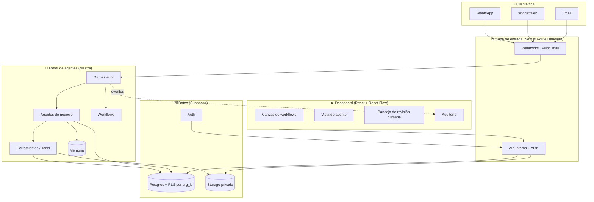

# 01 · Arquitectura

## 1. Visión de alto nivel
Kaudal tiene **tres mundos** conectados pero aislados entre sí:

1. **El cliente final** (ej: el comprador de una tienda) habla por WhatsApp / web widget. Nunca ve el sistema interno.
2. **El dueño de la PYME** entra a un **dashboard visual** donde arma, ve y controla sus agentes.
3. **El motor de agentes** (Mastra) razona, usa herramientas, recuerda contexto y deja todo auditado.

## 2. Principio clave: separación de canales
Igual que en la referencia OxideLabs, **el canal del cliente final está separado del sistema interno**:
- El cliente final solo interactúa por mensajería (WhatsApp/web). No tiene acceso al dashboard.
- El dashboard es exclusivo para usuarios internos autenticados de la empresa.
- Cada empresa (org) ve **solo** sus datos: aislamiento por `org_id` con Row Level Security de Postgres.

## 3. Multi-tenant (varias empresas, una plataforma)
- Una sola base de datos, aislada lógicamente por `org_id` en cada tabla + políticas RLS.
- Los secretos de cada empresa (tokens de WhatsApp, claves) se guardan cifrados server-side, nunca en el cliente.
- El plan de "código fuente / on-premise" (ver `05`) despliega una instancia dedicada por cliente.

## 4. Ciclo de vida de una interacción (ejemplo: reclamo de un cliente)
1. Cliente escribe por WhatsApp: "mi pedido llegó roto".
2. **Webhook** valida la firma de Twilio, normaliza el teléfono, identifica la empresa y el contacto.
3. **Orquestador (Mastra)** enruta al **Agente de Postventa**.
4. El agente: clasifica el caso, consulta el pedido (tool → Postgres), decide si resuelve solo o **deriva a revisión humana** según nivel de confianza.
5. Si resuelve: responde, registra el caso y agenda seguimiento.
6. Si deriva: crea una tarjeta en la **Bandeja de revisión** del dashboard, bonita y con todo el contexto.
7. **Todo queda auditado**: quién, qué, cuándo, con qué datos y con qué resultado.

## 5. Componentes principales
| Componente | Responsabilidad | Tecnología |
|---|---|---|
| **Gateway de canales** | Recibir/validar/responder mensajes | Next.js Route Handlers + Twilio |
| **Orquestador** | Enrutar al agente correcto, manejar workflows | Mastra |
| **Agentes de negocio** | Razonar y actuar en su dominio | Mastra Agents + Claude |
| **Herramientas (Tools)** | Acciones concretas (consultar pedido, crear cita, cobrar) | Funciones TS validadas con Zod |
| **Memoria** | Contexto por conversación y por cliente | Mastra Memory + Postgres/pgvector |
| **Base operacional** | Datos de negocio, agentes, auditoría | Supabase Postgres + RLS |
| **Storage** | Archivos (documentos, evidencias) | Supabase Storage privado, URLs firmadas |
| **Dashboard** | Configurar, ver, revisar, auditar | Next.js + React + React Flow |
| **Cola/eventos** | Reintentos, tareas programadas, recordatorios | Inngest o QStash |

## 6. Modelo de datos (tablas núcleo)
- `orgs` — empresas cliente.
- `users` — usuarios internos, con rol (`owner`, `admin`, `operator`, `viewer`).
- `agents` — instancias de agentes activados por la empresa (config, modelo, estado).
- `agent_runs` — cada ejecución de un agente (input, pasos, tools usadas, resultado, confianza).
- `workflows` — flujos visuales (nodos + conexiones en JSON).
- `conversations` / `messages` — hilos con clientes finales.
- `review_queue` — casos que esperan revisión humana.
- `contacts` — clientes finales de cada empresa.
- `audit_log` — bitácora inmutable de todo lo relevante.
- `documents` — archivos procesados por agentes.
- `subscriptions` — plan y facturación por org.

Toda tabla lleva: `id`, `org_id`, `created_at`, `updated_at`.

## 7. Por qué esta arquitectura
- **Aísla el riesgo:** el canal del cliente nunca toca el core interno.
- **Escala por empresa:** RLS + org_id permite miles de clientes en una base sin filtraciones.
- **Auditable de fábrica:** `agent_runs` + `audit_log` responden cualquier "¿qué hizo la IA?".
- **Portable:** el motor (Mastra) corre igual en la nube de Kaudal o on-premise del cliente.
