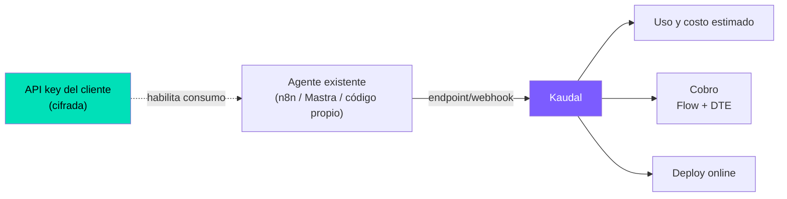
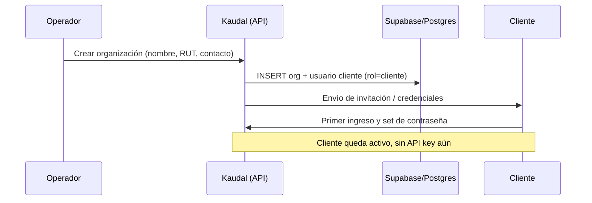
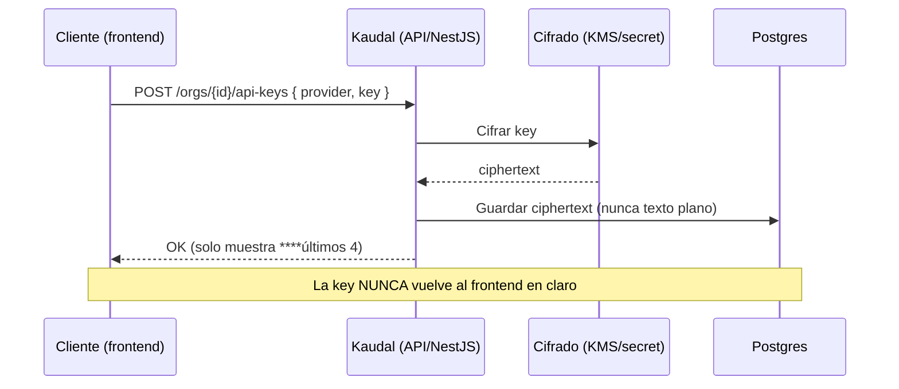
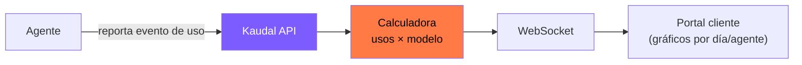
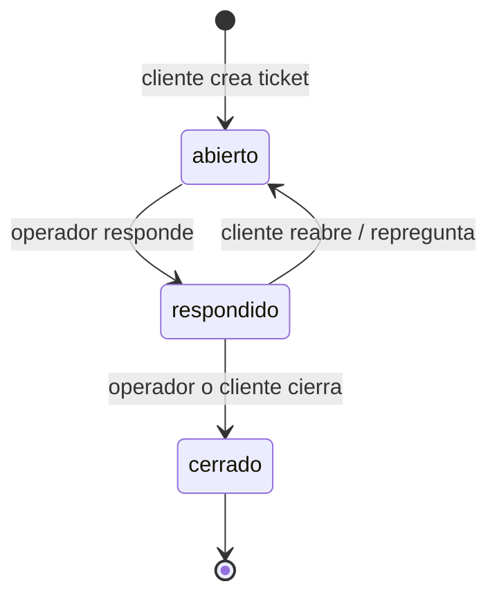
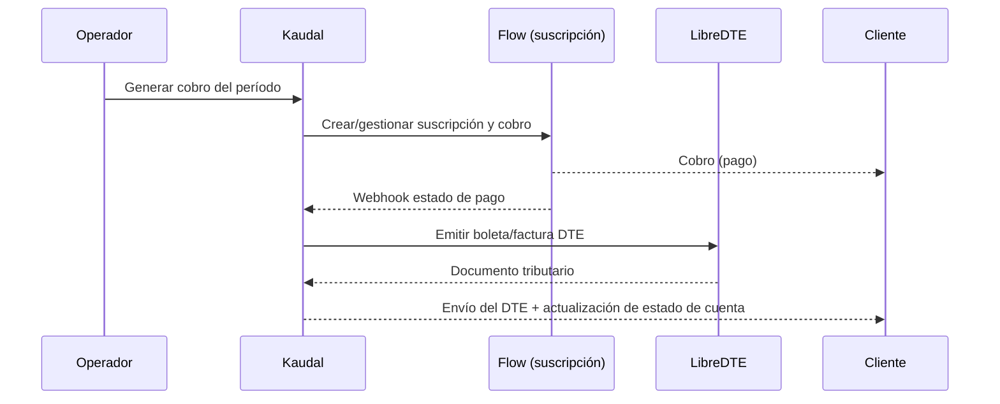

# 00 · Definición y Requisitos

> **Documento base del proyecto Kaudal.** Define qué es el producto, quiénes lo usan, los flujos clave, y los requisitos funcionales (RF) y no funcionales (RNF) que gobiernan el resto de la documentación técnica. Todo lo que sigue en la carpeta de docs se apoya en las decisiones cerradas de acá.

---

## 1. Qué es Kaudal

Kaudal es la **capa de servicialización** de agentes de IA. Toma un agente que **ya está corriendo** —en n8n, Mastra o código propio— y lo convierte en un servicio cobrable y observable, sin reescribir el agente.

Kaudal **no es un motor de agentes**. No ejecuta la lógica del agente ni intercepta las llamadas al modelo. Se conecta al agente por su endpoint/webhook y le agrega cuatro capacidades que el agente por sí solo no tiene:

| Capacidad | Qué hace Kaudal |
|---|---|
| **Registrar** | Da de alta el agente por su endpoint/webhook y lo deja identificado dentro de una organización (cliente). |
| **Medir uso y costo** | Muestra dónde y cuánto se usa el agente (por día, por agente) y **estima** su costo con una calculadora (usos × modelo). |
| **Cobrar** | Emite el cobro con Flow (suscripción) y el documento tributario (boleta/factura DTE en Chile) vía LibreDTE. |
| **Desplegar** | Ayuda a dejar el agente disponible online. |

### Modelo de costos (importante)

Kaudal **no es un proxy del modelo** por ahora. No interceptamos las llamadas a Anthropic/OpenAI. Por lo tanto:

- El costo es **estimado**, no medido al centavo.
- La estimación se calcula con `usos × precio del modelo`, y/o se **reporta desde el propio agente**.
- Las cifras se presentan siempre como **"costo estimado"** en la interfaz, nunca como un cargo exacto del proveedor de modelo.

### Quién pone la API key

El **cliente pone su propia API key** del proveedor de modelo (Anthropic/OpenAI). Así, el consumo del modelo corre por cuenta y key del cliente, no de Kaudal ni del operador. Kaudal solo guarda la key de forma **cifrada** para que el agente pueda operar.

---

## 2. Los dos roles

Kaudal tiene exactamente **dos tipos de usuario**. No hay auto-registro público del cliente: el operador siempre inscribe.

### 2.1 Operador (el dueño — Raúl)

- Administra **todo** el sistema.
- **Inscribe clientes**: crea la cuenta de cada empresa cliente.
- Registra agentes, define modelos y precios para la calculadora de costos.
- Ve el uso y costo estimado de **todos** los clientes.
- **Responde** las dudas y reclamos (tickets) que levantan los clientes.
- Gestiona el cobro (suscripciones Flow) y la emisión de DTE.

### 2.2 Cliente (empresa inscrita por el operador)

- Entra a un **portal visual y bonito**, en modo oscuro.
- **Pone su propia API key** del proveedor de modelo.
- Ve **dónde y cuánto** se usa su agente: uso por día, por agente.
- Ve su **costo estimado**.
- Levanta **dudas y reclamos** (tickets) que el operador responde.
- Lenguaje: tuteo, español de Chile, **sin jerga técnica**.

| Aspecto | Operador | Cliente |
|---|---|---|
| Crea su propia cuenta | Sí (o cuenta raíz del sistema) | **No** — lo inscribe el operador |
| Ve datos de todas las orgs | Sí | Solo su propia org |
| Pone API key del modelo | No (opcional, para pruebas) | **Sí — obligatorio para operar** |
| Registra/edita agentes | Sí | Ve; edición según permiso |
| Define precios de modelos | Sí | No |
| Levanta tickets | Puede | **Sí** |
| Responde tickets | **Sí** | No |
| Gestiona cobro y DTE | **Sí** | Ve su estado de cuenta |

> **Aislamiento:** cada cliente es una **organización** (`org_id`). Los datos están aislados por org mediante **RLS** en Postgres. Un cliente nunca ve datos de otro.

---

## 3. Flujos clave

### 3.1 Inscribir cliente (operador)

1. El operador crea la organización del cliente (razón social, RUT, contacto).
2. Kaudal crea la org (`org_id`) y el usuario cliente con rol `cliente`.
3. Se envía invitación al cliente para su primer ingreso.
4. El cliente queda activo, pero **todavía no puede operar** hasta poner su API key.

### 3.2 Cliente pone su API key

- El cliente ingresa su key de Anthropic/OpenAI en su portal.
- Kaudal la **cifra** antes de persistir. **Nunca** se guarda en texto plano ni se devuelve al frontend.
- El frontend solo muestra un **enmascarado** (`sk-…AB12`) y el estado (válida/ inválida).
- La key está **aislada por org**.

### 3.3 Ver uso y costo (cliente y operador)

- El uso se **reporta desde el agente** o se **estima** por número de usos.
- El cliente ve: uso por día, uso por agente, **costo estimado**.
- Actualización en **tiempo real** vía WebSocket cuando llegan nuevos eventos de uso.

### 3.4 Poner reclamo / duda (cliente)

- El cliente crea un **ticket** (tipo: duda o reclamo) desde su portal.
- El ticket queda asociado a su `org_id` y, opcionalmente, a un agente.
- El operador recibe notificación en tiempo real.

### 3.5 Operador responde (operador)

- El operador ve la bandeja de tickets de todas las orgs.
- Responde; el cliente ve la respuesta en su portal (y notificación WebSocket).
- El ticket cambia de estado (`abierto → respondido → cerrado`).

### 3.6 Cobrar (operador)

- El operador genera el cobro del período (basado en la suscripción del cliente).
- **Flow** gestiona la suscripción y el pago.
- Al confirmarse el pago (webhook), Kaudal emite la **boleta/factura DTE** vía **LibreDTE**.
- El cliente recibe su documento tributario y ve el estado de cuenta.

---

## 4. Requisitos funcionales (RF)

### Autenticación y roles

| ID | Requisito |
|---|---|
| RF-01 | El sistema debe soportar dos roles: `operador` y `cliente`, con permisos diferenciados. |
| RF-02 | Solo el operador puede crear organizaciones (clientes). No existe auto-registro público del cliente. |
| RF-03 | Cada usuario pertenece a una organización (`org_id`); el operador tiene acceso transversal a todas. |
| RF-04 | El cliente debe poder iniciar sesión, cambiar su contraseña y recuperar acceso. |

### Gestión de clientes y agentes

| ID | Requisito |
|---|---|
| RF-05 | El operador puede crear, editar y desactivar organizaciones cliente (razón social, RUT, contacto). |
| RF-06 | El operador puede registrar un agente indicando su tipo (n8n / Mastra / código propio) y su endpoint/webhook. |
| RF-07 | Cada agente queda asociado a una organización. |
| RF-08 | El operador puede definir el modelo asociado a un agente (para la calculadora de costos). |

### API keys del cliente

| ID | Requisito |
|---|---|
| RF-09 | El cliente puede ingresar su propia API key del proveedor de modelo (Anthropic/OpenAI). |
| RF-10 | La API key debe guardarse **cifrada**; nunca en texto plano. |
| RF-11 | La API key **nunca** debe exponerse al frontend en claro; solo se muestra enmascarada. |
| RF-12 | El cliente puede reemplazar o eliminar su API key. |
| RF-13 | El sistema debe indicar el estado de la key (presente / ausente / inválida). |

### Uso y costos

| ID | Requisito |
|---|---|
| RF-14 | El sistema debe registrar eventos de uso reportados por el agente y/o estimados. |
| RF-15 | El sistema debe calcular el **costo estimado** con la fórmula `usos × precio del modelo`. |
| RF-16 | El cliente debe ver su uso por día y por agente en gráficos. |
| RF-17 | El cliente debe ver su costo estimado del período. |
| RF-18 | El operador debe ver el uso y costo estimado de todas las organizaciones. |
| RF-19 | Las cifras de costo se presentan explícitamente como **"estimado"**. |
| RF-20 | Los datos de uso deben actualizarse en tiempo real (WebSocket). |

### Tickets (dudas y reclamos)

| ID | Requisito |
|---|---|
| RF-21 | El cliente puede crear tickets con tipo `duda` o `reclamo`. |
| RF-22 | Un ticket puede asociarse opcionalmente a un agente. |
| RF-23 | El operador puede ver, responder y cerrar tickets de todas las organizaciones. |
| RF-24 | El ticket maneja estados: `abierto`, `respondido`, `cerrado`. |
| RF-25 | Cliente y operador reciben notificación en tiempo real de nuevos mensajes en un ticket. |

### Cobro y facturación

| ID | Requisito |
|---|---|
| RF-26 | El operador puede generar cobros por período asociados a la suscripción del cliente. |
| RF-27 | El cobro se gestiona vía Flow (suscripción). |
| RF-28 | Al confirmarse el pago, el sistema emite boleta/factura DTE vía LibreDTE. |
| RF-29 | El cliente puede ver su estado de cuenta y descargar sus documentos tributarios. |
| RF-30 | El sistema debe procesar los webhooks de Flow para actualizar el estado de pago. |

### Despliegue

| ID | Requisito |
|---|---|
| RF-31 | Kaudal debe ayudar a dejar el agente disponible online (deploy). |
| RF-32 | El registro por endpoint/webhook debe validar conectividad con el agente. |

---

## 5. Requisitos no funcionales (RNF)

### Seguridad

| ID | Requisito |
|---|---|
| RNF-01 | **Multi-tenant por `org_id` con RLS** en Postgres: un cliente nunca accede a datos de otra org. |
| RNF-02 | Las API keys de clientes se guardan **cifradas** (cifrado en reposo), aisladas por cliente. |
| RNF-03 | Ningún secreto (API key, credenciales DTE/Flow) se expone al frontend. |
| RNF-04 | Toda comunicación sobre HTTPS/WSS. |
| RNF-05 | Control de acceso por rol en cada endpoint del backend (autorización, no solo autenticación). |
| RNF-06 | Validación de firma en webhooks entrantes (Flow, agentes). |

### Rendimiento y tiempo real

| ID | Requisito |
|---|---|
| RNF-07 | Los tableros de uso deben reflejar nuevos eventos vía WebSocket con baja latencia. |
| RNF-08 | Las vistas de uso/costo deben responder de forma fluida con el volumen esperado del período. |

### Usabilidad

| ID | Requisito |
|---|---|
| RNF-09 | El portal del cliente debe ser visual, claro y en **modo oscuro**. |
| RNF-10 | Lenguaje en **español de Chile**, tuteo, sin jerga para el cliente. |
| RNF-11 | Paleta de marca: violeta `#7C5CFF`, menta `#00E0B8`, naranjo `#FF7A45`. |
| RNF-12 | Interfaz responsiva (escritorio y móvil). |

### Tecnología y despliegue

| ID | Requisito |
|---|---|
| RNF-13 | Frontend en Next.js (React, TypeScript, Tailwind). |
| RNF-14 | Backend en NestJS (API REST + WebSocket). |
| RNF-15 | Datos en Supabase/Postgres con RLS. |
| RNF-16 | Deploy inicial local/Raspberry; migración posterior a Railway sin cambios de arquitectura. |
| RNF-17 | Integraciones externas desacopladas (Flow, LibreDTE) para permitir reemplazo o mock. |

### Mantenibilidad y trazabilidad

| ID | Requisito |
|---|---|
| RNF-18 | Registro de auditoría de acciones sensibles (alta de key, emisión de DTE, cobros). |
| RNF-19 | Configuración por variables de entorno; sin secretos en el repositorio. |
| RNF-20 | Estimación de costos parametrizable (tabla de precios de modelos editable por el operador). |

---

## 6. Historias de usuario principales

### Operador

- **HU-O1** — Como operador, quiero **inscribir a una empresa cliente** creando su organización y su cuenta, para que empiece a usar Kaudal.
- **HU-O2** — Como operador, quiero **registrar el agente de un cliente por su endpoint/webhook**, para poder medir su uso y cobrar por él.
- **HU-O3** — Como operador, quiero **definir el modelo y su precio**, para que la calculadora estime el costo correctamente.
- **HU-O4** — Como operador, quiero **ver el uso y costo estimado de todos mis clientes**, para gestionar el negocio.
- **HU-O5** — Como operador, quiero **responder las dudas y reclamos** de los clientes, para dar soporte.
- **HU-O6** — Como operador, quiero **generar el cobro y emitir la boleta/factura DTE**, para facturar el servicio en regla.

### Cliente

- **HU-C1** — Como cliente, quiero **ingresar mi propia API key de forma segura**, para que mi agente opere con mi cuenta del modelo.
- **HU-C2** — Como cliente, quiero **ver dónde y cuánto se usa mi agente** (por día y por agente), para entender mi consumo.
- **HU-C3** — Como cliente, quiero **ver mi costo estimado**, para anticipar cuánto pagaré.
- **HU-C4** — Como cliente, quiero **poner una duda o un reclamo**, para pedir ayuda al operador.
- **HU-C5** — Como cliente, quiero **ver la respuesta del operador** a mi ticket, para resolver mi problema.
- **HU-C6** — Como cliente, quiero **ver mi estado de cuenta y mis documentos tributarios**, para llevar mi contabilidad.

---

## 7. Fuera de alcance

Lo siguiente **no** es parte de Kaudal (al menos en esta etapa), y debe rechazarse explícitamente para evitar desviaciones:

- **No es un motor de agentes.** Kaudal no ejecuta ni orquesta la lógica del agente. El agente ya corre en n8n, Mastra o código propio.
- **No es proxy del modelo.** No interceptamos las llamadas a Anthropic/OpenAI. Por eso el costo es **estimado**, no medido exacto.
- **No provee las API keys del modelo.** Cada cliente pone la suya; Kaudal no vende ni comparte keys.
- **No hay medición de costo al centavo** desde el proveedor. Solo estimación (`usos × modelo`) y/o reporte del agente.
- **No hay auto-registro público de clientes.** El operador siempre inscribe.
- **No hay marketplace público de agentes** ni catálogo abierto.
- **No hay facturación fuera de Chile** en esta etapa (el DTE es chileno, vía LibreDTE).
- **No hay pasarelas de pago distintas de Flow** en esta etapa.
- **No hay app móvil nativa**; el portal es web responsivo.

---

## 8. Glosario rápido

| Término | Significado |
|---|---|
| **Operador** | Dueño del sistema (Raúl). Administra todo e inscribe clientes. |
| **Cliente** | Empresa inscrita por el operador. Pone su API key y ve su uso. |
| **Org (`org_id`)** | Organización = frontera de aislamiento multi-tenant (RLS). |
| **Agente** | Agente de IA existente, registrado por endpoint/webhook. |
| **Costo estimado** | Cálculo `usos × precio del modelo`; no es un cargo exacto del proveedor. |
| **Ticket** | Duda o reclamo del cliente que el operador responde. |
| **DTE** | Documento Tributario Electrónico (boleta/factura), emitido vía LibreDTE. |
| **Flow** | Pasarela de pago/suscripción usada para cobrar. |
| **RLS** | Row Level Security de Postgres: aísla filas por `org_id`. |