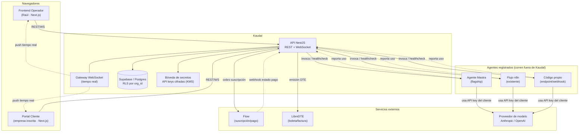
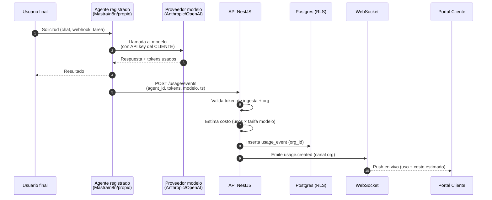
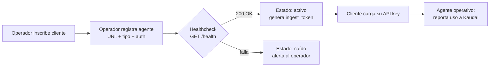
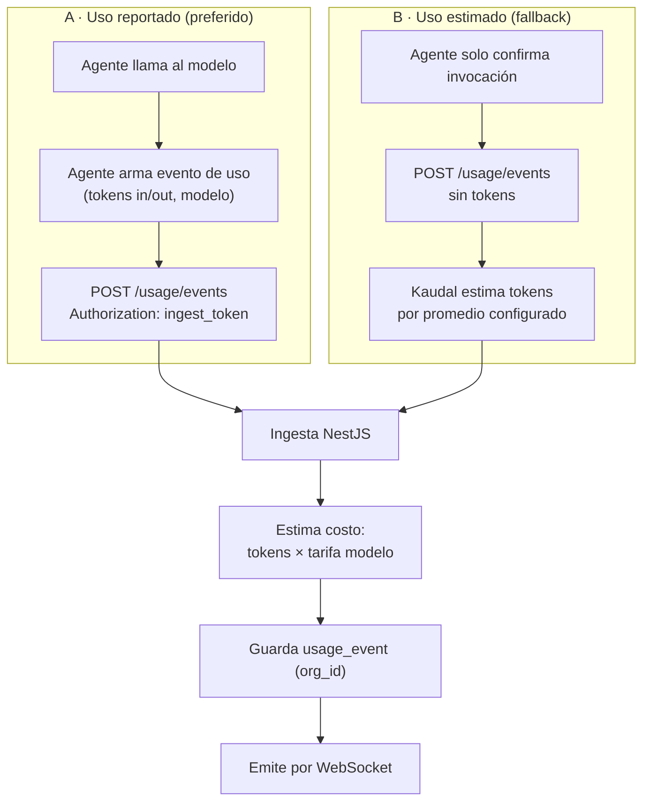
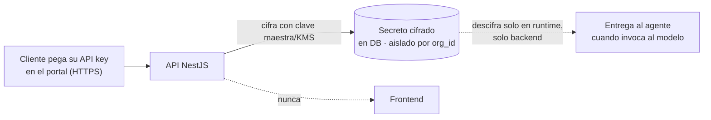
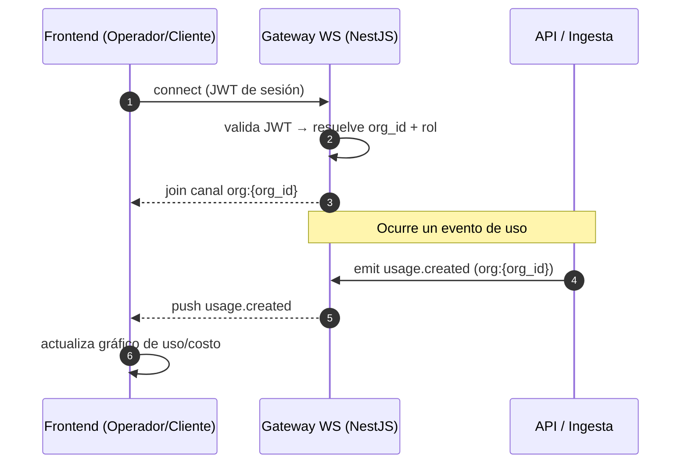
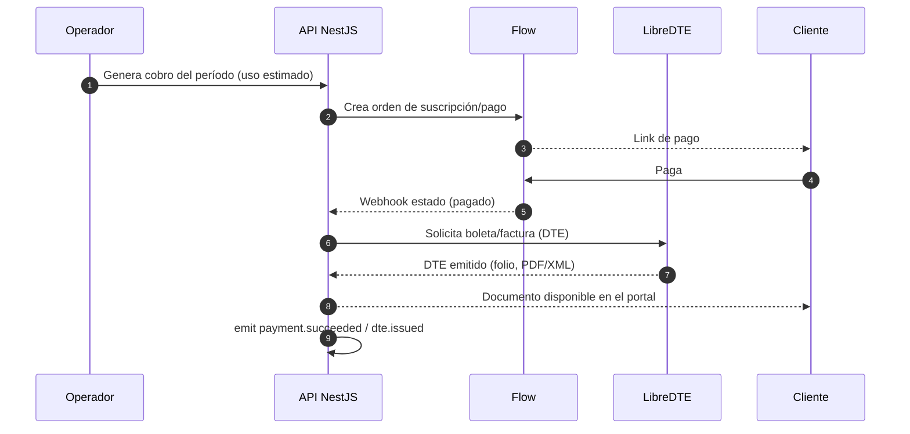

# 01 · Arquitectura

> Kaudal es la capa que toma un agente de IA que **ya está corriendo** (n8n, Mastra o código propio) y lo convierte en un **servicio**: lo registra, mide su uso, estima su costo, ayuda a cobrar (Flow + boleta/factura DTE) y a desplegarlo online. **Kaudal no es un motor de agentes**: no ejecuta ni orquesta la lógica del agente, y hoy tampoco intercepta las llamadas al modelo.

Este documento describe los componentes del sistema, cómo conversan entre sí, cómo se registra un agente existente y cómo fluye el uso hacia Kaudal en tiempo real.

---

## 1. Vista de componentes



**Punto clave sobre las API keys:** el agente usa la key del **cliente** (que él mismo carga en su portal) para llamar al modelo. El consumo del modelo corre por cuenta del cliente. Kaudal **guarda esa key cifrada** y se la entrega al agente solo cuando corresponde (ver [§6](#6-seguridad-de-las-api-keys)); nunca viaja al frontend ni se almacena en texto plano.

---

## 2. Responsabilidad de cada componente

| Componente | Stack | Responsabilidad | Qué NO hace |
|---|---|---|---|
| **Frontend Operador** | Next.js, React, TS, Tailwind | Panel de Raúl: inscribir clientes, registrar agentes, ver todo el uso/costo, responder tickets, gestionar cobros | Ejecutar lógica de agente |
| **Portal Cliente** | Next.js, React, TS, Tailwind | Portal visual: cargar su API key, ver dónde/cuánto se usa su agente, costo estimado, abrir dudas y reclamos | Ver keys de otros clientes; ver datos de otra org |
| **API NestJS** | NestJS (REST + WS) | Autenticación, registro de agentes, ingesta de uso, cálculo de costo estimado, orquestación de cobro (Flow) y emisión (DTE), broadcast en tiempo real | Correr el agente; interceptar llamadas al modelo |
| **Postgres (Supabase)** | Postgres + RLS | Persistencia multi-tenant aislada por `org_id` | Guardar keys en claro |
| **Bóveda de secretos** | Cifrado con KMS/clave maestra | Custodiar las API keys de los clientes cifradas | Exponer keys al frontend |
| **Agente (Mastra/n8n/propio)** | Fuera de Kaudal | Ejecutar la tarea de IA, llamar al modelo con la key del cliente, reportar su uso | Autogestionar cobro/DTE |
| **Flow** | Externo | Suscripción y pagos | — |
| **LibreDTE** | Externo | Boleta/factura tributaria (DTE) en Chile | — |

---

## 3. Flujo end-to-end de una interacción

Escenario: un usuario final consume el agente de un cliente; Kaudal registra el uso, lo muestra en tiempo real y contribuye al costo estimado del período.



Notas de ingeniería:

- El **costo es estimado**, no facturado por el proveedor: Kaudal no es proxy del modelo, así que no ve el cargo real. Calcula con `usos × tarifa_del_modelo` según una tabla de tarifas versionada (ver [documento de Costos]).
- Si el agente **no reporta tokens** (caso n8n simple), Kaudal estima por **número de invocaciones** y un promedio configurado por agente/modelo.
- La respuesta al usuario final **no depende** de que Kaudal esté arriba: el reporte de uso es asíncrono y tolerante a fallos (reintentos, cola).

---

## 4. Registro de un agente que ya corre

Kaudal no despliega el agente por ti (eso viene después, en Railway): lo **registra** apuntando a un endpoint o webhook que **ya responde**, y verifica que está vivo con un **healthcheck**.



### 4.1 Datos que se registran por agente

| Campo | Tipo | Descripción |
|---|---|---|
| `id` | uuid | Identificador interno |
| `org_id` | uuid | Cliente dueño (aislamiento RLS) |
| `nombre` | string | Nombre visible en el portal |
| `tipo` | enum | `mastra` · `n8n` · `propio` |
| `endpoint_url` | string | URL de invocación del agente |
| `webhook_url` | string? | Webhook entrante, si aplica |
| `health_url` | string | Endpoint de healthcheck (`GET`, espera `200`) |
| `auth_tipo` | enum | `bearer` · `header_key` · `none` |
| `auth_secret_ref` | ref | Referencia cifrada al secreto de auth del agente |
| `modelo_default` | string | Modelo asumido para estimar costo |
| `ingest_token` | secret | Token que el agente usa para reportar uso |
| `estado` | enum | `activo` · `caido` · `pausado` |
| `creado_en` | timestamptz | Fecha de registro |

### 4.2 Healthcheck

- Kaudal hace `GET {health_url}` de forma **periódica** (ej. cada 60 s) y **on-demand** al registrar.
- Contrato mínimo esperado del agente:

```json
GET /health  →  200 OK
{ "status": "ok", "version": "1.4.2" }
```

- Si falla N veces seguidas, el agente pasa a `caido`, se alerta al operador y el portal del cliente lo muestra con estado degradado (sin exponer detalles internos).

### 4.3 Endpoints de registro (API NestJS)

| Método | Ruta | Rol | Descripción |
|---|---|---|---|
| `POST` | `/orgs/:orgId/agents` | Operador | Registra un agente existente |
| `GET` | `/orgs/:orgId/agents` | Operador · Cliente* | Lista agentes de la org |
| `GET` | `/agents/:id` | Operador · Cliente* | Detalle del agente |
| `PATCH` | `/agents/:id` | Operador | Actualiza URL/auth/modelo |
| `POST` | `/agents/:id/healthcheck` | Operador | Fuerza un healthcheck ahora |
| `DELETE` | `/agents/:id` | Operador | Da de baja el agente |

\* El cliente solo ve agentes de **su** `org_id` (RLS). El `ingest_token` y los secretos **nunca** se devuelven al frontend.

---

## 5. Cómo fluye el uso hacia Kaudal

Hoy Kaudal **no intercepta** las llamadas al modelo. El uso llega por uno de dos caminos, según qué tanto reporte el agente.



### 5.1 Endpoint de ingesta

```
POST /usage/events
Authorization: Bearer <ingest_token>
Content-Type: application/json
```

| Campo | Tipo | Req. | Descripción |
|---|---|---|---|
| `agent_id` | uuid | sí | Agente que generó el uso |
| `occurred_at` | timestamptz | sí | Momento real del uso |
| `model` | string | no | Modelo usado; si falta, usa `modelo_default` |
| `tokens_in` | int | no | Tokens de entrada (si el agente los conoce) |
| `tokens_out` | int | no | Tokens de salida |
| `units` | int | no | Nº de invocaciones (default `1`) para estimación |
| `metadata` | jsonb | no | Contexto libre (usuario final anónimo, canal, etc.) |
| `idempotency_key` | string | reco. | Evita duplicar el evento en reintentos |

**Respuesta**

```json
201 Created
{ "id": "…", "estimated_cost_clp": 12.4, "model": "claude-…", "stored": true }
```

### 5.2 Reglas de ingesta

- **Aislamiento:** el `ingest_token` resuelve a un `org_id` y `agent_id`; un token nunca puede escribir uso de otra org.
- **Idempotencia:** con `idempotency_key`, un reintento del agente no duplica el evento.
- **Estimación de costo:** se calcula al momento de ingesta contra la tabla de tarifas vigente y se **congela** en el evento (auditable), aunque las tarifas cambien después.
- **Agregación:** un job agrega por día / agente / modelo para las vistas del portal (uso por día, por agente).

### 5.3 Consulta de uso y costo

| Método | Ruta | Rol | Descripción |
|---|---|---|---|
| `GET` | `/orgs/:orgId/usage?from&to&agent_id` | Operador · Cliente* | Serie de uso agregada |
| `GET` | `/orgs/:orgId/costs?period` | Operador · Cliente* | Costo estimado del período |
| `GET` | `/agents/:id/usage/daily` | Operador · Cliente* | Uso diario del agente |

\* Cliente solo su propia `org_id`.

---

## 6. Seguridad de las API keys

Requisito crítico e innegociable.



- La key se recibe por **HTTPS**, se **cifra en el backend** (KMS o clave maestra fuera de la DB) y se guarda **cifrada**. Nunca en texto plano.
- **Nunca** se devuelve al frontend: el portal muestra solo un **último-4** / estado (`configurada` / `no configurada`), jamás el valor.
- Aislada por `org_id`; **RLS** impide que una org lea secretos de otra.
- Se descifra **solo en runtime**, en el backend, en el momento de entregarla al agente que la usará contra el modelo.
- Rotación soportada: reemplazar la key invalida la anterior; los eventos de uso históricos quedan intactos.

---

## 7. Tiempo real por WebSocket

El portal del cliente y el panel del operador se actualizan en vivo (uso, costo, estado del agente, tickets) sin recargar.



### 7.1 Canales y eventos

| Canal | Quién se suscribe | Eventos |
|---|---|---|
| `org:{org_id}` | Cliente de esa org · Operador | `usage.created`, `cost.updated`, `agent.status_changed` |
| `org:{org_id}:tickets` | Cliente · Operador | `ticket.created`, `ticket.replied`, `ticket.status_changed` |
| `admin` | Solo Operador | `agent.down`, `payment.failed`, `dte.issued` |

### 7.2 Reglas de autorización del socket

- La conexión se autentica con el **JWT de sesión**; el gateway deriva `org_id` y `rol` del token, **no** de lo que pida el cliente.
- Un cliente **solo** puede unirse a `org:{su_org_id}`. El operador puede unirse a cualquier canal y a `admin`.
- Los payloads en vivo respetan las mismas reglas de RLS que la API REST: nada de secretos, nada de datos de otra org.

---

## 8. Dudas y reclamos (tickets)

Camino de soporte cliente → operador, con eco en tiempo real.

| Método | Ruta | Rol | Descripción |
|---|---|---|---|
| `POST` | `/orgs/:orgId/tickets` | Cliente | Abre una duda o reclamo |
| `GET` | `/orgs/:orgId/tickets` | Cliente · Operador | Lista tickets de la org |
| `POST` | `/tickets/:id/replies` | Operador · Cliente | Responde en el hilo |
| `PATCH` | `/tickets/:id` | Operador | Cambia estado (`abierto` → `en_curso` → `resuelto`) |

Cada acción emite el evento correspondiente en `org:{org_id}:tickets`, así el cliente ve la respuesta del operador al instante.

---

## 9. Cobro y emisión (Flow + DTE)

Kaudal orquesta el cobro; la ejecución vive en servicios externos.



| Método | Ruta | Rol | Descripción |
|---|---|---|---|
| `POST` | `/orgs/:orgId/charges` | Operador | Genera cobro del período |
| `POST` | `/webhooks/flow` | Flow (firmado) | Recibe estado de pago |
| `GET` | `/orgs/:orgId/invoices` | Operador · Cliente* | DTE emitidos (boleta/factura) |

\* El webhook de Flow se valida por **firma**; nunca se confía en el estado sin verificar.

---

## 10. Multi-tenant y aislamiento

- **Modelo de identidad:** `Operador` (global, ve todo) y `Cliente` (acotado a su `org_id`). El operador **inscribe** al cliente y crea su cuenta; el cliente entra y carga su propia API key.
- **RLS en Postgres:** toda tabla con datos de cliente (`agents`, `usage_events`, `tickets`, `invoices`, `secrets`) filtra por `org_id` a nivel de base de datos. El aislamiento no depende solo del código de la API.
- **Defensa en profundidad:** JWT en API y WS → guardas de rol en NestJS → RLS en la DB → cifrado de secretos en la bóveda. Ninguna capa confía ciegamente en la anterior.

---

## 11. Despliegue (hoy → después)

| Etapa | Dónde corre Kaudal | Notas |
|---|---|---|
| **Ahora** | Local / Raspberry Pi | Frontend Next.js + API NestJS + Postgres (Supabase o local). Agentes corren donde ya vivían. |
| **Después** | Railway | Mismo diseño, contenedores gestionados; sin cambios de contrato de API/WS. |

Los agentes registrados **siempre** viven fuera de Kaudal (en n8n, Mastra o infra propia del cliente/operador): Kaudal los apunta por URL y los mide, no los hospeda.

---

## 12. Resumen de decisiones de arquitectura

1. Kaudal **registra y mide**, no ejecuta agentes.
2. El **cliente pone su propia API key**; el consumo del modelo corre por su cuenta.
3. Las keys se guardan **cifradas**, aisladas por org, **nunca** en el frontend.
4. El costo es **estimado** (usos × tarifa), no interceptado — Kaudal no es proxy del modelo por ahora.
5. El uso llega por **reporte del agente** (preferido) o **estimación** (fallback).
6. **Tiempo real** por WebSocket con canales por `org_id` y autorización derivada del JWT.
7. **Multi-tenant** con RLS por `org_id` como línea de defensa dura, no solo lógica de aplicación.