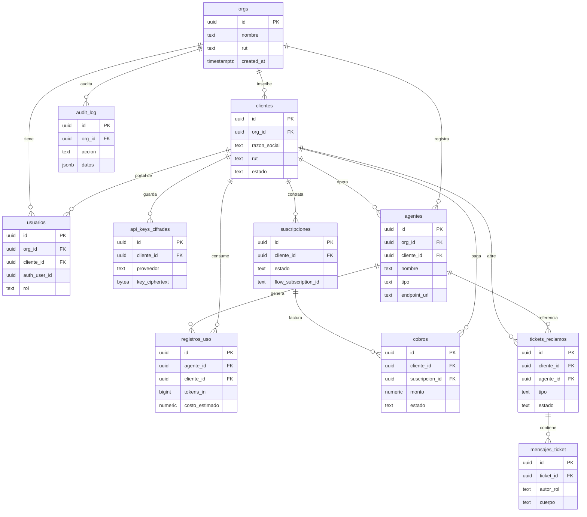
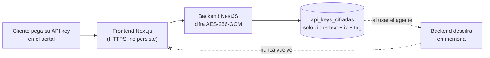

# 02 · Modelo de Datos

> Documento técnico de referencia para el esquema de datos de Kaudal. Define tablas, tipos, relaciones, políticas RLS y DDL resumido. Aplica a **Supabase / PostgreSQL** con Row Level Security activo en todas las tablas.

---

## 1. Principios de diseño

Estas reglas son transversales y no se negocian por tabla:

1. **Multi-tenant por `org_id`.** Toda fila de negocio pertenece a una organización. El aislamiento es de arriba hacia abajo: `org_id` viaja en cada tabla y es la columna sobre la que operan las políticas RLS.
2. **Operador vs. Cliente.** Un `org` es del **operador** (Raúl). Cada **cliente** que el operador inscribe vive dentro de la org del operador como fila en `clientes`, con su propio aislamiento por `cliente_id` para lo que el cliente puede ver de sí mismo.
3. **Toda tabla lleva `id`, `created_at`, `updated_at`.** `id` es `uuid` (default `gen_random_uuid()`). `created_at`/`updated_at` son `timestamptz` con default `now()`; `updated_at` se mantiene por trigger.
4. **Las API keys nunca en texto plano.** La tabla `api_keys_cifradas` guarda solo el ciphertext + metadatos. El descifrado ocurre exclusivamente en el backend (NestJS), nunca se expone al frontend, nunca sale por la API REST/WebSocket.
5. **Borrado lógico donde importa la trazabilidad.** Clientes, agentes, suscripciones y cobros usan `deleted_at` (soft delete) en vez de `DELETE` físico. `audit_log` es append-only.
6. **RLS deniega por defecto.** Cada tabla tiene `ENABLE ROW LEVEL SECURITY` y `FORCE ROW LEVEL SECURITY`. Sin política que calce, no hay acceso.

### Convenciones de tipos

| Concepto | Tipo Postgres | Nota |
|---|---|---|
| Identificador | `uuid` | default `gen_random_uuid()` |
| Timestamps | `timestamptz` | siempre UTC en almacenamiento |
| Montos | `numeric(14,2)` | CLP sin decimales de uso común, pero soportamos otras monedas |
| Moneda | `char(3)` | ISO 4217, default `'CLP'` |
| Estados | `text` + `CHECK` (o enum) | ver cada tabla |
| Datos flexibles | `jsonb` | metadata, payloads de uso |
| Tokens/conteos | `bigint` | uso acumulado puede crecer |

---

## 2. Roles y contexto de sesión

El backend fija variables de sesión que las políticas RLS leen. No confiamos en el `auth.uid()` de Supabase por sí solo para el tenant: derivamos `org_id` y `cliente_id` desde la tabla `usuarios`.

```sql
-- Funciones helper leídas por las políticas RLS
create or replace function app.current_org_id() returns uuid
  language sql stable as $$
    select org_id from public.usuarios where auth_user_id = auth.uid()
$$;

create or replace function app.current_rol() returns text
  language sql stable as $$
    select rol from public.usuarios where auth_user_id = auth.uid()
$$;

create or replace function app.current_cliente_id() returns uuid
  language sql stable as $$
    select cliente_id from public.usuarios where auth_user_id = auth.uid()
$$;
```

| Rol (`usuarios.rol`) | Alcance | Ejemplo |
|---|---|---|
| `operador` | Toda la org: ve y administra clientes, agentes, cobros, tickets. `cliente_id` es NULL. | Raúl |
| `cliente` | Solo su propio `cliente_id` dentro de la org: su uso, su costo, sus tickets. | Usuario de la empresa inscrita |

---

## 3. Diagrama de relaciones (ERD)



---

## 4. Tablas

### 4.1 `orgs` — organización del operador

La raíz del tenant. Hoy hay una org (la de Raúl), pero el modelo soporta N operadores.

| Campo | Tipo | Null | Default | Descripción |
|---|---|---|---|---|
| `id` | uuid | no | `gen_random_uuid()` | PK |
| `nombre` | text | no | | Nombre comercial del operador |
| `rut` | text | sí | | RUT del operador (emisor DTE) |
| `email_contacto` | text | sí | | Contacto administrativo |
| `dte_config` | jsonb | sí | `'{}'` | Config LibreDTE (folios, giro, dirección emisor) — sin secretos en claro |
| `flow_config` | jsonb | sí | `'{}'` | Referencias de cuenta Flow (no secretos) |
| `created_at` | timestamptz | no | `now()` | |
| `updated_at` | timestamptz | no | `now()` | |

---

### 4.2 `clientes` — empresas inscritas por el operador

El operador crea la cuenta del cliente. El cliente luego ingresa a su portal.

| Campo | Tipo | Null | Default | Descripción |
|---|---|---|---|---|
| `id` | uuid | no | `gen_random_uuid()` | PK |
| `org_id` | uuid | no | | FK → `orgs.id` |
| `razon_social` | text | no | | Nombre legal de la empresa |
| `nombre_fantasia` | text | sí | | Nombre visible en el portal |
| `rut` | text | sí | | RUT receptor para boleta/factura |
| `giro` | text | sí | | Giro comercial (DTE) |
| `direccion` | text | sí | | Dirección tributaria |
| `email` | text | sí | | Email de contacto del cliente |
| `estado` | text | no | `'activo'` | `activo` \| `suspendido` \| `inactivo` |
| `plan_default` | text | sí | | Referencia comercial del plan contratado |
| `deleted_at` | timestamptz | sí | | Soft delete |
| `created_at` | timestamptz | no | `now()` | |
| `updated_at` | timestamptz | no | `now()` | |

**Índices:** `(org_id)`, `(org_id, estado)`, único parcial `(org_id, rut) where deleted_at is null`.

---

### 4.3 `usuarios` — cuentas de acceso (operador y cliente)

Puente entre Supabase Auth (`auth.users`) y el modelo de negocio. Un usuario `operador` tiene `cliente_id = NULL`; un usuario `cliente` está amarrado a un `cliente_id`.

| Campo | Tipo | Null | Default | Descripción |
|---|---|---|---|---|
| `id` | uuid | no | `gen_random_uuid()` | PK |
| `org_id` | uuid | no | | FK → `orgs.id` |
| `cliente_id` | uuid | sí | | FK → `clientes.id`. NULL si es operador |
| `auth_user_id` | uuid | no | | FK → `auth.users.id` (Supabase Auth) |
| `rol` | text | no | `'cliente'` | `operador` \| `cliente` |
| `nombre` | text | sí | | Nombre visible |
| `email` | text | no | | Email (espejo del de Auth) |
| `ultimo_acceso` | timestamptz | sí | | Telemetría de login |
| `created_at` | timestamptz | no | `now()` | |
| `updated_at` | timestamptz | no | `now()` | |

**Constraint clave:** `CHECK (rol = 'operador' AND cliente_id IS NULL) OR (rol = 'cliente' AND cliente_id IS NOT NULL)`.

**Índices:** único `(auth_user_id)`, `(org_id, rol)`, `(cliente_id)`.

---

### 4.4 `api_keys_cifradas` — llaves de proveedor del cliente (CIFRADAS)

> **Seguridad crítica.** Aquí vive la API key que el cliente pega en su portal (Anthropic/OpenAI). Se guarda **cifrada**, aislada por cliente, y **jamás** se devuelve al frontend. El backend descifra en memoria solo cuando debe usarla; el descifrado usa una clave maestra fuera de la base de datos (variable de entorno / KMS).

| Campo | Tipo | Null | Default | Descripción |
|---|---|---|---|---|
| `id` | uuid | no | `gen_random_uuid()` | PK |
| `cliente_id` | uuid | no | | FK → `clientes.id` |
| `org_id` | uuid | no | | FK → `orgs.id` (denormalizado para RLS) |
| `proveedor` | text | no | | `anthropic` \| `openai` \| `otro` |
| `alias` | text | sí | | Etiqueta amigable ("Prod", "Pruebas") |
| `key_ciphertext` | bytea | no | | Llave cifrada (AES-256-GCM) |
| `key_iv` | bytea | no | | Vector de inicialización / nonce |
| `key_auth_tag` | bytea | no | | Tag de autenticación GCM |
| `key_last4` | text | sí | | Últimos 4 caracteres, solo para UI ("···· ab12") |
| `key_fingerprint` | text | sí | | Hash SHA-256 para detectar duplicados sin exponer |
| `estado` | text | no | `'activa'` | `activa` \| `revocada` |
| `rotada_de` | uuid | sí | | FK → `api_keys_cifradas.id` (cadena de rotación) |
| `created_at` | timestamptz | no | `now()` | |
| `updated_at` | timestamptz | no | `now()` | |

**Reglas de columna:** `key_ciphertext`, `key_iv`, `key_auth_tag` **nunca** se seleccionan en respuestas API. El backend expone solo `proveedor`, `alias`, `key_last4`, `estado`. Vista pública `api_keys_publicas` filtra estas columnas.

**Índices:** `(cliente_id, estado)`, único parcial `(cliente_id, proveedor, alias) where estado = 'activa'`.



---

### 4.5 `agentes` — agentes registrados

Un agente que ya corre (n8n, Mastra, código propio) registrado en Kaudal por su endpoint/webhook. Kaudal **no** ejecuta el agente; lo registra, mide y ayuda a cobrar.

| Campo | Tipo | Null | Default | Descripción |
|---|---|---|---|---|
| `id` | uuid | no | `gen_random_uuid()` | PK |
| `org_id` | uuid | no | | FK → `orgs.id` |
| `cliente_id` | uuid | no | | FK → `clientes.id` (dueño del agente) |
| `nombre` | text | no | | Nombre del agente |
| `descripcion` | text | sí | | Qué hace, en lenguaje claro |
| `tipo` | text | no | `'mastra'` | `mastra` \| `n8n` \| `custom` |
| `endpoint_url` | text | sí | | Endpoint/webhook público del agente |
| `metodo_reporte` | text | no | `'estimado'` | `estimado` (calculadora) \| `reportado` (el agente envía uso) |
| `modelo_default` | text | sí | | Modelo asociado para estimar costo (ej. `claude-sonnet-4`) |
| `api_key_id` | uuid | sí | | FK → `api_keys_cifradas.id`: qué llave del cliente consume |
| `ingest_token_hash` | text | sí | | Hash del token con que el agente reporta uso (si `reportado`) |
| `estado` | text | no | `'activo'` | `activo` \| `pausado` \| `archivado` |
| `deleted_at` | timestamptz | sí | | Soft delete |
| `created_at` | timestamptz | no | `now()` | |
| `updated_at` | timestamptz | no | `now()` | |

**Índices:** `(cliente_id, estado)`, `(org_id)`, `(api_key_id)`.

---

### 4.6 `registros_uso` — eventos de uso (base del costo estimado)

Cada fila es un uso del agente. El costo es **estimado** (usos × modelo). Kaudal no es proxy del modelo: el uso se estima o lo reporta el agente vía endpoint de ingesta.

| Campo | Tipo | Null | Default | Descripción |
|---|---|---|---|---|
| `id` | uuid | no | `gen_random_uuid()` | PK |
| `org_id` | uuid | no | | FK → `orgs.id` |
| `cliente_id` | uuid | no | | FK → `clientes.id` |
| `agente_id` | uuid | no | | FK → `agentes.id` |
| `ocurrido_en` | timestamptz | no | `now()` | Momento del uso (para agrupar por día) |
| `modelo` | text | sí | | Modelo usado en este evento |
| `tokens_in` | bigint | sí | `0` | Tokens de entrada (si se conocen) |
| `tokens_out` | bigint | sí | `0` | Tokens de salida |
| `unidades` | integer | no | `1` | N.º de invocaciones representadas |
| `costo_estimado` | numeric(14,4) | no | `0` | Costo calculado por la calculadora |
| `moneda` | char(3) | no | `'CLP'` | |
| `origen` | text | no | `'estimado'` | `estimado` \| `reportado` |
| `metadata` | jsonb | sí | `'{}'` | Payload del evento (ruta, latencia, etc.) |
| `created_at` | timestamptz | no | `now()` | |
| `updated_at` | timestamptz | no | `now()` | |

**Índices:** `(cliente_id, ocurrido_en)`, `(agente_id, ocurrido_en)`, `(org_id, ocurrido_en)`. Considerar particionado por rango de `ocurrido_en` cuando el volumen crezca.

**Vista de agregación sugerida** para el portal (uso por día/agente):

```sql
create view uso_diario as
select cliente_id, agente_id,
       date_trunc('day', ocurrido_en) as dia,
       sum(unidades)        as usos,
       sum(tokens_in)       as tokens_in,
       sum(tokens_out)      as tokens_out,
       sum(costo_estimado)  as costo_estimado,
       moneda
from registros_uso
group by cliente_id, agente_id, date_trunc('day', ocurrido_en), moneda;
```

---

### 4.7 `suscripciones` — plan de cobro recurrente (Flow)

| Campo | Tipo | Null | Default | Descripción |
|---|---|---|---|---|
| `id` | uuid | no | `gen_random_uuid()` | PK |
| `org_id` | uuid | no | | FK → `orgs.id` |
| `cliente_id` | uuid | no | | FK → `clientes.id` |
| `plan` | text | no | | Nombre/código del plan |
| `monto` | numeric(14,2) | no | | Monto recurrente |
| `moneda` | char(3) | no | `'CLP'` | |
| `periodicidad` | text | no | `'mensual'` | `mensual` \| `anual` |
| `estado` | text | no | `'activa'` | `activa` \| `pausada` \| `cancelada` \| `morosa` |
| `flow_subscription_id` | text | sí | | ID de la suscripción en Flow |
| `flow_customer_id` | text | sí | | ID del cliente en Flow |
| `inicio` | date | sí | | Fecha de inicio |
| `proximo_cobro` | date | sí | | Próxima fecha de cobro |
| `deleted_at` | timestamptz | sí | | Soft delete |
| `created_at` | timestamptz | no | `now()` | |
| `updated_at` | timestamptz | no | `now()` | |

**Índices:** `(cliente_id, estado)`, único parcial `(flow_subscription_id) where flow_subscription_id is not null`.

---

### 4.8 `cobros` — cobros individuales y su DTE

Cada intento/cobro concreto. Enlaza el pago Flow con la boleta/factura LibreDTE.

| Campo | Tipo | Null | Default | Descripción |
|---|---|---|---|---|
| `id` | uuid | no | `gen_random_uuid()` | PK |
| `org_id` | uuid | no | | FK → `orgs.id` |
| `cliente_id` | uuid | no | | FK → `clientes.id` |
| `suscripcion_id` | uuid | sí | | FK → `suscripciones.id` (NULL si cobro único) |
| `monto` | numeric(14,2) | no | | Monto cobrado |
| `moneda` | char(3) | no | `'CLP'` | |
| `estado` | text | no | `'pendiente'` | `pendiente` \| `pagado` \| `rechazado` \| `reembolsado` |
| `flow_payment_id` | text | sí | | ID del pago en Flow |
| `flow_order` | text | sí | | Orden comercial en Flow |
| `pagado_en` | timestamptz | sí | | Fecha efectiva de pago |
| `dte_tipo` | text | sí | | `boleta` \| `factura` |
| `dte_folio` | text | sí | | Folio del DTE emitido |
| `dte_estado` | text | no | `'no_emitido'` | `no_emitido` \| `emitido` \| `anulado` |
| `dte_url` | text | sí | | URL/PDF del DTE (LibreDTE) |
| `created_at` | timestamptz | no | `now()` | |
| `updated_at` | timestamptz | no | `now()` | |

**Índices:** `(cliente_id, estado)`, `(suscripcion_id)`, único parcial `(flow_payment_id) where flow_payment_id is not null`, `(dte_folio)`.

---

### 4.9 `tickets_reclamos` — dudas y reclamos del cliente

El cliente abre tickets desde su portal; el operador responde.

| Campo | Tipo | Null | Default | Descripción |
|---|---|---|---|---|
| `id` | uuid | no | `gen_random_uuid()` | PK |
| `org_id` | uuid | no | | FK → `orgs.id` |
| `cliente_id` | uuid | no | | FK → `clientes.id` |
| `agente_id` | uuid | sí | | FK → `agentes.id` (si el ticket refiere a un agente) |
| `abierto_por` | uuid | sí | | FK → `usuarios.id` |
| `tipo` | text | no | `'duda'` | `duda` \| `reclamo` |
| `asunto` | text | no | | Título del ticket |
| `estado` | text | no | `'abierto'` | `abierto` \| `en_proceso` \| `respondido` \| `cerrado` |
| `prioridad` | text | no | `'normal'` | `baja` \| `normal` \| `alta` |
| `ultimo_mensaje_en` | timestamptz | sí | | Para ordenar la bandeja |
| `cerrado_en` | timestamptz | sí | | |
| `created_at` | timestamptz | no | `now()` | |
| `updated_at` | timestamptz | no | `now()` | |

**Índices:** `(cliente_id, estado)`, `(org_id, estado, ultimo_mensaje_en)`, `(agente_id)`.

---

### 4.10 `mensajes_ticket` — conversación del ticket

| Campo | Tipo | Null | Default | Descripción |
|---|---|---|---|---|
| `id` | uuid | no | `gen_random_uuid()` | PK |
| `org_id` | uuid | no | | FK → `orgs.id` (denormalizado para RLS) |
| `ticket_id` | uuid | no | | FK → `tickets_reclamos.id` |
| `autor_id` | uuid | sí | | FK → `usuarios.id` |
| `autor_rol` | text | no | | `operador` \| `cliente` (congelado al crear) |
| `cuerpo` | text | no | | Contenido del mensaje |
| `es_interno` | boolean | no | `false` | `true` = nota interna del operador; el cliente **jamás** la ve (filtrado en RLS, no solo en la app — ver `docs/eng/08` §2/§8.3) |
| `adjuntos` | jsonb | sí | `'[]'` | Referencias a archivos (Supabase Storage) |
| `leido_por_operador` | boolean | no | `false` | |
| `leido_por_cliente` | boolean | no | `false` | |
| `created_at` | timestamptz | no | `now()` | |
| `updated_at` | timestamptz | no | `now()` | |

**Índices:** `(ticket_id, created_at)`.

---

### 4.11 `audit_log` — bitácora de auditoría (append-only)

Registra acciones sensibles: alta/baja de clientes, alta/rotación/revocación de API keys, emisión de DTE, cambios de suscripción. **No** se actualiza ni borra.

| Campo | Tipo | Null | Default | Descripción |
|---|---|---|---|---|
| `id` | uuid | no | `gen_random_uuid()` | PK |
| `org_id` | uuid | no | | FK → `orgs.id` |
| `actor_id` | uuid | sí | | FK → `usuarios.id` (quién actuó) |
| `actor_rol` | text | sí | | `operador` \| `cliente` \| `sistema` |
| `accion` | text | no | | Ej. `api_key.create`, `cobro.dte_emitido`, `cliente.suspender` |
| `entidad` | text | sí | | Tabla/recurso afectado |
| `entidad_id` | uuid | sí | | ID del recurso afectado |
| `datos` | jsonb | sí | `'{}'` | Diff/contexto (nunca secretos en claro) |
| `ip` | inet | sí | | IP de origen |
| `user_agent` | text | sí | | |
| `created_at` | timestamptz | no | `now()` | Momento de la acción |
| `updated_at` | timestamptz | no | `now()` | = `created_at` (inmutable) |

**Índices:** `(org_id, created_at)`, `(entidad, entidad_id)`, `(accion, created_at)`.

**Regla:** solo `INSERT`. Se revoca `UPDATE`/`DELETE` a nivel de rol de aplicación; RLS solo permite `SELECT` (operador) e `INSERT` (backend).

---

**Implementación actual:** las altas y los cambios de ciclo de vida de `clientes`, `usuarios`, `agentes`, `suscripciones` y `cobros` se escriben mediante triggers `SECURITY DEFINER`; las API keys se auditan dentro de sus RPC y los tickets en su trigger propio. El actor se deriva de la sesión, o queda como `sistema` para procesos backend. Los diffs excluyen secretos, material criptográfico y endpoints privados.

## 5. Resumen de relaciones

| Tabla | Pertenece a `org` | Aislada además por `cliente` | FKs salientes |
|---|---|---|---|
| `orgs` | (raíz) | — | — |
| `clientes` | ✅ | (es el cliente) | `org_id` |
| `usuarios` | ✅ | opcional (`cliente_id`) | `org_id`, `cliente_id`, `auth_user_id` |
| `api_keys_cifradas` | ✅ | ✅ | `cliente_id`, `org_id`, `rotada_de` |
| `agentes` | ✅ | ✅ | `org_id`, `cliente_id`, `api_key_id` |
| `registros_uso` | ✅ | ✅ | `org_id`, `cliente_id`, `agente_id` |
| `suscripciones` | ✅ | ✅ | `org_id`, `cliente_id` |
| `cobros` | ✅ | ✅ | `org_id`, `cliente_id`, `suscripcion_id` |
| `tickets_reclamos` | ✅ | ✅ | `org_id`, `cliente_id`, `agente_id`, `abierto_por` |
| `mensajes_ticket` | ✅ | (vía ticket) | `org_id`, `ticket_id`, `autor_id` |
| `audit_log` | ✅ | — | `org_id`, `actor_id` |

---

## 6. Políticas RLS

Patrón general por tabla:

- **Operador** ve/administra todo lo de **su org**: `org_id = app.current_org_id() AND app.current_rol() = 'operador'`.
- **Cliente** ve solo lo **suyo**: `org_id = app.current_org_id() AND cliente_id = app.current_cliente_id()`.
- El **backend** (rol `service_role` de Supabase) puede escribir lo que el cliente no debería (uso reportado, cobros, DTE, descifrado de keys). Ese rol **bypassa RLS** por diseño y concentra la lógica sensible.

### 6.1 Matriz de acceso (resumen)

| Tabla | Operador | Cliente | service_role (backend) |
|---|---|---|---|
| `orgs` | SELECT/UPDATE (su org) | — | todo |
| `clientes` | ALL (su org) | SELECT (solo su propia fila) | todo |
| `usuarios` | ALL (su org) | SELECT (su propia fila) | todo |
| `api_keys_cifradas` | SELECT metadatos (vía vista) | INSERT/UPDATE metadatos propios (vía RPC) | todo (único que descifra) |
| `agentes` | ALL (su org) | SELECT (propios) | todo |
| `registros_uso` | SELECT (su org) | SELECT (propios) | INSERT/todo |
| `suscripciones` | ALL (su org) | SELECT (propias) | todo |
| `cobros` | SELECT (su org) | SELECT (propios) | INSERT/UPDATE/todo |
| `tickets_reclamos` | ALL (su org) | SELECT + INSERT (propios) | todo |
| `mensajes_ticket` | SELECT + INSERT (su org, incluidas notas internas) | SELECT + INSERT (de sus tickets, **nunca** `es_interno = true`) | todo |
| `audit_log` | SELECT (su org) | — | INSERT |

### 6.2 Ejemplos de política

```sql
-- clientes: operador administra toda su org
create policy clientes_operador on public.clientes
  for all to authenticated
  using  (org_id = app.current_org_id() and app.current_rol() = 'operador')
  with check (org_id = app.current_org_id() and app.current_rol() = 'operador');

-- clientes: el cliente solo ve su propia ficha
create policy clientes_self on public.clientes
  for select to authenticated
  using (org_id = app.current_org_id() and id = app.current_cliente_id());

-- agentes: cliente ve solo los suyos
create policy agentes_cliente on public.agentes
  for select to authenticated
  using (org_id = app.current_org_id() and cliente_id = app.current_cliente_id());

-- agentes: operador administra todos los de su org
create policy agentes_operador on public.agentes
  for all to authenticated
  using  (org_id = app.current_org_id() and app.current_rol() = 'operador')
  with check (org_id = app.current_org_id() and app.current_rol() = 'operador');

-- registros_uso: lectura por cliente propio y por operador de la org
create policy uso_cliente on public.registros_uso
  for select to authenticated
  using (org_id = app.current_org_id()
         and (app.current_rol() = 'operador'
              or cliente_id = app.current_cliente_id()));

-- tickets: el cliente puede abrir y ver los propios
create policy tickets_cliente_rw on public.tickets_reclamos
  for select to authenticated
  using (org_id = app.current_org_id() and cliente_id = app.current_cliente_id());

create policy tickets_cliente_insert on public.tickets_reclamos
  for insert to authenticated
  with check (org_id = app.current_org_id() and cliente_id = app.current_cliente_id());

-- mensajes_ticket: participante ve mensajes de sus tickets, salvo notas
-- internas del operador (es_interno = true), que el cliente jamas ve.
create policy mensajes_participante on public.mensajes_ticket
  for select to authenticated
  using (
    org_id = app.current_org_id()
    and (app.current_rol() = 'operador' or es_interno = false)
    and exists (
      select 1 from public.tickets_reclamos t
      where t.id = ticket_id
        and t.org_id = app.current_org_id()
        and (app.current_rol() = 'operador'
             or t.cliente_id = app.current_cliente_id())
    )
  );

-- audit_log: solo lectura por operador; sin update/delete para nadie
create policy audit_operador_read on public.audit_log
  for select to authenticated
  using (org_id = app.current_org_id() and app.current_rol() = 'operador');
```

### 6.3 Protección especial de `api_keys_cifradas`

El cliente **nunca** hace `SELECT *` sobre esta tabla. Se le da acceso solo a metadatos vía una vista y funciones RPC controladas por el backend:

```sql
-- Vista sin material sensible (lo que sí puede ver el frontend)
create view public.api_keys_publicas as
  select id, cliente_id, org_id, proveedor, alias, key_last4, estado,
         created_at, updated_at
  from public.api_keys_cifradas;

-- RLS de la tabla base: el cliente NO lee columnas cifradas directamente.
-- Solo el service_role (backend) accede a ciphertext/iv/auth_tag.
create policy apikeys_no_select_authenticated on public.api_keys_cifradas
  for select to authenticated
  using (false);   -- deniega SELECT directo a usuarios finales

-- Alta/rotación se hacen por RPC security definer que cifra en el backend;
-- el cliente nunca inserta ciphertext desde el navegador.
```

> Regla de oro: **si una consulta desde el frontend puede tocar `key_ciphertext`, `key_iv` o `key_auth_tag`, está mal diseñada.** Ese material solo lo lee el proceso NestJS bajo `service_role`.

---

## 7. Triggers comunes

`updated_at` automático en todas las tablas:

```sql
create or replace function app.set_updated_at() returns trigger
  language plpgsql as $$
  begin
    new.updated_at := now();
    return new;
  end $$;

-- aplicar a cada tabla, ej.:
create trigger trg_clientes_updated
  before update on public.clientes
  for each row execute function app.set_updated_at();
```

`audit_log` inmutable:

```sql
create rule audit_log_no_update as
  on update to public.audit_log do instead nothing;
create rule audit_log_no_delete as
  on delete to public.audit_log do instead nothing;
```

---

## 8. DDL resumido

```sql
-- Extensiones
create extension if not exists pgcrypto;   -- gen_random_uuid()

-- ORGS
create table public.orgs (
  id            uuid primary key default gen_random_uuid(),
  nombre        text not null,
  rut           text,
  email_contacto text,
  dte_config    jsonb default '{}',
  flow_config   jsonb default '{}',
  created_at    timestamptz not null default now(),
  updated_at    timestamptz not null default now()
);

-- CLIENTES
create table public.clientes (
  id             uuid primary key default gen_random_uuid(),
  org_id         uuid not null references public.orgs(id),
  razon_social   text not null,
  nombre_fantasia text,
  rut            text,
  giro           text,
  direccion      text,
  email          text,
  estado         text not null default 'activo'
                 check (estado in ('activo','suspendido','inactivo')),
  plan_default   text,
  deleted_at     timestamptz,
  created_at     timestamptz not null default now(),
  updated_at     timestamptz not null default now()
);
create index idx_clientes_org on public.clientes(org_id);
create unique index uq_clientes_rut on public.clientes(org_id, rut)
  where deleted_at is null;

-- USUARIOS
create table public.usuarios (
  id           uuid primary key default gen_random_uuid(),
  org_id       uuid not null references public.orgs(id),
  cliente_id   uuid references public.clientes(id),
  auth_user_id uuid not null,
  rol          text not null default 'cliente'
               check (rol in ('operador','cliente')),
  nombre       text,
  email        text not null,
  ultimo_acceso timestamptz,
  created_at   timestamptz not null default now(),
  updated_at   timestamptz not null default now(),
  constraint chk_rol_cliente check (
    (rol = 'operador' and cliente_id is null) or
    (rol = 'cliente'  and cliente_id is not null)
  )
);
create unique index uq_usuarios_auth on public.usuarios(auth_user_id);
create index idx_usuarios_org_rol on public.usuarios(org_id, rol);

-- API_KEYS_CIFRADAS
create table public.api_keys_cifradas (
  id             uuid primary key default gen_random_uuid(),
  cliente_id     uuid not null references public.clientes(id),
  org_id         uuid not null references public.orgs(id),
  proveedor      text not null check (proveedor in ('anthropic','openai','otro')),
  alias          text,
  key_ciphertext bytea not null,
  key_iv         bytea not null,
  key_auth_tag   bytea not null,
  key_last4      text,
  key_fingerprint text,
  estado         text not null default 'activa'
                 check (estado in ('activa','revocada')),
  rotada_de      uuid references public.api_keys_cifradas(id),
  created_at     timestamptz not null default now(),
  updated_at     timestamptz not null default now()
);
create index idx_apikeys_cliente on public.api_keys_cifradas(cliente_id, estado);

-- AGENTES
create table public.agentes (
  id            uuid primary key default gen_random_uuid(),
  org_id        uuid not null references public.orgs(id),
  cliente_id    uuid not null references public.clientes(id),
  nombre        text not null,
  descripcion   text,
  tipo          text not null default 'mastra'
                check (tipo in ('mastra','n8n','custom')),
  endpoint_url  text,
  metodo_reporte text not null default 'estimado'
                check (metodo_reporte in ('estimado','reportado')),
  modelo_default text,
  api_key_id    uuid references public.api_keys_cifradas(id),
  ingest_token_hash text,
  estado        text not null default 'activo'
                check (estado in ('activo','pausado','archivado')),
  deleted_at    timestamptz,
  created_at    timestamptz not null default now(),
  updated_at    timestamptz not null default now()
);
create index idx_agentes_cliente on public.agentes(cliente_id, estado);

-- REGISTROS_USO
create table public.registros_uso (
  id            uuid primary key default gen_random_uuid(),
  org_id        uuid not null references public.orgs(id),
  cliente_id    uuid not null references public.clientes(id),
  agente_id     uuid not null references public.agentes(id),
  ocurrido_en   timestamptz not null default now(),
  modelo        text,
  tokens_in     bigint default 0,
  tokens_out    bigint default 0,
  unidades      integer not null default 1,
  costo_estimado numeric(14,4) not null default 0,
  moneda        char(3) not null default 'CLP',
  origen        text not null default 'estimado'
                check (origen in ('estimado','reportado')),
  metadata      jsonb default '{}',
  created_at    timestamptz not null default now(),
  updated_at    timestamptz not null default now()
);
create index idx_uso_cliente_fecha on public.registros_uso(cliente_id, ocurrido_en);
create index idx_uso_agente_fecha  on public.registros_uso(agente_id, ocurrido_en);

-- SUSCRIPCIONES
create table public.suscripciones (
  id            uuid primary key default gen_random_uuid(),
  org_id        uuid not null references public.orgs(id),
  cliente_id    uuid not null references public.clientes(id),
  plan          text not null,
  monto         numeric(14,2) not null,
  moneda        char(3) not null default 'CLP',
  periodicidad  text not null default 'mensual'
                check (periodicidad in ('mensual','anual')),
  estado        text not null default 'activa'
                check (estado in ('activa','pausada','cancelada','morosa')),
  flow_subscription_id text,
  flow_customer_id     text,
  inicio        date,
  proximo_cobro date,
  deleted_at    timestamptz,
  created_at    timestamptz not null default now(),
  updated_at    timestamptz not null default now()
);
create index idx_susc_cliente on public.suscripciones(cliente_id, estado);
create unique index uq_susc_flow on public.suscripciones(flow_subscription_id)
  where flow_subscription_id is not null;

-- COBROS
create table public.cobros (
  id            uuid primary key default gen_random_uuid(),
  org_id        uuid not null references public.orgs(id),
  cliente_id    uuid not null references public.clientes(id),
  suscripcion_id uuid references public.suscripciones(id),
  monto         numeric(14,2) not null,
  moneda        char(3) not null default 'CLP',
  estado        text not null default 'pendiente'
                check (estado in ('pendiente','pagado','rechazado','reembolsado')),
  flow_payment_id text,
  flow_order    text,
  pagado_en     timestamptz,
  dte_tipo      text check (dte_tipo in ('boleta','factura')),
  dte_folio     text,
  dte_estado    text not null default 'no_emitido'
                check (dte_estado in ('no_emitido','emitido','anulado')),
  dte_url       text,
  created_at    timestamptz not null default now(),
  updated_at    timestamptz not null default now()
);
create index idx_cobros_cliente on public.cobros(cliente_id, estado);
create unique index uq_cobros_flow on public.cobros(flow_payment_id)
  where flow_payment_id is not null;

-- TICKETS_RECLAMOS
create table public.tickets_reclamos (
  id            uuid primary key default gen_random_uuid(),
  org_id        uuid not null references public.orgs(id),
  cliente_id    uuid not null references public.clientes(id),
  agente_id     uuid references public.agentes(id),
  abierto_por   uuid references public.usuarios(id),
  tipo          text not null default 'duda'
                check (tipo in ('duda','reclamo')),
  asunto        text not null,
  estado        text not null default 'abierto'
                check (estado in ('abierto','en_proceso','respondido','cerrado')),
  prioridad     text not null default 'normal'
                check (prioridad in ('baja','normal','alta')),
  ultimo_mensaje_en timestamptz,
  cerrado_en    timestamptz,
  created_at    timestamptz not null default now(),
  updated_at    timestamptz not null default now()
);
create index idx_tickets_cliente on public.tickets_reclamos(cliente_id, estado);
create index idx_tickets_org on public.tickets_reclamos(org_id, estado, ultimo_mensaje_en);

-- MENSAJES_TICKET
create table public.mensajes_ticket (
  id            uuid primary key default gen_random_uuid(),
  org_id        uuid not null references public.orgs(id),
  ticket_id     uuid not null references public.tickets_reclamos(id),
  autor_id      uuid references public.usuarios(id),
  autor_rol     text not null check (autor_rol in ('operador','cliente')),
  cuerpo        text not null,
  adjuntos      jsonb default '[]',
  leido_por_operador boolean not null default false,
  leido_por_cliente  boolean not null default false,
  created_at    timestamptz not null default now(),
  updated_at    timestamptz not null default now()
);
create index idx_mensajes_ticket on public.mensajes_ticket(ticket_id, created_at);

-- AUDIT_LOG
create table public.audit_log (
  id            uuid primary key default gen_random_uuid(),
  org_id        uuid not null references public.orgs(id),
  actor_id      uuid references public.usuarios(id),
  actor_rol     text check (actor_rol in ('operador','cliente','sistema')),
  accion        text not null,
  entidad       text,
  entidad_id    uuid,
  datos         jsonb default '{}',
  ip            inet,
  user_agent    text,
  created_at    timestamptz not null default now(),
  updated_at    timestamptz not null default now()
);
create index idx_audit_org_fecha on public.audit_log(org_id, created_at);
create index idx_audit_entidad on public.audit_log(entidad, entidad_id);

-- Activar RLS en todas las tablas
alter table public.orgs               enable row level security;
alter table public.clientes           enable row level security;
alter table public.usuarios           enable row level security;
alter table public.api_keys_cifradas  enable row level security;
alter table public.agentes            enable row level security;
alter table public.registros_uso      enable row level security;
alter table public.suscripciones      enable row level security;
alter table public.cobros             enable row level security;
alter table public.tickets_reclamos   enable row level security;
alter table public.mensajes_ticket    enable row level security;
alter table public.audit_log          enable row level security;

alter table public.api_keys_cifradas  force row level security;
-- (repetir force en las tablas sensibles según política de seguridad)
```

---

## 9. Notas de implementación

- **Ciclo de vida del cobro:** `cobros.estado` lo mueve el backend al recibir el webhook de Flow; la emisión DTE (LibreDTE) actualiza `dte_estado`, `dte_folio` y `dte_url`. Ambos pasos escriben en `audit_log`.
- **Ingesta de uso reportado:** el agente llama al endpoint de ingesta con su token (`agentes.ingest_token_hash`). El backend valida, calcula/normaliza `costo_estimado` y hace `INSERT` en `registros_uso` con `origen = 'reportado'`. El WebSocket de NestJS empuja el nuevo dato al portal del cliente en tiempo real.
- **Uso estimado:** cuando `metodo_reporte = 'estimado'`, el costo sale de la calculadora (usos × tarifa del modelo). Kaudal no intercepta llamadas al proveedor.
- **Tiempo real:** el portal del cliente (uso por día, costo, tickets) se alimenta de `SELECT` con RLS + suscripciones WebSocket. Nada de esto toca material cifrado.
- **Migraciones:** versionar en `/supabase/migrations`. Cambios de columnas sensibles en `api_keys_cifradas` requieren revisión de seguridad explícita antes de mergear.
