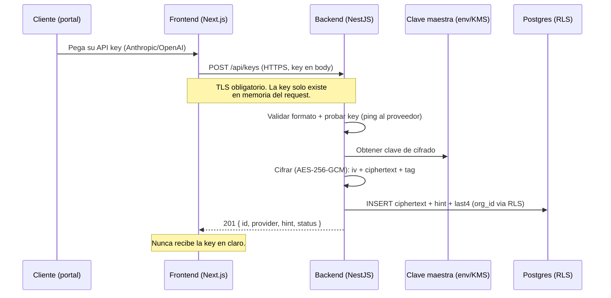
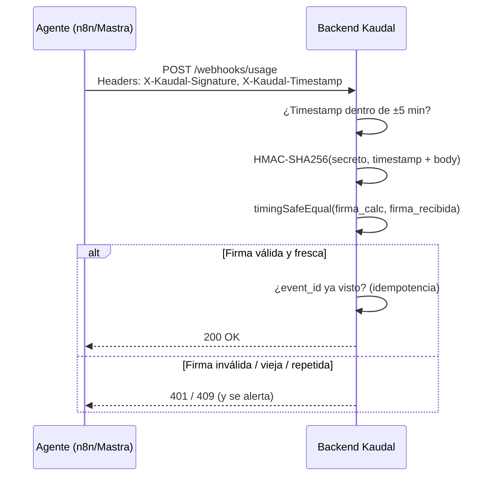

# 03 · Seguridad y Manejo de API Keys

> **Documento crítico.** Aquí se define cómo Kaudal recibe, cifra, guarda y usa las API keys de los clientes sin exponerlas jamás al frontend ni a los logs, cómo aislamos los datos entre organizaciones y cómo autenticamos a operadores y clientes. Si algo de este documento no se cumple en el código, es un bloqueante de release.

---

## 1. Principios de seguridad (no negociables)

| # | Principio | Implicancia técnica |
|---|-----------|---------------------|
| 1 | Las API keys de clientes se guardan **cifradas**, nunca en texto plano. | Cifrado autenticado (AES-256-GCM o libsodium `secretbox`) con clave del servidor. La columna en BD guarda solo el *ciphertext*. |
| 2 | El **frontend nunca ve** una API key. | La key no viaja de vuelta en ningún endpoint de lectura. Solo se expone un *hint* (`sk-ant-...4f2a`). |
| 3 | Las API keys **nunca aparecen en logs**, trazas ni mensajes de error. | Redacción obligatoria en el logger + validación de que el request body cifrado no se loguee. |
| 4 | **Aislamiento por `org_id`** en toda la data. | Row Level Security (RLS) en Postgres/Supabase. Ninguna query cruza organizaciones. |
| 5 | La **clave maestra de cifrado** no vive en el código ni en el repo. | Variable de entorno / secret manager. Rotable sin migrar datos (ver §2.4). |
| 6 | **Mínimo privilegio** en todo. | El operador ve todo; el cliente solo lo suyo. El backend descifra solo cuando el agente necesita usar la key. |
| 7 | Todo lo que entra se **valida y se firma**. | Webhooks con firma HMAC, requests con auth, rate limiting por tenant. |

---

## 2. Ciclo de vida de una API key de cliente

### 2.1 Flujo general



### 2.2 Recepción

- La key entra **solo** por `POST /api/keys` (o `PUT` para actualizar), siempre sobre **HTTPS/TLS**.
- El body con la key **no se loguea nunca** (interceptor de redacción, §5.3).
- Antes de guardar, el backend:
  1. **Valida el formato** según proveedor (`sk-ant-…` para Anthropic, `sk-…` / `sk-proj-…` para OpenAI).
  2. **Verifica que sirve**: hace un request barato de prueba al proveedor (ej. listar modelos). Si falla → `422`, no se guarda.
  3. Extrae un **hint** (`last4` = últimos 4 caracteres) para mostrar en UI sin exponer nada.

### 2.3 Cifrado (el corazón)

Usamos **cifrado autenticado con clave del servidor**. Recomendación de implementación: `libsodium` (`crypto_secretbox`, XSalsa20-Poly1305) o `AES-256-GCM` del módulo `crypto` de Node. Ambos entregan confidencialidad **e** integridad (detectan manipulación del ciphertext).

**Estructura de lo que se guarda** (nunca la key en claro):

```
almacenado = version || key_id || nonce/iv || ciphertext || auth_tag
```

| Campo | Descripción |
|-------|-------------|
| `version` | Versión del esquema de cifrado (permite migrar algoritmos). |
| `key_id` | Identificador de la clave maestra usada (habilita rotación, §2.4). |
| `nonce` / `iv` | Vector de inicialización **aleatorio y único por cifrado** (12 bytes GCM / 24 bytes secretbox). Nunca se reutiliza. |
| `ciphertext` | La key cifrada. |
| `auth_tag` | Tag de autenticación (16 bytes). Si el ciphertext se altera, el descifrado falla. |

Ejemplo de referencia (NestJS, AES-256-GCM):

```ts
// crypto.service.ts — referencia, no exponer nunca la salida en logs
import { randomBytes, createCipheriv, createDecipheriv } from 'crypto';

const ALG = 'aes-256-gcm';

encrypt(plaintext: string): EncryptedBlob {
  const key = this.getMasterKey();        // 32 bytes desde env/KMS, jamás hardcodeada
  const iv = randomBytes(12);             // nonce único por cifrado
  const cipher = createCipheriv(ALG, key, iv);
  const ct = Buffer.concat([cipher.update(plaintext, 'utf8'), cipher.final()]);
  const tag = cipher.getAuthTag();
  return { v: 1, keyId: this.currentKeyId, iv, ct, tag };
}

decrypt(blob: EncryptedBlob): string {
  const key = this.getMasterKey(blob.keyId);
  const decipher = createDecipheriv(ALG, key, blob.iv);
  decipher.setAuthTag(blob.tag);
  return decipher.update(blob.ct) + decipher.final('utf8');
}
```

**Reglas duras:**
- La **clave maestra** (32 bytes) vive en `KAUDAL_MASTER_KEY` (env) o en un KMS. **Nunca** en el repo, ni en el `.env` versionado, ni en el frontend.
- El **nonce/iv es aleatorio por cada operación** de cifrado. Reutilizar nonce en GCM rompe la seguridad.
- El descifrado **valida el tag**: si falla, se rechaza y se alerta (posible manipulación).

### 2.4 Rotación de clave maestra

La rotación **no requiere re-cifrar de inmediato** todo, gracias a `key_id`:

1. Se agrega una nueva clave maestra `key_id = 2`.
2. Toda **nueva** key de cliente se cifra con `key_id = 2`.
3. Un job en background re-cifra progresivamente los blobs con `key_id = 1` (descifra con la vieja, cifra con la nueva).
4. Cuando no quedan blobs con `key_id = 1`, se retira la clave vieja.

Rotación recomendada: **cada 6–12 meses**, o de inmediato ante sospecha de compromiso.

### 2.5 Uso de la key

- La key **solo** se descifra en el momento en que el agente del cliente necesita llamar al proveedor de modelo, en memoria del backend, y se descarta enseguida.
- Como Kaudal **no es proxy del modelo** (por ahora), en la práctica la key descifrada se entrega al runtime del agente (Mastra / n8n) por un canal seguro **server-to-server**, nunca pasa por el navegador.
- Cada descifrado queda **auditado** (quién, cuándo, para qué agente) — pero **sin** registrar la key.

### 2.6 Actualización y borrado

- **Actualizar**: `PUT /api/keys/:id` reemplaza el ciphertext completo (nuevo nonce). No hay "editar parcial".
- **Borrar**: `DELETE /api/keys/:id` elimina el registro. Si el cliente se da de baja, se purgan sus keys (ver Ley 19.628/21.719, §9).

---

## 3. Endpoints de API keys

| Método | Ruta | Rol | Descripción | Devuelve la key |
|--------|------|-----|-------------|:---------------:|
| `POST` | `/api/keys` | Cliente | Registra una nueva API key (valida + cifra). | ❌ |
| `GET` | `/api/keys` | Cliente | Lista sus keys (solo metadata + hint). | ❌ |
| `GET` | `/api/keys/:id` | Cliente | Detalle de una key (metadata). | ❌ |
| `PUT` | `/api/keys/:id` | Cliente | Reemplaza la key (re-cifra). | ❌ |
| `DELETE` | `/api/keys/:id` | Cliente | Elimina la key. | ❌ |
| `POST` | `/api/keys/:id/test` | Cliente | Prueba que la key siga válida contra el proveedor. | ❌ |

**Forma de un registro de key (lo que el frontend SÍ puede ver):**

```jsonc
{
  "id": "key_8f2a...",
  "org_id": "org_123",           // nunca editable por el cliente
  "provider": "anthropic",        // anthropic | openai
  "label": "Producción",
  "hint": "sk-ant-…4f2a",         // solo últimos 4
  "status": "valid",              // valid | invalid | untested
  "last_validated_at": "2026-08-25T14:03:00Z",
  "created_at": "2026-08-20T10:00:00Z"
}
```

Campos que **jamás** salen del backend: `ciphertext`, `iv`, `auth_tag`, la key en claro.

---

## 4. Aislamiento multi-tenant (RLS)

Todo dato pertenece a una **organización** (`org_id`). El aislamiento se aplica en **la base de datos**, no solo en el código de la app (defensa en profundidad).

### 4.1 Modelo

```mermaid
flowchart TD
    subgraph Postgres["Postgres / Supabase — RLS activo"]
        O[organizations]
        U[users -- role: operator | client]
        K[api_keys -- org_id]
        A[agents -- org_id]
        US[usage -- org_id]
        T[tickets -- org_id]
    end
    O --> U
    O --> K
    O --> A
    O --> US
    O --> T
    style K fill:#7C5CFF,color:#fff
```

### 4.2 Reglas RLS

- **RLS activado (`ENABLE ROW LEVEL SECURITY`) en todas las tablas** con `org_id`.
- Cada request lleva el `org_id` y el rol en el contexto de sesión de Postgres (claim del JWT).
- Política base para tablas de cliente:

```sql
-- El cliente solo ve/edita filas de su propia organización
CREATE POLICY tenant_isolation ON api_keys
  USING (org_id = current_setting('app.current_org')::uuid);

-- El operador (rol elevado) puede ver todas las organizaciones
CREATE POLICY operator_read_all ON api_keys
  FOR SELECT
  USING (current_setting('app.current_role') = 'operator');
```

- **Nunca** se confía solo en el `WHERE org_id = ...` de la app. Si el código olvida el filtro, RLS igual bloquea.
- La `service_role` key de Supabase **solo** se usa en el backend, jamás en el frontend. El frontend usa la `anon` key + JWT del usuario.

---

## 5. Autenticación, roles y sesiones

### 5.1 Roles

| Rol | Quién | Puede |
|-----|-------|-------|
| **operador** | El dueño (Raúl). | Ver y administrar todas las organizaciones, inscribir clientes, responder tickets, ver uso/costos globales, gestionar cobros. |
| **cliente** | Empresa inscrita por el operador. | Ver solo su portal: uso y costo de *sus* agentes, poner sus API keys, abrir dudas/reclamos. |

> El operador **crea** la cuenta del cliente (invitación). El cliente **no** se auto-registra.

### 5.2 Autenticación

- Auth basada en **Supabase Auth** (o JWT propio de NestJS), con tokens firmados.
- El **JWT** contiene: `sub` (user id), `org_id`, `role`. Se valida en cada request (guard de NestJS) y alimenta el contexto de RLS.
- **Contraseñas**: hash con `argon2id` (o `bcrypt` cost ≥ 12). Nunca en texto plano.
- **MFA / 2FA** recomendado para el operador (acceso total).

### 5.3 Sesiones y tokens

| Aspecto | Regla |
|---------|-------|
| Access token | Vida corta (15–60 min). |
| Refresh token | Rotativo, revocable, guardado en cookie **HttpOnly + Secure + SameSite=Strict**. |
| Logout | Invalida el refresh token en servidor. |
| Cookies | Nunca guardar JWT en `localStorage` (XSS). Preferir cookie HttpOnly. |
| Transporte | Solo HTTPS. HSTS habilitado. |

**Redacción en logs (interceptor obligatorio):**

```ts
// Campos que SIEMPRE se redactan antes de loguear
const REDACT = ['apiKey', 'api_key', 'key', 'authorization',
                'password', 'ciphertext', 'token', 'refresh_token'];
// Además: nunca loguear el body de POST/PUT /api/keys
```

---

## 6. Validación de webhooks

Kaudal registra agentes por **endpoint/webhook** y recibe reportes de uso desde los agentes. Todo webhook entrante se valida.

### 6.1 Reglas

1. **Firma HMAC-SHA256** en cada webhook. El emisor firma el payload con un secreto compartido por agente/organización; el backend recalcula y compara.
2. Comparación en **tiempo constante** (`crypto.timingSafeEqual`) para evitar timing attacks.
3. **Timestamp + ventana** (ej. ±5 min) para evitar *replay*. Payloads viejos se rechazan.
4. **Idempotencia**: cada evento trae un `event_id` único; los repetidos se descartan.
5. El secreto del webhook se guarda **cifrado** igual que las API keys.



### 6.2 Endpoint de webhook

| Método | Ruta | Auth | Descripción |
|--------|------|------|-------------|
| `POST` | `/webhooks/usage` | HMAC | Recibe reportes de uso de un agente (usos, tokens estimados, modelo). |

Headers requeridos: `X-Kaudal-Signature`, `X-Kaudal-Timestamp`, `X-Kaudal-Event-Id`.

---

## 7. Rate limiting

Protege contra abuso, fuerza bruta y costos descontrolados. Se aplica **por tenant** y **por endpoint**.

| Ámbito | Límite sugerido | Acción al exceder |
|--------|-----------------|-------------------|
| Login / auth | 5 intentos / min por IP+usuario | `429` + backoff exponencial + bloqueo temporal. |
| `POST /api/keys` y `/test` | 10 / min por org | `429`. |
| Webhooks `/webhooks/*` | Según volumen del agente, por org | `429` + alerta si es anómalo. |
| API general (lectura) | 100–300 / min por org | `429`. |

- Implementación: middleware de NestJS (`@nestjs/throttler`) con store en Redis (para escalar) o memoria (local/Raspberry).
- Respuesta `429` incluye `Retry-After`.
- **Lockout progresivo** en login tras N fallos.

---

## 8. Superficie de seguridad adicional

| Control | Detalle |
|---------|---------|
| **CORS** | Origen permitido restringido al dominio del frontend de Kaudal. |
| **Headers** | `Content-Security-Policy`, `X-Content-Type-Options: nosniff`, `X-Frame-Options: DENY`, `Strict-Transport-Security`. |
| **Validación de input** | DTOs con `class-validator` en NestJS. Rechazar payloads no esperados (`whitelist: true`, `forbidNonWhitelisted: true`). |
| **Inyección SQL** | Solo queries parametrizadas / ORM. Nunca concatenar strings. |
| **Secrets en repo** | `.gitignore` para `.env`. Escaneo de secrets en CI. |
| **Dependencias** | `npm audit` / Dependabot en CI. |
| **WebSocket (tiempo real)** | Autenticado con el mismo JWT; el socket solo emite eventos del `org_id` del usuario. |
| **Deploy** | En Raspberry/local: firewall, solo puertos necesarios, HTTPS con cert válido. En Railway: variables de entorno como secrets. |

---

## 9. Cumplimiento de datos en Chile (Ley 19.628 / 21.719)

Kaudal trata **datos personales** (contactos de clientes, potencialmente datos en los tickets) y **datos sensibles de negocio** (API keys, uso). Aplica la Ley 19.628 sobre protección de la vida privada, **modernizada por la Ley 21.719** (nueva Ley de Protección de Datos Personales, con Agencia de Protección de Datos y régimen de sanciones).

### 9.1 Obligaciones que respetamos

| Principio (Ley 21.719) | Cómo lo cumple Kaudal |
|------------------------|-----------------------|
| **Licitud y finalidad** | Los datos se usan solo para el servicio contratado (registrar, medir, cobrar). Se informa al cliente. |
| **Consentimiento / base legal** | El cliente acepta términos al ser inscrito; el tratamiento se apoya en la relación contractual. |
| **Seguridad de los datos** | Cifrado de API keys, RLS, TLS, control de acceso por rol (este documento es la evidencia técnica). |
| **Confidencialidad** | Acceso mínimo. El operador accede por necesidad; queda auditado. |
| **Calidad y exactitud** | El cliente puede corregir sus datos desde su portal. |
| **Derechos ARCO+ / derechos del titular** | Acceso, rectificación, cancelación (supresión) y oposición. Ver §9.2. |
| **Responsabilidad proactiva** | Registro de actividades de tratamiento, retención definida, respuesta a incidentes. |
| **Notificación de brechas** | Ante una vulneración de seguridad, se notifica a la Agencia y a los afectados según los plazos que fije la ley. |

### 9.2 Derechos del titular

- **Acceso**: el cliente ve sus datos en el portal; puede solicitar copia.
- **Rectificación**: edita sus datos.
- **Supresión / cancelación**: al darse de baja, se **purgan sus API keys** y datos personales, salvo lo que la ley obligue a conservar (ej. documentos tributarios DTE por el plazo legal del SII).
- **Oposición**: puede oponerse a tratamientos no esenciales.

### 9.3 Retención

| Dato | Retención |
|------|-----------|
| API keys | Mientras la cuenta esté activa. Se purgan al eliminar la key o dar de baja. |
| Datos de uso / costos estimados | Definido por contrato; agregables/anonimizables tras cierto tiempo. |
| Tickets (dudas/reclamos) | Mientras dure la relación + respaldo razonable. |
| Documentos tributarios (boleta/factura DTE) | El plazo legal del SII (no se borran antes por obligación tributaria). |

> **Nota:** los DTE y datos de cobro (Flow / LibreDTE) tienen obligaciones tributarias que **priman** sobre una solicitud de borrado. Eso se informa al titular.

---

## 10. Respuesta a incidentes (resumen)

1. **Detectar**: alerta por firma de webhook inválida, descifrado fallido (tag), picos de `429`, accesos anómalos.
2. **Contener**: revocar tokens, rotar clave maestra si se sospecha compromiso del cifrado, invalidar API keys afectadas y pedir al cliente que rote su key en el proveedor.
3. **Erradicar y recuperar**: parchar, re-cifrar, restaurar.
4. **Notificar**: a la Agencia de Protección de Datos y a los afectados según Ley 21.719.
5. **Documentar**: post-mortem sin filtrar secretos.

---

## 11. Checklist de seguridad (bloqueante de release)

**Cifrado y API keys**
- [ ] API keys guardadas cifradas con AES-256-GCM o libsodium (nunca en texto plano).
- [ ] Nonce/iv aleatorio y único por cada cifrado.
- [ ] Tag de autenticación validado en cada descifrado.
- [ ] Clave maestra en env/KMS, **no** en el repo ni en el frontend.
- [ ] Esquema con `key_id` para rotar la clave maestra sin migración masiva.
- [ ] La key en claro solo existe en memoria del backend y se descarta tras usarse.

**Exposición**
- [ ] Ningún endpoint devuelve la API key en claro (solo hint/last4).
- [ ] Logger redacta `apiKey`, `token`, `password`, `ciphertext`, `authorization`.
- [ ] `POST/PUT /api/keys` nunca loguea el body.

**Multi-tenant**
- [ ] RLS activado en todas las tablas con `org_id`.
- [ ] Políticas RLS probadas: un cliente no puede leer data de otra org.
- [ ] `service_role` de Supabase solo en backend; frontend usa `anon` + JWT.

**Auth y sesiones**
- [ ] JWT con `org_id` + `role`, validado en cada request.
- [ ] Contraseñas con argon2id/bcrypt cost ≥ 12.
- [ ] Refresh token en cookie HttpOnly + Secure + SameSite=Strict.
- [ ] MFA para el operador.
- [ ] Lockout progresivo en login.

**Webhooks y límites**
- [ ] Webhooks validados con HMAC-SHA256 en tiempo constante.
- [ ] Ventana de timestamp (±5 min) + idempotencia por `event_id`.
- [ ] Rate limiting por tenant en login, keys y webhooks.

**Transporte y superficie**
- [ ] TLS/HTTPS obligatorio en todo. HSTS activo.
- [ ] CORS restringido al dominio del frontend.
- [ ] Headers de seguridad (CSP, nosniff, X-Frame-Options).
- [ ] DTOs validados (`whitelist` + `forbidNonWhitelisted`).
- [ ] Queries parametrizadas / ORM (sin SQL concatenado).
- [ ] Secrets fuera del repo; escaneo de secrets en CI.

**Cumplimiento Chile**
- [ ] Cliente informado de finalidad y base legal (Ley 21.719).
- [ ] Flujo de supresión: purga de API keys y datos personales al dar de baja.
- [ ] Retención de DTE según plazo del SII documentada.
- [ ] Plan de notificación de brechas definido.

---

**Referencias internas:** `01 · Arquitectura`, `02 · Modelo de datos y RLS`, `04 · Cobro (Flow + DTE)`.