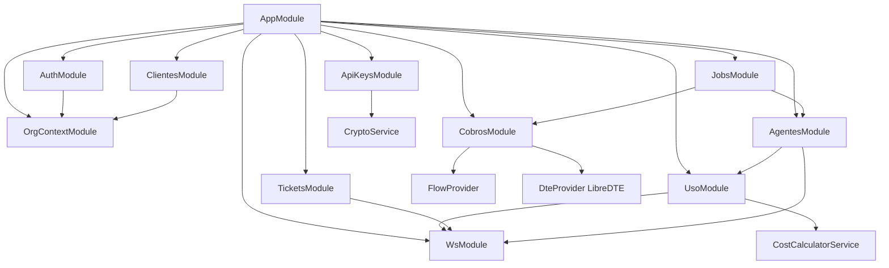
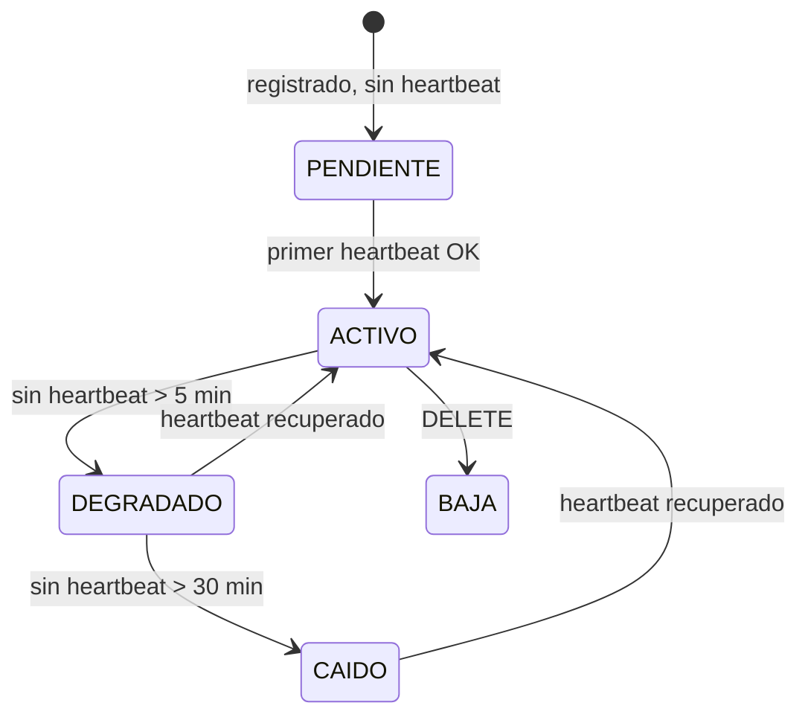
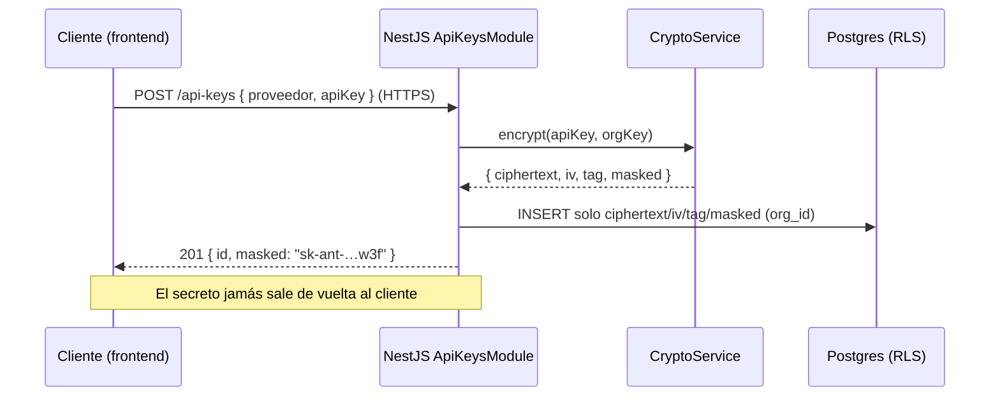
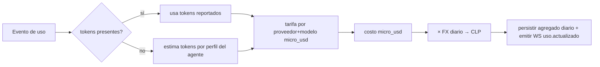
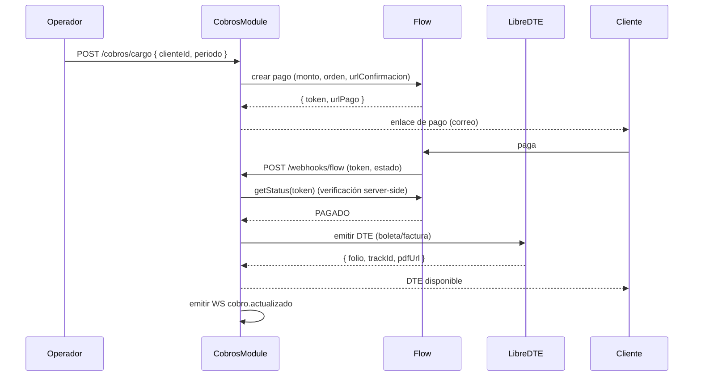

# 04 · Backend NestJS

> Capa de servicio de Kaudal. Expone la API REST + WebSocket que consume el frontend Next.js, orquesta la persistencia en Supabase/Postgres (con RLS) e integra Flow (cobro) y LibreDTE (boleta/factura). **No ejecuta agentes**: registra, mide, estima costo, cobra y despliega.

---

## 1. Alcance y principios

- **Framework:** NestJS (TypeScript estricto), API REST versionada bajo `/api/v1` + Gateway WebSocket bajo `/ws`.
- **Multi-tenant:** todo dato pertenece a una `org_id`. El backend nunca confía solo en la app: la aislación real vive en **RLS de Postgres**. El backend propaga el contexto de tenant a cada query.
- **API keys de clientes:** se reciben una sola vez, se **cifran con AES-256-GCM** (clave maestra en variable de entorno / KMS), se guardan solo cifradas y **jamás** se devuelven al frontend. El endpoint de lectura entrega máscara (`sk-ant-…w3f`) y metadatos, nunca el secreto.
- **Roles:** `OPERADOR` (Raúl, ve y administra todo dentro de su org) y `CLIENTE` (ve solo lo suyo). Se resuelve por JWT + guard + RLS.
- **Estimación, no proxy:** el costo se calcula (`usos × modelo`), no se interceptan llamadas al modelo. El uso llega **reportado por el agente** o **estimado** por calculadora.

### Convenciones transversales

| Aspecto | Decisión |
|---|---|
| Prefijo | `/api/v1/...` |
| Auth | `Authorization: Bearer <jwt>` (Supabase Auth) salvo ingesta de agentes |
| Ingesta de agentes | Header `X-Kaudal-Key: <agent_ingest_key>` (por agente, no es la API key del modelo) |
| Formato fechas | ISO 8601 UTC (`2026-08-26T14:03:00Z`) |
| Montos | CLP enteros; costos estimados en `micro_usd` (entero, 1 USD = 1.000.000) para evitar flotantes |
| Paginación | `?page=1&pageSize=50` → `{ data, page, pageSize, total }` |
| Errores | RFC 7807 (`application/problem+json`) |

### Formato de error estándar

```json
{
  "type": "https://kaudal.cl/errors/validation",
  "title": "Datos inválidos",
  "status": 422,
  "detail": "El campo endpointUrl no es una URL válida",
  "code": "AGENTS_INVALID_ENDPOINT",
  "traceId": "01J8Z…"
}
```

---

## 2. Mapa de módulos



| Módulo | Responsabilidad | Depende de |
|---|---|---|
| `AuthModule` | Login/registro, verificación de JWT de Supabase, guards y decorators de rol | OrgContext |
| `OrgContextModule` | Resuelve `org_id`/rol desde el request y lo inyecta a la capa de datos (RLS) | — |
| `ClientesModule` | El operador inscribe/administra empresas cliente y sus usuarios | OrgContext |
| `AgentesModule` | Registra agentes por endpoint/webhook, estado, heartbeat | Uso, Ws |
| `ApiKeysModule` | Alta/rotación/baja de API keys del cliente (cifradas) | Crypto |
| `UsoModule` | Ingesta de uso, agregaciones diarias, costo estimado | CostCalculator, Ws |
| `CobrosModule` | Suscripción Flow + emisión DTE (boleta/factura) | Flow, Dte |
| `TicketsModule` | Dudas y reclamos del cliente; respuesta del operador | Ws |
| `WsModule` | Gateway de tiempo real (uso, tickets, estado de agentes) | — |
| `JobsModule` | Cron: heartbeat, recordatorios de cobro, cierre de agregados | Agentes, Cobros |

---

## 3. Autenticación y autorización

- El frontend autentica con **Supabase Auth**; el backend valida el JWT (JWKS de Supabase) en `JwtAuthGuard`.
- El JWT incluye `sub` (user_id). El backend resuelve `org_id` y `role` desde la tabla `memberships`.
- `RolesGuard` + `@Roles('OPERADOR')` / `@Roles('CLIENTE','OPERADOR')` protegen rutas.
- **RLS**: por cada request se ejecuta `SET LOCAL app.current_org = <org_id>` y `app.current_role`, de modo que aunque haya un bug en un guard, Postgres no entrega datos de otra org.

### AuthModule — endpoints

| Método | Ruta | Auth | Rol | Descripción |
|---|---|---|---|---|
| POST | `/api/v1/auth/login` | pública | — | Devuelve sesión (delegado a Supabase) |
| POST | `/api/v1/auth/refresh` | refresh token | — | Renueva access token |
| GET | `/api/v1/auth/me` | Bearer | ambos | Perfil + org + rol del usuario actual |
| POST | `/api/v1/auth/logout` | Bearer | ambos | Invalida sesión |

**`GET /auth/me` — response**

```json
{
  "userId": "uuid",
  "email": "raul@kaudal.cl",
  "role": "OPERADOR",
  "org": { "id": "uuid", "nombre": "Kaudal", "rut": "77.123.456-7" }
}
```

---

## 4. ClientesModule

El **operador** inscribe empresas cliente y crea el usuario de acceso del cliente. El cliente no se autoregistra.

### Endpoints

| Método | Ruta | Auth | Rol | Descripción |
|---|---|---|---|---|
| GET | `/api/v1/clientes` | Bearer | OPERADOR | Lista de clientes de la org (paginada, búsqueda por `?q=`) |
| POST | `/api/v1/clientes` | Bearer | OPERADOR | Inscribe cliente + crea su usuario de acceso |
| GET | `/api/v1/clientes/:id` | Bearer | OPERADOR | Detalle de cliente |
| PATCH | `/api/v1/clientes/:id` | Bearer | OPERADOR | Edita datos (nombre, RUT, giro, contacto) |
| POST | `/api/v1/clientes/:id/estado` | Bearer | OPERADOR | Activa/suspende cliente |
| GET | `/api/v1/clientes/mi-empresa` | Bearer | CLIENTE | Datos de la propia empresa (solo lectura) |

### Campos — crear cliente

| Campo | Tipo | Req. | Notas |
|---|---|---|---|
| `nombre` | string | sí | Razón social o nombre de fantasía |
| `rut` | string | sí | Formato chileno, validado con dígito verificador |
| `giro` | string | no | Giro comercial (para DTE) |
| `contactoEmail` | string(email) | sí | Se usa para crear el usuario del cliente |
| `contactoNombre` | string | sí | — |
| `tipoDte` | enum(`BOLETA`,`FACTURA`) | sí | Documento por defecto para cobros |
| `plan` | enum(`BASICO`,`PRO`,`CUSTOM`) | sí | Define la suscripción Flow |

**Response 201**

```json
{
  "id": "uuid",
  "nombre": "Comercial XY SpA",
  "rut": "76.987.654-3",
  "estado": "ACTIVO",
  "usuarioCreado": { "userId": "uuid", "email": "pagos@xy.cl", "inviteEnviado": true }
}
```

> Al crear el cliente se genera su usuario en Supabase Auth y se envía correo de invitación con enlace para fijar contraseña. El cliente, al entrar, carga su **propia API key** (ver §6).

---

## 5. AgentesModule

Registra el agente que **ya corre** (n8n, Mastra, código propio) por su endpoint/webhook. Kaudal lo referencia, mide su uso y muestra su estado; no lo ejecuta.

### Endpoints

| Método | Ruta | Auth | Rol | Descripción |
|---|---|---|---|---|
| GET | `/api/v1/agentes` | Bearer | ambos | Lista (cliente ve los suyos; operador ve todos) |
| POST | `/api/v1/agentes` | Bearer | OPERADOR | Registra agente para un cliente |
| GET | `/api/v1/agentes/:id` | Bearer | ambos | Detalle + estado + últimas métricas |
| PATCH | `/api/v1/agentes/:id` | Bearer | OPERADOR | Edita nombre, modelo, endpoint |
| DELETE | `/api/v1/agentes/:id` | Bearer | OPERADOR | Baja lógica |
| POST | `/api/v1/agentes/:id/ingest-key/rotate` | Bearer | OPERADOR | Rota la clave de ingesta del agente |
| POST | `/api/v1/agentes/:id/heartbeat` | `X-Kaudal-Key` | agente | El agente reporta que está vivo |
| POST | `/api/v1/agentes/:id/test` | Bearer | OPERADOR | Ping al endpoint del agente y valida respuesta |

### Campos — registrar agente

| Campo | Tipo | Req. | Notas |
|---|---|---|---|
| `clienteId` | uuid | sí | Dueño del agente |
| `nombre` | string | sí | Ej. "Bot cotizaciones" |
| `runtime` | enum(`MASTRA`,`N8N`,`CUSTOM`) | sí | Origen del agente |
| `endpointUrl` | string(url) | sí | Webhook/endpoint que expone el agente |
| `modelo` | string | sí | Ej. `claude-sonnet-4`, `gpt-4o` (para estimar costo) |
| `proveedor` | enum(`ANTHROPIC`,`OPENAI`) | sí | Provee la tarifa de la calculadora |
| `metodoUso` | enum(`REPORTADO`,`ESTIMADO`) | sí | `REPORTADO`: el agente hace POST a `/uso`. `ESTIMADO`: calculadora por usos |

**Response 201** incluye la **clave de ingesta** una sola vez:

```json
{
  "id": "uuid",
  "nombre": "Bot cotizaciones",
  "estado": "PENDIENTE",
  "ingestKey": "kdl_ig_9f3a…d21",
  "ingestKeyNota": "Guárdala ahora: no se vuelve a mostrar. Úsala en el header X-Kaudal-Key."
}
```

### Estado del agente



**Heartbeat — request** (`X-Kaudal-Key`)

```json
{ "ts": "2026-08-26T14:03:00Z", "versionAgente": "1.4.0", "ok": true }
```

Cada cambio de estado emite evento WS `agente.estado` (ver §11).

---

## 6. ApiKeysModule (crítico de seguridad)

El cliente carga su propia API key del proveedor. **Nunca** en texto plano, **nunca** al frontend.

### Flujo de cifrado



- **Algoritmo:** AES-256-GCM. Clave maestra en `KAUDAL_MASTER_KEY` (env/KMS). Se deriva subclave por `org_id` (HKDF) para aislación por tenant.
- Se guarda `ciphertext`, `iv`, `authTag`, `masked`, `hashLookup` (HMAC para detectar duplicados sin descifrar). Nunca el plaintext.
- El descifrado solo ocurre **en el backend** y solo cuando un proceso interno lo requiere (hoy: validación de la key y, a futuro, si se ofrece proxy). El plaintext descifrado vive en memoria el mínimo tiempo y no se loguea.

### Endpoints

| Método | Ruta | Auth | Rol | Descripción |
|---|---|---|---|---|
| GET | `/api/v1/api-keys` | Bearer | CLIENTE | Lista enmascarada de las keys de la propia empresa |
| POST | `/api/v1/api-keys` | Bearer | CLIENTE | Carga/reemplaza key de un proveedor |
| POST | `/api/v1/api-keys/:id/validar` | Bearer | CLIENTE | Valida la key contra el proveedor (llamada mínima) |
| DELETE | `/api/v1/api-keys/:id` | Bearer | CLIENTE | Elimina la key |
| GET | `/api/v1/api-keys/estado` | Bearer | OPERADOR | Ve **solo** si cada cliente tiene key cargada (nunca el valor) |

### Campos — cargar key

| Campo | Tipo | Req. | Notas |
|---|---|---|---|
| `proveedor` | enum(`ANTHROPIC`,`OPENAI`) | sí | Un registro por proveedor por cliente |
| `apiKey` | string | sí | Secreto en claro solo en tránsito HTTPS; no se persiste en claro |

**Response 201 / GET (siempre enmascarado)**

```json
{
  "id": "uuid",
  "proveedor": "ANTHROPIC",
  "masked": "sk-ant-…w3f",
  "estado": "VALIDA",
  "cargadaEl": "2026-08-26T13:40:00Z",
  "ultimaValidacion": "2026-08-26T13:41:12Z"
}
```

> **Regla dura:** ningún endpoint devuelve el campo `apiKey` en claro. Cualquier PR que lo intente debe fallar en review.

---

## 7. UsoModule

Recibe el uso (reportado por el agente) o lo estima con la calculadora, y produce agregados diarios + costo estimado.

### Ingesta de uso

| Método | Ruta | Auth | Rol | Descripción |
|---|---|---|---|---|
| POST | `/api/v1/uso/ingest` | `X-Kaudal-Key` | agente | El agente reporta un uso (idempotente por `eventId`) |
| POST | `/api/v1/uso/batch` | `X-Kaudal-Key` | agente | Lote de usos |

**`POST /uso/ingest` — request**

```json
{
  "eventId": "uuid-o-hash-idempotente",
  "agenteId": "uuid",
  "ts": "2026-08-26T14:03:00Z",
  "modelo": "claude-sonnet-4",
  "inputTokens": 1820,
  "outputTokens": 640,
  "invocaciones": 1,
  "meta": { "canal": "webhook", "ref": "cotizacion-88" }
}
```

- **Idempotencia:** `eventId` único por org → reintentos no duplican.
- Si `metodoUso = ESTIMADO`, el agente puede omitir tokens y enviar solo `invocaciones`; la calculadora estima tokens por perfil del agente.

### Consultas (frontend)

| Método | Ruta | Auth | Rol | Descripción |
|---|---|---|---|---|
| GET | `/api/v1/uso/resumen` | Bearer | ambos | KPIs: usos hoy/mes, costo estimado mes, agente top |
| GET | `/api/v1/uso/diario` | Bearer | ambos | Serie por día `?desde=&hasta=&agenteId=` |
| GET | `/api/v1/uso/por-agente` | Bearer | ambos | Uso y costo agrupado por agente en el rango |
| GET | `/api/v1/uso/costo` | Bearer | ambos | Costo estimado desglosado por modelo/agente |

**`GET /uso/diario` — response**

```json
{
  "rango": { "desde": "2026-08-01", "hasta": "2026-08-26" },
  "moneda": "CLP",
  "puntos": [
    { "fecha": "2026-08-25", "invocaciones": 320, "inputTokens": 540200,
      "outputTokens": 180400, "costoEstimadoClp": 4210 },
    { "fecha": "2026-08-26", "invocaciones": 288, "inputTokens": 501000,
      "outputTokens": 165100, "costoEstimadoClp": 3980 }
  ]
}
```

### CostCalculatorService (servicio clave)

- Tabla de tarifas por `(proveedor, modelo)` en `micro_usd` por 1K tokens input/output, versionada por vigencia (`vigente_desde`).
- Costo evento = `(inputTokens/1000 · tarifaIn) + (outputTokens/1000 · tarifaOut)`.
- Conversión a CLP con `tipo_cambio` diario (tabla `fx_rates`, fuente configurable). Se guarda el FX usado para trazabilidad.
- **Es estimación**: la UI del cliente siempre rotula "Costo estimado".



---

## 8. CobrosModule

Suscripción vía **Flow** y emisión de DTE (boleta/factura) vía **LibreDTE**. El costo cobrado se basa en el plan del cliente y/o su uso estimado del período.

### Endpoints

| Método | Ruta | Auth | Rol | Descripción |
|---|---|---|---|---|
| GET | `/api/v1/cobros` | Bearer | ambos | Lista de cobros del cliente / de todos (operador) |
| POST | `/api/v1/cobros/suscripcion` | Bearer | OPERADOR | Crea/activa suscripción Flow para un cliente |
| POST | `/api/v1/cobros/cargo` | Bearer | OPERADOR | Genera un cobro puntual del período |
| GET | `/api/v1/cobros/:id` | Bearer | ambos | Detalle de un cobro + estado de pago + DTE |
| POST | `/api/v1/cobros/:id/dte` | Bearer | OPERADOR | Emite boleta/factura del cobro |
| GET | `/api/v1/cobros/:id/dte/pdf` | Bearer | ambos | Descarga PDF del DTE emitido |
| POST | `/api/v1/webhooks/flow` | firma Flow | Flow | Callback de resultado de pago (público, verificado) |

### Campos — crear suscripción

| Campo | Tipo | Req. | Notas |
|---|---|---|---|
| `clienteId` | uuid | sí | — |
| `plan` | enum(`BASICO`,`PRO`,`CUSTOM`) | sí | Define monto base |
| `montoClp` | int | según plan | Requerido si `CUSTOM` |
| `periodicidad` | enum(`MENSUAL`) | sí | Hoy solo mensual |
| `tipoDte` | enum(`BOLETA`,`FACTURA`) | sí | Documento a emitir |

### Flujo de cobro + pago + DTE



**Estados de cobro:** `PENDIENTE → EN_PAGO → PAGADO → DTE_EMITIDO` / `RECHAZADO` / `ANULADO`.

> El webhook de Flow **nunca** confía en el body: siempre re-consulta el estado con `getStatus(token)` server-side y valida la firma antes de marcar pagado.

---

## 9. Integraciones — interfaces (servicios clave)

### FlowProvider

```typescript
interface FlowProvider {
  crearPago(input: {
    ordenComercio: string;      // idempotente por cobro
    montoClp: number;
    asunto: string;
    emailPagador: string;
    urlConfirmacion: string;    // webhook backend
    urlRetorno: string;         // vuelta del cliente al portal
  }): Promise<{ token: string; urlPago: string }>;

  getEstado(token: string): Promise<{
    estado: 'PENDIENTE' | 'PAGADO' | 'RECHAZADO' | 'ANULADO';
    ordenComercio: string;
    montoClp: number;
    fechaPago?: string;
  }>;

  verificarFirmaWebhook(payload: unknown, firma: string): boolean;

  crearSuscripcion(input: {
    clienteId: string; planExternoId: string; emailPagador: string;
  }): Promise<{ suscripcionId: string }>;
}
```

### DteProvider (LibreDTE)

```typescript
interface DteProvider {
  emitir(input: {
    tipo: 'BOLETA' | 'FACTURA';   // 39 / 33 en SII
    receptor: { rut: string; razonSocial: string; giro?: string; direccion?: string };
    detalle: Array<{ nombre: string; cantidad: number; precioUnitarioClp: number }>;
    totalClp: number;
    fechaEmision: string;
  }): Promise<{
    folio: number;
    trackId: string;
    estadoSii: 'ENVIADO' | 'ACEPTADO' | 'RECHAZADO';
    pdfUrl: string;
    xml: string;
  }>;

  consultarEstado(trackId: string): Promise<{
    estadoSii: 'ENVIADO' | 'ACEPTADO' | 'RECHAZADO' | 'REPARO';
  }>;

  anular(folio: number, tipo: 'BOLETA' | 'FACTURA'): Promise<{ ok: boolean }>;
}
```

- Ambas integraciones se registran como providers inyectables, con implementación real + **implementación fake** para tests y para el modo local/Raspberry.
- Credenciales de Flow y LibreDTE viven en variables de entorno del backend, nunca en el frontend.

---

## 10. TicketsModule

Dudas y reclamos del cliente; el operador responde. Tiempo real vía WS.

### Endpoints

| Método | Ruta | Auth | Rol | Descripción |
|---|---|---|---|---|
| GET | `/api/v1/tickets` | Bearer | ambos | Cliente ve los suyos; operador ve todos (`?estado=&tipo=`) |
| POST | `/api/v1/tickets` | Bearer | CLIENTE | Abre duda o reclamo |
| GET | `/api/v1/tickets/:id` | Bearer | ambos | Detalle + hilo de mensajes |
| POST | `/api/v1/tickets/:id/mensajes` | Bearer | ambos | Agrega mensaje al hilo |
| POST | `/api/v1/tickets/:id/estado` | Bearer | OPERADOR | Cambia estado (`EN_CURSO`,`RESUELTO`,`CERRADO`) |

### Campos — abrir ticket

| Campo | Tipo | Req. | Notas |
|---|---|---|---|
| `tipo` | enum(`DUDA`,`RECLAMO`) | sí | — |
| `agenteId` | uuid | no | Si aplica a un agente puntual |
| `asunto` | string | sí | — |
| `mensaje` | string | sí | Primer mensaje del hilo |
| `prioridad` | enum(`BAJA`,`MEDIA`,`ALTA`) | no | Default `MEDIA` |

**Estados:** `ABIERTO → EN_CURSO → RESUELTO → CERRADO`. Cada mensaje nuevo o cambio de estado emite evento WS `ticket.actualizado`.

---

## 11. WsModule (tiempo real)

Gateway WebSocket (Socket.IO sobre NestJS) en `/ws`. El handshake exige el mismo JWT; el cliente se une a la room de su `org_id`, y el CLIENTE además solo a rooms de su empresa. El OPERADOR se une a la room global de su org.

### Autenticación del socket

```
connect → auth: { token: <jwt> }
→ backend valida JWT, resuelve org_id/rol
→ join room `org:<orgId>` (operador) o `cliente:<clienteId>` (cliente)
```

### Eventos emitidos por el servidor

| Evento | Payload | Quién lo recibe | Origen |
|---|---|---|---|
| `agente.estado` | `{ agenteId, estado, ts }` | operador + cliente dueño | Heartbeat / cron |
| `uso.actualizado` | `{ agenteId, fecha, invocaciones, costoEstimadoClp }` | operador + cliente dueño | Ingesta de uso |
| `cobro.actualizado` | `{ cobroId, estado, dteFolio? }` | operador + cliente dueño | Webhook Flow / DTE |
| `ticket.actualizado` | `{ ticketId, estado, ultimoMensaje }` | operador + cliente dueño | Tickets |
| `notificacion` | `{ tipo, titulo, detalle }` | según destinatario | Varios |

### Eventos recibidos del cliente

| Evento | Payload | Efecto |
|---|---|---|
| `ticket.typing` | `{ ticketId }` | Reenvía indicador de "escribiendo" a la contraparte del hilo |
| `subscribe.agente` | `{ agenteId }` | Suscribe al detalle en vivo de un agente (valida pertenencia) |

> Toda emisión respeta el aislamiento: se publica a rooms específicas, nunca broadcast global entre orgs.

---

## 12. JobsModule (cron)

Tareas programadas con `@nestjs/schedule`. En modo local/Raspberry corren en el mismo proceso; en Railway pueden separarse a un worker.

| Job | Frecuencia | Acción |
|---|---|---|
| `agentesHeartbeatCheck` | cada 1 min | Marca `DEGRADADO`/`CAIDO` según último heartbeat; emite `agente.estado` |
| `cierreAgregadoDiario` | 00:10 UTC | Consolida uso del día anterior en `uso_diario` |
| `recalculoCostoDiario` | 00:20 UTC | Recalcula costo estimado con FX del día |
| `recordatorioCobro` | 09:00 CLT diario | Notifica cobros `PENDIENTE`/vencidos (correo + WS) |
| `sincronizarEstadoDte` | cada 30 min | Consulta `estadoSii` de DTE `ENVIADO` no resueltos |
| `verificarPagosPendientes` | cada 15 min | Re-consulta `getEstado(token)` de pagos en `EN_PAGO` (reconciliación) |
| `alertaKeyInvalida` | cada 6 h | Reintenta validación de API keys marcadas inválidas; avisa al operador |

Cada job es **idempotente** y usa lock por `org` para evitar dobles ejecuciones si hay más de una instancia.

---

## 13. Estructura de carpetas

```
src/
├─ main.ts
├─ app.module.ts
├─ common/
│  ├─ guards/            (JwtAuthGuard, RolesGuard)
│  ├─ decorators/        (@Roles, @CurrentUser, @OrgId)
│  ├─ filters/           (ProblemDetailsFilter)
│  ├─ interceptors/      (OrgContextInterceptor → SET LOCAL RLS)
│  └─ pipes/             (validación con class-validator)
├─ modules/
│  ├─ auth/
│  ├─ org-context/
│  ├─ clientes/
│  ├─ agentes/
│  ├─ api-keys/          (+ crypto.service.ts)
│  ├─ uso/               (+ cost-calculator.service.ts)
│  ├─ cobros/
│  │  ├─ providers/flow.provider.ts
│  │  └─ providers/dte.provider.ts
│  ├─ tickets/
│  └─ ws/
├─ jobs/
└─ config/               (env, tarifas, fx)
```

---

## 14. Variables de entorno (backend)

| Variable | Uso |
|---|---|
| `DATABASE_URL` | Postgres/Supabase |
| `SUPABASE_JWT_JWKS_URL` | Validación de JWT |
| `KAUDAL_MASTER_KEY` | Clave maestra AES-256-GCM (API keys de clientes) |
| `FLOW_API_KEY` / `FLOW_SECRET` / `FLOW_BASE_URL` | Integración Flow |
| `LIBREDTE_TOKEN` / `LIBREDTE_BASE_URL` / `LIBREDTE_EMISOR_RUT` | Integración DTE |
| `FX_SOURCE_URL` | Tipo de cambio USD→CLP |
| `WS_ORIGIN_ALLOWLIST` | Orígenes permitidos para el gateway |

> `KAUDAL_MASTER_KEY`, `FLOW_SECRET` y `LIBREDTE_TOKEN` **jamás** se exponen al frontend ni se loguean. En Railway van como secrets; en local/Raspberry en `.env` fuera del control de versiones.

---

## 15. Reglas de seguridad no negociables

1. API keys de clientes: cifradas AES-256-GCM, aisladas por `org_id`, nunca en respuesta ni en logs.
2. RLS activo en todas las tablas con `org_id`; el backend siempre setea el contexto de tenant por request.
3. Webhooks (Flow) se verifican por firma **y** se reconcilian con `getEstado` server-side antes de marcar pagado.
4. Ingesta de agentes usa `X-Kaudal-Key` por agente, rotable, distinta de la API key del modelo.
5. Todo endpoint pasa por `JwtAuthGuard` + `RolesGuard`, salvo `login`, webhooks e ingesta (que usan su propio esquema).
6. El operador puede ver **si** un cliente tiene key cargada, nunca su valor.