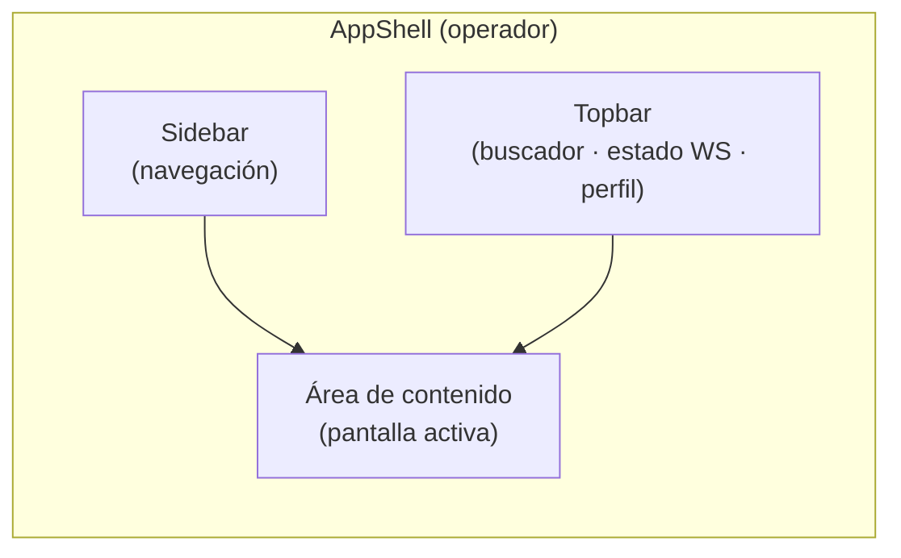
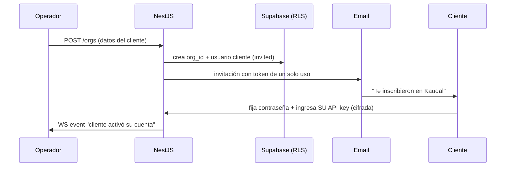
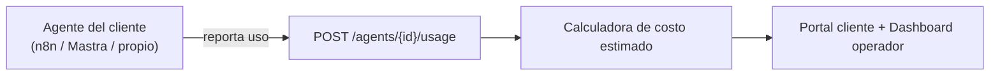
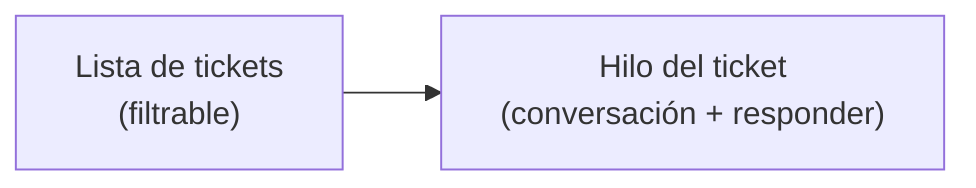
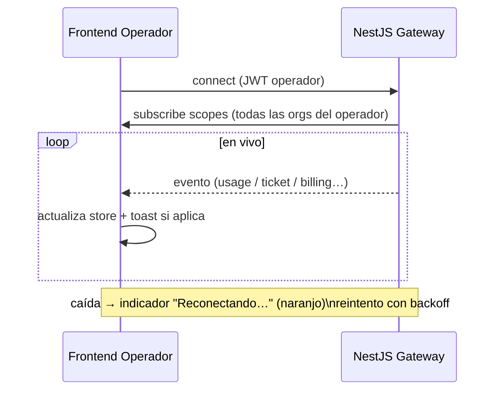

# 05 · Frontend Operador

> **Panel del operador (Raúl).** Es la consola donde el dueño administra TODO: inscribe clientes, registra los agentes que ya corren, mira uso y costos estimados, gestiona cobros y responde reclamos. Construido en **Next.js (App Router) + React + TypeScript + Tailwind**, modo oscuro por defecto, con estado en vivo vía **WebSocket** contra el backend NestJS.

---

## 1. Alcance y principios

El Frontend Operador es una SPA autenticada de un solo tenant lógico: el operador ve **todas las organizaciones** que él mismo inscribió. No es el portal del cliente (eso vive en el doc *06 · Frontend Cliente*).

Principios de diseño:

- **El operador nunca ve la API key en texto plano.** Ni siquiera él. El backend guarda la key cifrada y el frontend solo recibe metadatos (proveedor, últimos 4, estado de validación).
- **Costos siempre rotulados como "estimado".** Nunca se muestra un monto de consumo como si fuera un cargo real del proveedor. Ver *04 · Modelo de Costos*.
- **Todo lo caro de calcular llega por WebSocket o server component.** El cliente React no recalcula tokens.
- **Accionable sobre bonito.** Cada pantalla tiene una acción primaria clara.

---

## 2. Paleta y tokens de marca

Modo oscuro es el default y único soportado en v1.

| Token | Uso | Valor |
|---|---|---|
| `--bg-base` | Fondo app | `#0E0E13` |
| `--bg-surface` | Tarjetas, paneles | `#16161F` |
| `--bg-surface-2` | Filas hover, inputs | `#1E1E2A` |
| `--brand-violeta` | Primario, marca, CTA principal | `#7C5CFF` |
| `--brand-menta` | Éxito, activo, "en vivo", métricas positivas | `#00E0B8` |
| `--brand-naranjo` | Alertas, pendientes, reclamos abiertos | `#FF7A45` |
| `--text-primary` | Texto principal | `#F4F4F8` |
| `--text-muted` | Secundario, labels | `#9A9AAE` |
| `--border` | Bordes sutiles | `#2A2A38` |
| `--danger` | Errores, destructivo | `#FF5C7A` |

**Regla de color semántico:**
- **Violeta** = acción / marca / navegación activa.
- **Menta** = todo lo que está sano y corriendo (agente activo, key válida, pago conciliado, conexión en vivo).
- **Naranjo** = requiere atención del operador (reclamo abierto, cobro vencido, key por validar).

```
Tailwind config (extracto)
theme.extend.colors = {
  violeta:  '#7C5CFF',
  menta:    '#00E0B8',
  naranjo:  '#FF7A45',
  base:     '#0E0E13',
  surface:  '#16161F',
}
```

---

## 3. Layout general



**Sidebar — orden fijo:**

1. Dashboard
2. Clientes
3. Agentes
4. Uso
5. Cobros
6. Reclamos *(badge naranjo con conteo de abiertos)*
7. Ajustes

**Topbar:**
- Buscador global (`⌘K`): salta a un cliente, agente o ticket.
- **Indicador de conexión en vivo:** punto menta pulsante "En vivo" cuando el WS está conectado; naranjo "Reconectando…" si cae.
- Perfil del operador + cerrar sesión.

---

## 4. Rutas (App Router)

| Ruta | Pantalla | Render |
|---|---|---|
| `/` | Dashboard | Server component + WS |
| `/clientes` | Lista de clientes | Server + búsqueda cliente |
| `/clientes/nuevo` | Inscribir cliente | Client (formulario) |
| `/clientes/[orgId]` | Ficha de cliente | Server + WS |
| `/agentes` | Lista de agentes | Server |
| `/agentes/nuevo` | Registrar agente | Client (wizard) |
| `/agentes/[agentId]` | Ficha de agente | Server + WS |
| `/uso` | Panel de uso | Server + WS |
| `/cobros` | Cobros y suscripciones | Server |
| `/cobros/[subId]` | Detalle de cobro | Server |
| `/reclamos` | Bandeja de reclamos | Server + WS |
| `/reclamos/[ticketId]` | Hilo de reclamo | Server + WS |
| `/ajustes` | Ajustes del operador | Client |

---

## 5. Pantalla · Dashboard `/`

Vista de aterrizaje. Responde de un vistazo: *¿está todo corriendo?* y *¿qué necesita mi atención hoy?*

**Fila de KPIs (tarjetas `StatCard`):**

| KPI | Color acento | Detalle |
|---|---|---|
| Clientes activos | violeta | Total inscritos con al menos 1 agente activo |
| Agentes corriendo | menta | Activos / total; menta si 100% sano |
| Uso del mes | violeta | Usos totales del período |
| Costo estimado del mes | menta | Suma estimada, rótulo "estimado" |
| Reclamos abiertos | naranjo | Enlaza directo a la bandeja |
| Cobros por vencer | naranjo | Suscripciones con pago pendiente |

**Bloques inferiores:**
- **Actividad en vivo** (`LiveFeed`): stream WS de eventos — "Agente *Cotizador* de ACME registró 12 usos", "Nuevo reclamo de Comercial Andes". Cada fila con timestamp relativo ("hace 2 min").
- **Uso por día** (`UsageChart`, 30 días): barras violeta.
- **Salud de agentes** (`AgentHealthList`): agentes con problema arriba (key inválida, sin heartbeat).

**Copy es-CL (ejemplos):**
- Encabezado: *"Hola, Raúl. Esto es lo que está pasando hoy."*
- Estado sano: *"Todo corriendo. No hay nada urgente."*
- Con pendientes: *"Tienes 3 reclamos por responder y 1 cobro por vencer."*

---

## 6. Pantalla · Clientes `/clientes`

Lista de las organizaciones que el operador inscribió.

**Tabla (`ClientsTable`):**

| Columna | Contenido |
|---|---|
| Cliente | Nombre + RUT |
| Agentes | N° activos / total |
| Uso (mes) | Usos del período |
| Costo estimado | Monto CLP estimado |
| Key del cliente | Chip de estado (ver abajo) |
| Estado cobro | Al día / Pendiente / Vencido |
| Acciones | Ver ficha · Suspender |

**Chip de estado de key (`KeyStatusChip`):**

| Estado | Color | Texto |
|---|---|---|
| Válida | menta | "Key OK · Anthropic ••••4f2a" |
| Sin cargar | naranjo | "Sin key" |
| Inválida | danger | "Key con error" |
| Validando | violeta | "Validando…" |

Acción primaria: **"Inscribir cliente"** (botón violeta, esquina superior derecha).

---

## 7. Pantalla · Inscribir cliente `/clientes/nuevo`

El operador **crea la cuenta del cliente**. El cliente después entra y pone su propia API key; el operador **no** ingresa la key aquí.

**Formulario (`InscribirClienteForm`):**

| Campo | Tipo | Validación | Nota |
|---|---|---|---|
| Razón social | text | requerido | Nombre legal |
| Nombre de fantasía | text | opcional | Se muestra en portal |
| RUT | text | validador RUT-CL (módulo 11) | Único por operador |
| Giro | text | opcional | Para DTE |
| Email contacto | email | requerido, único | Recibe la invitación |
| Nombre del contacto | text | requerido | Persona que administra |
| Teléfono | tel | opcional | Formato CL |
| Plan | select | requerido | Enlaza a suscripción Flow |
| Enviar invitación ahora | toggle | default ON | Email con link de acceso |

**Flujo de invitación:**



**Copy es-CL:**
- Ayuda del campo RUT: *"Formato 12.345.678-9. Lo validamos al tiro."*
- Toggle invitación: *"Enviarle el correo de acceso ahora. Podrá poner su propia API key al entrar."*
- Éxito: *"Listo. Inscribiste a {cliente}. Le llegó la invitación a {email}."*

**Importante mostrar en pantalla (nota de seguridad):**
> *"Tú no ingresas la API key del cliente. Él la pone en su portal y queda cifrada. Nunca la vas a ver en texto plano."*

---

## 8. Pantalla · Ficha de cliente `/clientes/[orgId]`

Vista 360° de una organización.

**Encabezado:** nombre, RUT, plan, chip de estado de key, botón "Ir al portal del cliente" (vista previa).

**Pestañas:**

1. **Resumen** — KPIs del cliente (uso mes, costo estimado, agentes activos, estado de cobro).
2. **Agentes** — agentes de este cliente; botón "Registrar agente".
3. **Uso** — gráfico por día y por agente, filtrable por período.
4. **Cobros** — suscripción Flow, historial de pagos, boletas/facturas DTE emitidas.
5. **Reclamos** — tickets del cliente con su estado.
6. **Configuración** — datos, plan, estado de la key (solo metadatos), suspender/reactivar.

**Panel de key (`ClientKeyPanel`) — pestaña Configuración:**

| Dato mostrado | Ejemplo |
|---|---|
| Proveedor | Anthropic |
| Últimos 4 | ••••4f2a |
| Estado | Válida (menta) |
| Última validación | hace 3 h |
| Acción | "Pedir al cliente que la revalide" (envía notificación) |

Nunca hay botón "ver key" ni campo con el valor. Solo metadatos.

---

## 9. Pantalla · Agentes `/agentes`

Todos los agentes de todos los clientes, en una tabla filtrable.

**Filtros:** por cliente, por estado (activo / pausado / con error), por tipo (Mastra / n8n / código propio).

**Tabla (`AgentsTable`):**

| Columna | Contenido |
|---|---|
| Agente | Nombre + tipo (badge) |
| Cliente | Org dueña |
| Endpoint | Host + método (`POST /webhook/…`) |
| Estado | Activo (menta) · Pausado · Error (danger) |
| Último uso | Timestamp relativo |
| Uso (mes) | N° de usos |
| Modelo | Ej. `claude-…` para estimar costo |

Acción primaria: **"Registrar agente"** (violeta).

**Badge por tipo de agente:**
- `Mastra` — violeta (flagship)
- `n8n` — menta
- `Código propio` — gris/`--text-muted`

---

## 10. Pantalla · Registrar agente `/agentes/nuevo`

Registra un agente **que ya corre** afuera. Kaudal no lo ejecuta: lo apunta por endpoint/webhook y lo convierte en servicio cobrable y medible.

**Wizard de 3 pasos (`RegistrarAgenteWizard`):**

### Paso 1 — Identidad y dueño

| Campo | Tipo | Nota |
|---|---|---|
| Cliente (org) | select | A qué cliente pertenece |
| Nombre del agente | text | Visible para el cliente |
| Descripción | textarea | Qué hace, en simple |
| Tipo | radio | Mastra · n8n · Código propio |

### Paso 2 — Conexión (endpoint / webhook)

| Campo | Tipo | Validación |
|---|---|---|
| URL del endpoint | url | requerido, https |
| Método | select | POST (default) / GET |
| Autenticación | select | Ninguna · Header · Bearer · Firma HMAC |
| Header/secreto de auth | text | según selección; se guarda cifrado |
| Ruta de reporte de uso | text | opcional; dónde el agente reporta usos |

**Acción "Probar conexión" (`TestConnectionButton`):**
- Dispara un ping desde el backend al endpoint.
- Estados en vivo por WS: *Probando…* (violeta) → *Conectado* (menta) / *No responde* (danger) con el código de error.

### Paso 3 — Medición y costo

| Campo | Tipo | Nota |
|---|---|---|
| Modelo asociado | select | Para estimar costo por uso |
| Modo de conteo | radio | **Reportado por el agente** · **Estimado por Kaudal** |
| Tokens estimados por uso | number | Si es estimado; ver *04 · Modelo de Costos* |
| Precio de venta al cliente | number | Lo que el cliente paga por uso/plan (opcional) |

**Recordatorio en pantalla:**
> *"Kaudal no intercepta las llamadas al modelo. El consumo corre por la API key del cliente. Acá solo estimamos o recibimos el conteo que reporta el agente."*

**Al terminar:** genera `agent_id` y, si aplica, muestra la **URL de reporte de uso** que el agente debe llamar, con un ejemplo `curl`.



**Copy es-CL:**
- Paso 2 éxito: *"Conectado. Tu agente responde bien."*
- Paso 2 error: *"No pudimos llegar al endpoint. Revisa la URL o la autenticación."*
- Final: *"Agente registrado. Ya aparece en el portal de {cliente} y empezamos a medir su uso."*

---

## 11. Pantalla · Ficha de agente `/agentes/[agentId]`

**Encabezado:** nombre, cliente, badge de tipo, chip de estado, botones "Pausar" / "Editar" / "Probar conexión".

**Bloques:**
- **Datos de conexión** (endpoint, método, auth enmascarada).
- **Uso en vivo** (`AgentUsageLive`): contador que sube por WS a medida que se reportan usos; gráfico por día.
- **Costo estimado** del agente en el período, rótulo "estimado".
- **Errores recientes**: si el endpoint falló o reportó usos con formato inválido.

---

## 12. Pantalla · Uso `/uso`

Panel transversal de consumo de todos los clientes.

**Controles:** selector de período (Hoy · 7d · 30d · Mes actual · Rango), filtro por cliente, filtro por agente.

**Visualizaciones:**
- **Uso por día** (`UsageChart`): barras violeta apiladas por cliente.
- **Uso por agente** (`UsageByAgent`): ranking, top 10.
- **Costo estimado acumulado** (`EstimatedCostArea`): área menta, con banda de "estimado".
- **Tabla exportable** (`UsageTable`): cliente · agente · usos · costo estimado · botón "Exportar CSV".

**Rótulos obligatorios:**
- Todo monto lleva el sufijo *"(estimado)"* o un ícono con tooltip: *"Costo calculado por Kaudal, no es un cargo del proveedor del modelo."*

---

## 13. Pantalla · Cobros `/cobros`

Gestión de suscripciones **Flow** y boletas/facturas **DTE (LibreDTE)**.

**Tabla (`BillingTable`):**

| Columna | Contenido |
|---|---|
| Cliente | Nombre |
| Plan | Suscripción |
| Estado suscripción | Activa (menta) · Pendiente · Vencida (naranjo) · Cancelada |
| Próximo cobro | Fecha |
| Último pago | Monto + fecha |
| DTE | Boleta/Factura emitida (link) · "Pendiente de emitir" |
| Acciones | Ver detalle · Reintentar cobro · Emitir DTE |

**Detalle de cobro `/cobros/[subId]` (`BillingDetail`):**
- Estado del pago en Flow (con `flowOrder`, `commerceOrder`).
- Historial de intentos.
- Documento DTE: tipo (boleta/factura), folio, estado de emisión, PDF/XML, botón "Descargar".
- Botón "Emitir boleta/factura" (dispara LibreDTE) con estado en vivo: *Emitiendo…* (violeta) → *Emitida* (menta) / *Rechazada por SII* (danger).

**Copy es-CL:**
- Estado vencida: *"Este cliente tiene el pago atrasado. Puedes reintentar el cobro o avisarle."*
- DTE ok: *"Boleta emitida. Folio {n}. Ya está disponible para el cliente."*

---

## 14. Pantalla · Reclamos `/reclamos`

Bandeja donde el operador **responde** dudas y reclamos (tickets) que ponen los clientes desde su portal.

**Layout de dos columnas:**



**Lista (`TicketsList`):**

| Elemento | Detalle |
|---|---|
| Prioridad/estado | Abierto (naranjo) · En curso (violeta) · Resuelto (menta) |
| Tipo | Duda · Reclamo |
| Cliente | Org |
| Asunto | Título |
| Antigüedad | "hace 4 h" |
| Sin leer | Punto violeta si hay mensaje nuevo del cliente |

**Filtros:** por estado, por cliente, por tipo, "solo sin responder".

**Badge en sidebar:** conteo de abiertos en naranjo; se actualiza por WS al llegar un ticket nuevo.

**Estados en vivo:**
- Toast al entrar un ticket nuevo: *"Nuevo reclamo de {cliente}."*
- Indicador "cliente escribiendo…" si aplica (WS).

---

## 15. Pantalla · Hilo de reclamo `/reclamos/[ticketId]`

**Encabezado:** asunto, cliente, agente asociado (si aplica), estado (cambiable), tipo.

**Conversación (`TicketThread`):**
- Mensajes del cliente a la izquierda, del operador a la derecha (violeta).
- Marca de tiempo y estado de lectura.
- Adjuntos si los hay.

**Caja de respuesta (`TicketReplyBox`):**
- Textarea + adjuntos.
- Acciones: **"Responder"** (violeta), "Responder y marcar resuelto" (menta), "Marcar en curso".
- Respuestas guardadas / plantillas rápidas.

**Al responder:**
- El mensaje llega al portal del cliente en vivo (WS).
- Cambia el estado según la acción.

**Copy es-CL:**
- Placeholder: *"Escríbele al cliente. Sé claro y directo."*
- Al resolver: *"Marcado como resuelto. El cliente ve tu respuesta al tiro."*
- Reapertura: *"El cliente respondió. El ticket volvió a abrirse."*

---

## 16. Estado en vivo (WebSocket)

El operador trabaja sobre datos que cambian solos. Un único cliente WS (`useKaudalSocket`) alimenta todas las pantallas.

**Eventos que consume el frontend operador:**

| Evento | Payload (resumen) | Efecto en UI |
|---|---|---|
| `usage.reported` | `{ orgId, agentId, usos, costoEstimado }` | Sube contadores, feed, gráficos |
| `agent.status` | `{ agentId, estado }` | Actualiza chip/salud del agente |
| `client.activated` | `{ orgId }` | Toast + refresca lista de clientes |
| `key.validated` | `{ orgId, estado }` | Cambia `KeyStatusChip` |
| `ticket.created` | `{ ticketId, orgId, tipo }` | Badge naranjo + toast |
| `ticket.replied` | `{ ticketId, autor }` | Actualiza hilo y lista |
| `billing.updated` | `{ subId, estado }` | Refresca cobros |
| `dte.emitted` | `{ subId, folio, estado }` | Actualiza detalle de cobro |

**Patrón de conexión:**



**Indicadores globales de conexión:**
- Conectado: punto menta "En vivo".
- Reconectando: punto naranjo "Reconectando…".
- Sin conexión: banner discreto *"Estás viendo datos que pueden estar desactualizados."*

---

## 17. Catálogo de componentes

| Componente | Rol | Notas de estado |
|---|---|---|
| `AppShell` | Layout global | Sidebar + topbar + slot |
| `StatCard` | KPI numérico | `variant`: violeta/menta/naranjo; skeleton en carga |
| `LiveFeed` | Actividad en vivo | Stream WS, virtualizado |
| `UsageChart` | Barras uso/día | Loading, vacío, error |
| `AgentHealthList` | Salud de agentes | Ordena por severidad |
| `ClientsTable` | Lista clientes | Búsqueda server, paginado |
| `InscribirClienteForm` | Alta de cliente | Validación RUT-CL, invitación |
| `KeyStatusChip` | Estado de key | Solo metadatos, nunca el valor |
| `AgentsTable` | Lista agentes | Filtros por tipo/estado |
| `RegistrarAgenteWizard` | Alta de agente | 3 pasos + prueba de conexión |
| `TestConnectionButton` | Ping al endpoint | Estados en vivo por WS |
| `AgentUsageLive` | Uso en vivo del agente | Contador WS |
| `BillingTable` | Cobros | Reintentar, emitir DTE |
| `BillingDetail` | Detalle cobro + DTE | Estado emisión en vivo |
| `TicketsList` | Bandeja reclamos | Badge, filtros, sin leer |
| `TicketThread` | Hilo conversación | Burbujas, adjuntos |
| `TicketReplyBox` | Responder | Responder / resolver / en curso |
| `ConnectionBadge` | Estado WS | Menta/naranjo pulsante |
| `EstimatedCostTag` | Rótulo "estimado" | Reutilizable en todo monto |
| `EmptyState` | Estado vacío | Copy es-CL amistoso |
| `Toast` | Notificaciones | Info/éxito/alerta |

---

## 18. Estados por pantalla (carga · vacío · error)

Cada pantalla implementa los tres estados. Copy es-CL de referencia:

| Estado | Ejemplo de copy |
|---|---|
| **Carga** | Skeletons; sin spinners intrusivos. |
| **Vacío · Clientes** | *"Todavía no inscribes clientes. Parte por acá."* + botón "Inscribir cliente". |
| **Vacío · Agentes** | *"Este cliente aún no tiene agentes. Registra el que ya tiene corriendo."* |
| **Vacío · Reclamos** | *"Sin reclamos. Todo tranquilo por ahora."* |
| **Error de carga** | *"No pudimos cargar esto. Reintenta en un momento."* + botón "Reintentar". |
| **Sin conexión WS** | *"Estás viendo datos que pueden estar desactualizados."* |

---

## 19. Seguridad en el frontend

Reglas que el frontend operador cumple sin excepción:

- **Nunca recibe ni renderiza API keys de clientes.** El backend solo expone proveedor, últimos 4 y estado. No existe endpoint ni componente que traiga el valor.
- **Secretos de auth de endpoints** (Bearer, HMAC) se envían al backend al registrar el agente y **no vuelven** al frontend; se muestran enmascarados.
- **Aislamiento por `org_id` con RLS:** aunque el operador ve todas sus orgs, cada request va con su JWT y Postgres aplica RLS. El frontend no asume que "ve todo": pide solo lo que la pantalla necesita.
- **JWT del operador** en cookie `httpOnly`; el WS se autentica con el mismo token.
- **Acciones destructivas** (suspender cliente, pausar agente, cancelar suscripción) piden confirmación explícita con nombre del recurso tipeado o modal de confirmación.

**Copy es-CL de la nota de key (repetida donde corresponde):**
> *"Las API keys de tus clientes están cifradas y aisladas. Ni tú las ves en texto plano. Kaudal muestra solo el proveedor y los últimos 4 dígitos."*

---

## 20. Checklist de implementación

- [ ] `AppShell` con sidebar, topbar y `ConnectionBadge`.
- [ ] `useKaudalSocket` con reconexión y backoff.
- [ ] Dashboard con KPIs + `LiveFeed` + salud de agentes.
- [ ] CRUD de clientes con `InscribirClienteForm` (validador RUT-CL) e invitación.
- [ ] `RegistrarAgenteWizard` con "Probar conexión" en vivo.
- [ ] Panel de uso con rótulos "estimado" en todo monto.
- [ ] Cobros Flow + emisión DTE con estado en vivo.
- [ ] Bandeja de reclamos con badge, hilo y respuesta en vivo.
- [ ] `KeyStatusChip` que **jamás** trae el valor de la key.
- [ ] Estados carga/vacío/error con copy es-CL en cada pantalla.
- [ ] Paleta de marca aplicada vía tokens Tailwind (violeta/menta/naranjo, modo oscuro).

---

*Relacionados: 04 · Modelo de Costos · 06 · Frontend Cliente · 07 · API Backend (NestJS) · 08 · Datos y RLS (Supabase).*