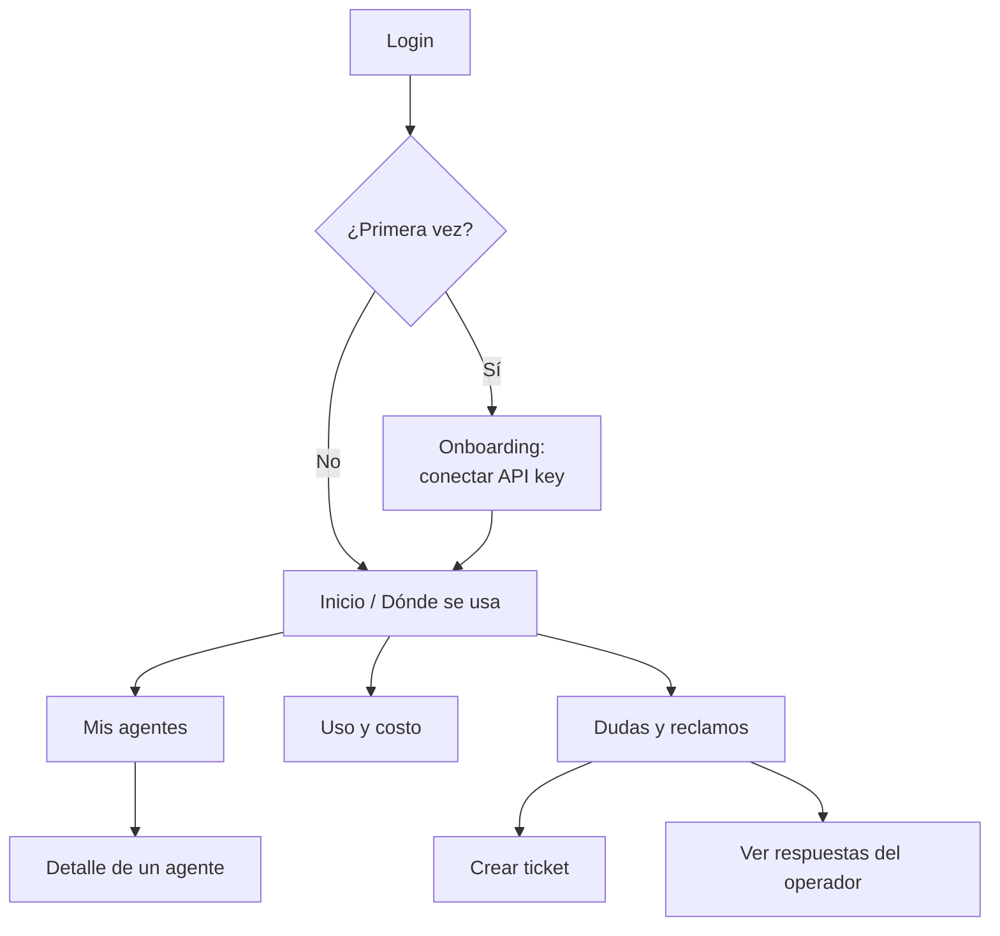
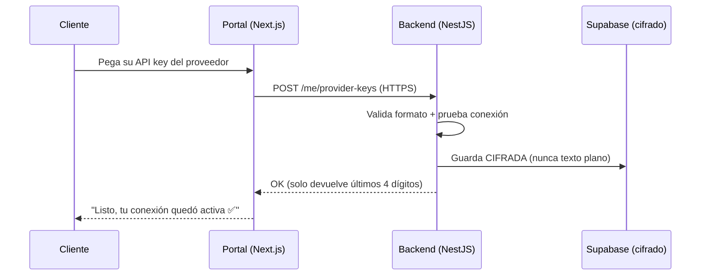
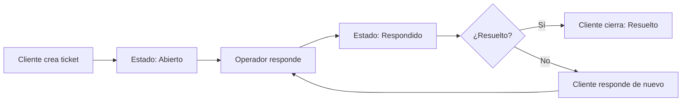

# 06 · Portal del Cliente (visual)

> **Para quién es esto:** el CLIENTE (la empresa que Raúl inscribe). Este documento describe cómo se ve y cómo se comporta el portal que usa el cliente. Es su cara pública de Kaudal: simple, en modo oscuro, sin jerga técnica.

---

## 1. Qué es el portal del cliente

Es el lugar donde el cliente entra a **ver su agente funcionando**: dónde se usa, cuánto se usa, cuánto le cuesta (estimado) y a preguntar o reclamar cuando algo no cuadra. No configura infraestructura, no ve código, no ve a otros clientes. Solo lo suyo.

Tres promesas que el portal debe cumplir de un vistazo:

| Promesa | Cómo se ve en pantalla |
|---|---|
| "Sé dónde se está usando mi agente" | Gráfico de uso por día y por agente |
| "Sé cuánto me va a costar" | Costo estimado del mes, siempre visible arriba |
| "Si algo falla, tengo a quién decirle" | Botón de Dudas y reclamos, siempre a mano |

**Reglas de tono:** tuteo, frases cortas, cero jerga. Nunca decimos "tokens", "endpoint", "payload". Decimos "usos", "conexión", "consultas".

---

## 2. Mapa del portal

**Navegación (barra lateral, íconos + texto):**

- 🏠 Inicio
- 🤖 Mis agentes
- 📊 Uso y costo
- 💬 Dudas y reclamos
- ⚙️ Mi cuenta

Barra superior fija: nombre de la empresa · costo estimado del mes · avatar/menú.

---

## 3. Onboarding — conectar la API key (paso a paso)

El cliente llega con una cuenta ya creada por el operador. Lo primero que ve es un asistente de 3 pasos. **No puede saltárselo:** sin API key, no hay uso que estimar.

### Flujo

### Pantalla del paso 1 — Bienvenida

> **Título:** ¡Hola, {nombre}! Bienvenido a Kaudal 👋
> **Bajada:** En 2 minutos dejamos tu agente conectado y funcionando. Empecemos.
> **Botón:** Comenzar

### Pantalla del paso 2 — Conectar tu API key

Este es el paso sensible. Debe transmitir seguridad **sin asustar**.

**Campos:**

| Campo | Tipo | Ayuda visible |
|---|---|---|
| Proveedor del modelo | Selector | Anthropic / OpenAI |
| Tu API key | Campo protegido (tipo contraseña, oculta) | "La pegas una vez. Queda guardada cifrada y nunca la mostramos completa." |

**Microcopy de confianza (bajo el campo, con ícono de candado 🔒):**

> Tu clave viaja cifrada y se guarda cifrada. Ni Kaudal ni tu operador la ven en texto. El consumo del modelo corre por tu cuenta, con tu clave.

**Validación en vivo:**
- Formato incorrecto → borde naranjo #FF7A45 + "Esa clave no tiene el formato de {proveedor}. Revísala."
- Conexión OK → tilde menta #00E0B8 + "Conexión verificada ✅"
- Conexión falla → "No pudimos conectar con esa clave. ¿La copiaste completa?"

**Botón:** Conectar y continuar

### Pantalla del paso 3 — Listo

> **Título:** ¡Todo conectado! 🎉
> **Bajada:** Ya podemos empezar a mostrarte dónde y cuánto se usa tu agente. Los primeros datos aparecen a medida que tu agente trabaja.
> **Botón:** Ir a mi panel

### Reglas de seguridad del onboarding (no negociables)

- La key **nunca** vuelve al frontend después de guardarse. La UI solo muestra `sk-…AB4F` (últimos 4).
- El campo de la key es `type="password"` con opción de "ver" temporal **solo antes** de enviar.
- Se guarda cifrada, aislada por `org_id`, con RLS. Ver documento 05 (Seguridad y multi-tenant).
- Reemplazar la key es posible en Mi cuenta, pero requiere volver a pegarla completa.

---

## 4. Inicio — "Dónde se usa" (la pantalla estrella)

Es lo primero que ve el cliente cada vez que entra. Debe responder en 3 segundos: *¿está funcionando? ¿cuánto llevo este mes? ¿algo raro?*

### Estructura visual (de arriba a abajo)

**1. Fila de tarjetas resumen (4 KPIs)**

| Tarjeta | Qué muestra | Color de acento |
|---|---|---|
| Usos este mes | 1.240 consultas | Violeta #7C5CFF |
| Costo estimado | ≈ $38.500 CLP | Menta #00E0B8 |
| Agentes activos | 2 de 2 funcionando | Menta #00E0B8 |
| Tickets abiertos | 1 esperando respuesta | Naranjo #FF7A45 |

> El "≈" y la palabra **estimado** van siempre. El costo NO es una factura: es un cálculo (usos × modelo). Nunca lo mostramos como monto exacto a cobrar.

**2. Gráfico "Uso por día"**

- Gráfico de barras/área, últimos 30 días.
- Eje Y: cantidad de usos. Eje X: días.
- Filtro rápido: 7 días · 30 días · Este mes.
- Al pasar el mouse: "14 de agosto · 82 usos · ≈ $2.400".

**3. Gráfico "Uso por agente"**

- Barras horizontales o dona: qué agente concentra el uso.
- Ejemplo: "Agente de cotizaciones — 68%" · "Agente de soporte — 32%".

**4. Franja inferior:** "¿Algo no cuadra con estos números? Cuéntanos →" (link a Dudas y reclamos).

### Estado vacío (recién conectado, sin datos aún)

> **Ilustración suave + texto:**
> **Título:** Aún no hay usos que mostrar
> **Bajada:** En cuanto tu agente empiece a trabajar, verás acá dónde y cuánto se usa, día a día. Suele tardar unos minutos desde la primera consulta.
> **Botón secundario:** Ver mis agentes

---

## 5. Mis agentes — lista y estado

El cliente ve la lista de agentes que el operador registró para él. Cada agente es una tarjeta.

### Tarjeta de agente

| Elemento | Contenido |
|---|---|
| Nombre | "Agente de cotizaciones" |
| Estado | 🟢 Funcionando / 🟡 Sin uso reciente / 🔴 Con problemas |
| Uso del mes | "820 usos este mes" |
| Costo estimado | "≈ $25.100 CLP" |
| Última actividad | "Hace 12 minutos" |
| Acción | Ver detalle → |

### Semántica de los estados (para el cliente, sin jerga)

| Punto | Etiqueta que ve el cliente | Qué significa por debajo |
|---|---|---|
| 🟢 Verde (menta) | Funcionando | Reportó uso recientemente, conexión OK |
| 🟡 Amarillo | Sin uso reciente | No hay actividad en X tiempo (no es un error) |
| 🔴 Rojo (naranjo) | Con problemas | Falló la conexión o la key dejó de validar |

Cuando el estado es 🔴, la tarjeta muestra una acción clara: **"Revisar conexión"** o **"Avisar al soporte"** (crea ticket precargado).

### Detalle de un agente

Al entrar a un agente, el cliente ve:

- Su gráfico de uso por día (solo ese agente).
- Su costo estimado del mes.
- **Dónde vive:** una descripción amable de dónde está desplegado ("Publicado y en línea" / "En pruebas"). Nunca URLs internas ni datos técnicos sensibles.
- Botón: **¿Tienes una duda sobre este agente?** → abre ticket precargado con el nombre del agente.

### Estado vacío (cliente sin agentes aún)

> **Título:** Todavía no tienes agentes conectados
> **Bajada:** Tu operador los está preparando. Apenas quede uno listo, aparecerá acá con su estado y su uso.
> **Botón:** Escribir a soporte

---

## 6. Uso y costo — la vista detallada

Misma data que el Inicio, pero con más control. Para el cliente que quiere mirar fino.

**Controles:**

- Rango de fechas (calendario).
- Agrupar por: día / semana / agente.
- Exportar: **Descargar resumen (CSV)** — solo lectura, para su contabilidad.

**Recuadro fijo "Cómo calculamos esto" (transparencia):**

> El costo es **estimado**: multiplicamos cuántas veces se usó tu agente por el precio del modelo que ocupa. No cobramos el modelo ni pasamos por medio de tus llamadas: tu proveedor te cobra por tu propia clave. Este número te sirve para tener una idea, no es una boleta.

Si el cliente además paga suscripción a Kaudal (Flow) y recibe boleta/factura DTE, esa parte vive en **Mi cuenta → Pagos**, separada del costo estimado del modelo, para no confundir ambos números.

---

## 7. Dudas y reclamos (tickets)

El canal directo cliente → operador. Simple como un chat, ordenado como una bandeja.

### Flujo

### Bandeja de tickets (lista)

| Columna | Ejemplo |
|---|---|
| Asunto | "El agente de cotizaciones no responde" |
| Tipo | Duda / Reclamo |
| Estado | 🟠 Abierto · 🔵 Respondido · 🟢 Resuelto |
| Última actualización | "Hoy, 15:20" |

**Botón principal, arriba a la derecha:** **+ Nueva duda o reclamo**

### Crear ticket

**Campos:**

| Campo | Tipo | Requerido | Ayuda |
|---|---|---|---|
| Tipo | Selector: Duda / Reclamo | Sí | — |
| Agente relacionado | Selector (o "General") | No | Se precarga si vienes desde un agente |
| Asunto | Texto corto | Sí | "Resume en una línea qué pasa" |
| Detalle | Texto largo | Sí | "Cuéntanos con calma qué esperabas y qué pasó" |
| Adjunto | Archivo (opcional) | No | "Una captura ayuda un montón" |

**Botón:** Enviar

**Confirmación:** "Listo, recibimos tu mensaje. Tu operador te responde por acá mismo. Te avisamos apenas conteste." (toast en menta #00E0B8).

### Detalle del ticket (conversación)

- Hilo tipo chat: mensajes del cliente a un lado, del operador al otro (con su nombre, ej. "Raúl · Soporte Kaudal").
- Tiempo real: cuando el operador responde, aparece sin recargar (WebSocket).
- Estado visible arriba.
- Acciones del cliente: **Responder** · **Marcar como resuelto**.

**Notificación en la barra superior:** badge naranjo cuando hay respuesta nueva sin leer.

### Estado vacío (sin tickets)

> **Título:** No tienes dudas ni reclamos abiertos 🎉
> **Bajada:** Si algo no cuadra —un número raro, un agente que no responde, una pregunta— escríbenos por acá. Te respondemos directo.
> **Botón:** + Nueva duda o reclamo

---

## 8. Mi cuenta

- **Datos de la empresa:** nombre, RUT, correo de contacto (edición básica).
- **Conexión del modelo:** proveedor + `sk-…AB4F` (solo últimos 4) + botón **Reemplazar clave**.
- **Pagos (si aplica):** estado de suscripción Flow, historial de boletas/facturas DTE descargables.
- **Cerrar sesión.**

**Al reemplazar la clave:**

> "Para cambiarla necesitamos que pegues la clave nueva completa. La anterior se elimina de forma segura." → mismo campo protegido del onboarding.

---

## 9. Microcopy — biblioteca rápida

| Situación | Texto |
|---|---|
| Cargando datos | "Buscando tus usos…" |
| Error de carga | "No pudimos cargar esto. Reintenta en un momento." + botón Reintentar |
| Sin conexión de internet | "Parece que te quedaste sin conexión. Revisa tu internet." |
| Key inválida detectada después | "Tu conexión dejó de funcionar. Revisa tu clave en Mi cuenta." |
| Guardado exitoso | "Guardado ✅" |
| Costo, siempre | Anteponer "≈" y usar la palabra **estimado** |
| Confirmar acción destructiva | "¿Seguro? Esto no se puede deshacer." |

---

## 10. Endpoints que consume el portal (referencia)

> Todos requieren sesión del cliente. El backend filtra por `org_id` con RLS: el cliente **jamás** ve datos de otra empresa.

| Método | Endpoint | Para qué | Notas de seguridad |
|---|---|---|---|
| `GET` | `/me` | Datos de la empresa y cuenta | Solo su `org_id` |
| `POST` | `/me/provider-keys` | Guardar/reemplazar API key | Cifra al recibir; nunca devuelve la key |
| `GET` | `/me/provider-keys` | Ver estado de la conexión | Devuelve solo proveedor + últimos 4 |
| `GET` | `/me/agents` | Lista de agentes y su estado | Filtrado por `org_id` |
| `GET` | `/me/agents/:id` | Detalle de un agente | Valida pertenencia |
| `GET` | `/me/usage?from=&to=&groupBy=` | Uso por día/agente | Datos estimados |
| `GET` | `/me/usage/estimate` | Costo estimado del período | Cálculo usos × modelo |
| `GET` | `/me/usage/export` | Descargar CSV | Solo lectura |
| `GET` | `/me/tickets` | Bandeja de tickets | Solo los suyos |
| `POST` | `/me/tickets` | Crear ticket | — |
| `GET` | `/me/tickets/:id` | Hilo del ticket | Valida pertenencia |
| `POST` | `/me/tickets/:id/messages` | Responder ticket | — |
| `PATCH` | `/me/tickets/:id` | Marcar resuelto | Solo el dueño |
| `WS` | `/ws/tickets` | Respuestas del operador en vivo | Suscrito a su `org_id` |

**Campos que el frontend NUNCA debe recibir:** la API key en texto, claves de otros clientes, IDs internos de infraestructura, URLs de webhooks o endpoints del agente.

---

## 11. Checklist de diseño (para que quede "bonito y simple")

- [ ] Modo oscuro por defecto. Fondos profundos, texto de alto contraste.
- [ ] Acentos: violeta #7C5CFF (primario), menta #00E0B8 (éxito/positivo), naranjo #FF7A45 (alerta/atención).
- [ ] El costo estimado, visible sin buscar, siempre con "≈" y "estimado".
- [ ] Todo estado vacío tiene título amable + una acción.
- [ ] Cero jerga técnica en textos de cara al cliente.
- [ ] La API key: campo protegido, candado 🔒, mensaje de confianza, nunca se muestra completa.
- [ ] Dudas y reclamos accesible desde cualquier pantalla.
- [ ] Respuestas del operador llegan en tiempo real (WebSocket) con aviso visible.
- [ ] Responsive: se ve bien en el teléfono del cliente.

---

**Relacionado:** 05 · Seguridad y multi-tenant (cifrado de keys, RLS) · 07 · Panel del Operador (el otro lado de los tickets) · 04 · Uso y costo estimado (cómo se calcula).