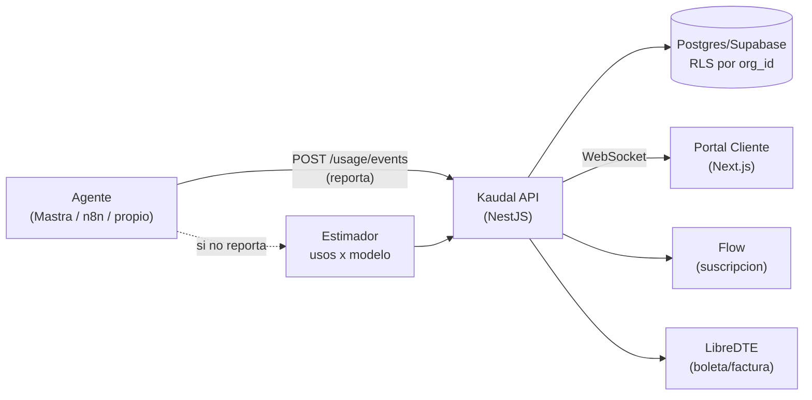
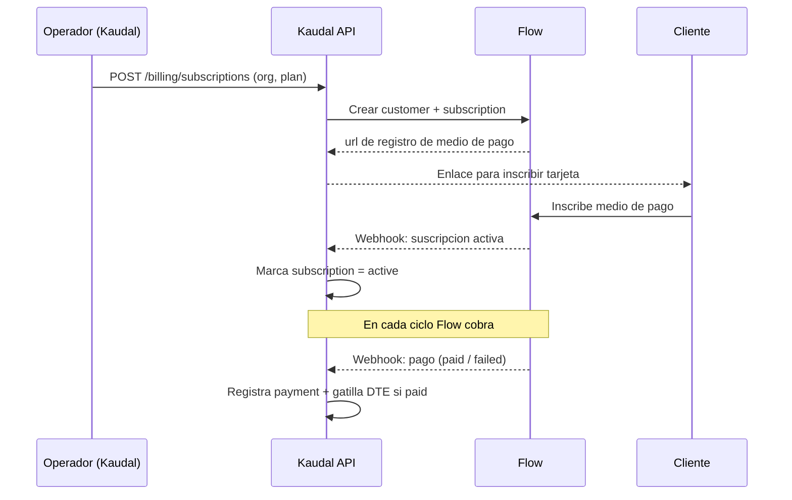
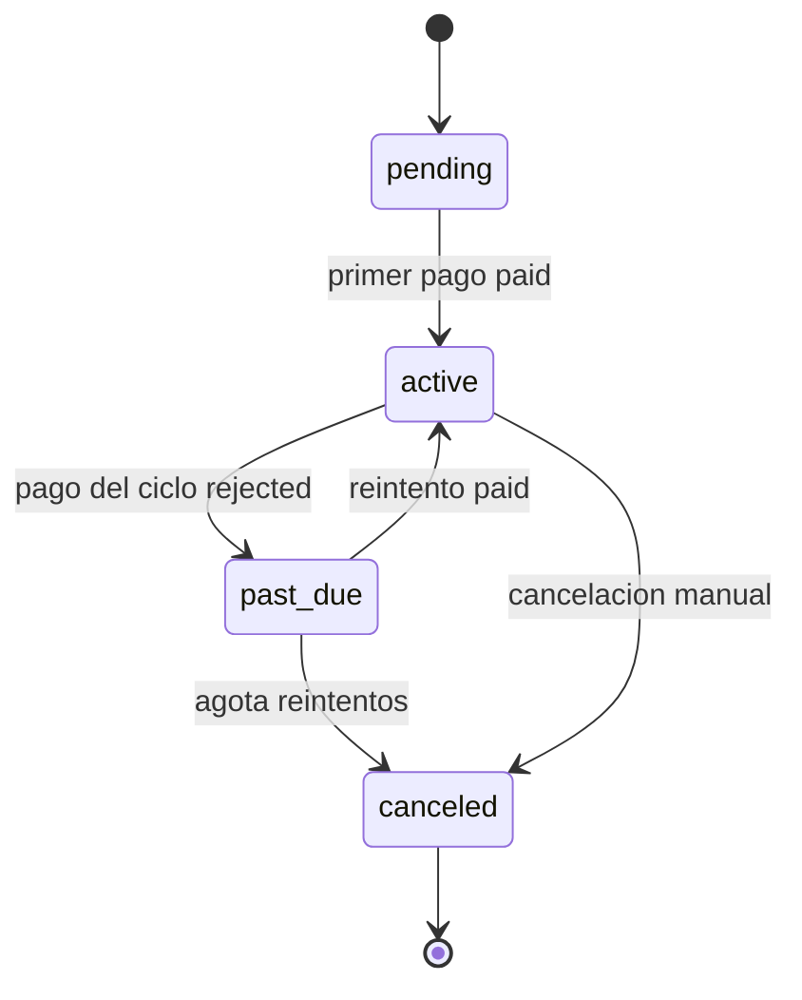
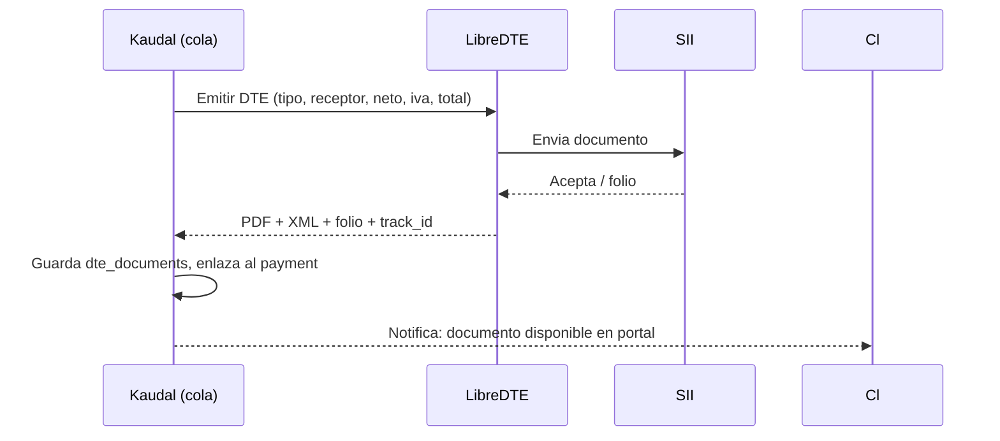
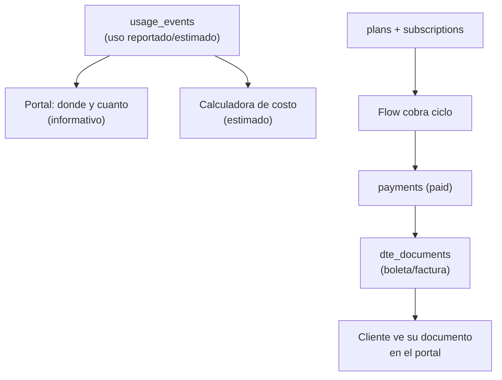

# 07 · Uso, Costos y Cobros

> Kaudal no es un motor de agentes ni un proxy de modelos. Este documento describe cómo Kaudal **captura/estima el uso** de un agente ya registrado, cómo lo **muestra** al operador y al cliente, cómo **estima costos** con la calculadora, y cómo **cobra** vía Flow (suscripción) y emite **boleta/factura DTE** con LibreDTE. Todo en CLP + IVA, aislado por `org_id` con RLS.

---

## 1. Alcance y principios

- **No interceptamos las llamadas al modelo.** El consumo del modelo corre por la **API key del propio cliente** (Anthropic/OpenAI). Kaudal solo **observa/estima** el uso; no es intermediario del token del modelo.
- **Dos fuentes de verdad para el uso:**
  1. **Uso reportado** — el agente (Mastra, n8n o código propio) emite un evento a Kaudal por cada ejecución.
  2. **Uso estimado** — cuando el agente no reporta, Kaudal estima con la fórmula `usos × modelo` (calculadora).
- **Costo siempre es estimado.** Lo mostramos como referencia; nunca lo presentamos como el cobro real del proveedor de modelo.
- **El cobro (Flow + DTE) es sobre el servicio Kaudal / plan del agente**, no sobre el consumo de tokens del cliente. Son dos planos distintos: *uso/costo estimado* (informativo) y *suscripción* (cobrable).
- **Multi-tenant:** todo evento, costo y cobro lleva `org_id`. RLS garantiza que un cliente solo ve lo suyo.



---

## 2. Captura de uso

### 2.1 Modos de captura

| Modo | Quién lo produce | Precisión | Cuándo se usa |
|---|---|---|---|
| **Reportado** | El agente llama a la API de Kaudal al terminar una ejecución | Alta (tokens reales si el agente los envía) | Mastra flagship y agentes instrumentados |
| **Estimado por evento** | Kaudal recibe la ejecución pero sin tokens; estima con perfil del agente | Media | n8n sin instrumentar tokens |
| **Estimado agregado** | No hay evento; se estima por conteo de invocaciones (webhook hits) | Baja | Fallback / agentes legacy |

### 2.2 Modelo de datos: `usage_events`

Tabla append-only. Un registro por ejecución del agente.

| Campo | Tipo | Descripción |
|---|---|---|
| `id` | uuid | PK |
| `org_id` | uuid | Tenant (cliente). Clave de RLS |
| `agent_id` | uuid | Agente registrado en Kaudal |
| `endpoint_id` | uuid | Endpoint/webhook por el que llegó |
| `occurred_at` | timestamptz | Momento de la ejecución (lo pone el agente) |
| `received_at` | timestamptz | Momento en que Kaudal recibió el evento |
| `source` | enum | `reported` \| `estimated_event` \| `estimated_aggregate` |
| `model` | text | p. ej. `claude-sonnet-4`, `gpt-4o` |
| `input_tokens` | int \| null | Tokens de entrada (si el agente los reporta) |
| `output_tokens` | int \| null | Tokens de salida |
| `units` | int | Nº de usos representados (normalmente 1) |
| `estimated_cost_clp` | numeric(12,2) | Costo estimado en CLP (calculado en ingest) |
| `status` | enum | `ok` \| `error` \| `timeout` |
| `metadata` | jsonb | Contexto libre (nombre de flujo, cliente final, etc.) |
| `idempotency_key` | text | Deduplicación de reintentos |

**Índices:** `(org_id, occurred_at)`, `(org_id, agent_id, occurred_at)`, único en `(org_id, idempotency_key)`.

### 2.3 Cómo reporta el agente

El agente autentica con un **token de ingest por agente** (no es la API key del modelo). Ese token identifica `org_id` + `agent_id`.

```
POST /usage/events
Authorization: Bearer <ingest_token_del_agente>
Idempotency-Key: <uuid-de-ejecucion>
Content-Type: application/json

{
  "occurred_at": "2026-08-26T14:03:11Z",
  "model": "claude-sonnet-4",
  "input_tokens": 1820,
  "output_tokens": 640,
  "units": 1,
  "status": "ok",
  "metadata": { "flow": "cotizador", "canal": "whatsapp" }
}
```

**Respuesta `202 Accepted`:**

```json
{ "id": "e3b0...", "source": "reported", "estimated_cost_clp": 12.40 }
```

Reglas de ingest:
- Si `input_tokens`/`output_tokens` vienen, `source = reported` y el costo se calcula con tarifa real del modelo.
- Si faltan, `source = estimated_event` y se usa el **perfil de tokens promedio** del agente (ver 3.3).
- `Idempotency-Key` obligatoria: reintentos del agente no duplican eventos.
- El endpoint **nunca** recibe ni almacena la API key del modelo del cliente.

### 2.4 Endpoints de uso

| Método | Ruta | Rol | Descripción |
|---|---|---|---|
| `POST` | `/usage/events` | Agente (ingest token) | Registra una ejecución |
| `GET` | `/usage/summary` | Operador / Cliente | Totales por rango: usos, tokens, costo estimado |
| `GET` | `/usage/by-agent` | Operador / Cliente | Desglose por agente |
| `GET` | `/usage/by-day` | Operador / Cliente | Serie diaria (para gráficos) |
| `GET` | `/usage/where` | Operador / Cliente | "Dónde se usa": por endpoint/canal (`metadata`) |
| `WS` | `/ws/usage` | Cliente | Empuje en tiempo real de nuevos eventos agregados |

Parámetros comunes de consulta: `from`, `to`, `agent_id?`, `granularity=day|hour`. Todos filtrados por `org_id` del token — un cliente **no** puede pasar otro `org_id`.

---

## 3. Estimación de costos (calculadora)

### 3.1 Fórmula base

El costo estimado de un evento es:

```
costo_evento_clp =
  ( input_tokens  / 1000 * tarifa_input_clp_por_1k(model)
  + output_tokens / 1000 * tarifa_output_clp_por_1k(model) )
  * units
```

Cuando no hay tokens (estimado), `input_tokens` y `output_tokens` se toman del **perfil del agente**.

Las tarifas del proveedor suelen estar en USD; se convierten a CLP con un **tipo de cambio configurable** (`fx_usd_clp`), guardado con la tarifa para trazabilidad.

### 3.2 Tabla `model_pricing`

| Campo | Tipo | Descripción |
|---|---|---|
| `model` | text | Identificador del modelo |
| `input_usd_per_1k` | numeric | Tarifa entrada por 1k tokens (USD) |
| `output_usd_per_1k` | numeric | Tarifa salida por 1k tokens (USD) |
| `fx_usd_clp` | numeric | Tipo de cambio usado |
| `effective_from` | date | Vigencia (histórico de precios) |
| `active` | bool | Tarifa vigente |

> El costo se congela en el evento (`estimated_cost_clp`) al momento del ingest. Cambiar la tarifa **no** reescribe históricos.

### 3.3 Perfil del agente (para estimación sin tokens)

| Campo | Descripción |
|---|---|
| `avg_input_tokens` | Promedio de tokens de entrada por uso |
| `avg_output_tokens` | Promedio de tokens de salida por uso |
| `default_model` | Modelo asumido si el evento no lo trae |

El perfil se calibra con los eventos `reported` reales del agente: mientras más reporta, mejor estima cuando no reporta.

### 3.4 Calculadora en el portal

Componente `<CostCalculator>` (Next.js). Deja al operador y al cliente simular costo **antes** de contratar volumen:

- Entradas: modelo, usos/mes estimados, tokens promedio (prellenados desde el perfil).
- Salida: costo estimado mensual en CLP, con IVA aparte, y comparación contra el uso real del último período.
- Endpoint de apoyo: `POST /usage/estimate` (sin persistir), devuelve el desglose.

```
POST /usage/estimate
{
  "model": "claude-sonnet-4",
  "monthly_uses": 4000,
  "avg_input_tokens": 1800,
  "avg_output_tokens": 600
}
```
```json
{
  "monthly_cost_clp": 512400,
  "per_use_clp": 128.10,
  "model": "claude-sonnet-4",
  "fx_usd_clp": 970
}
```

---

## 4. "Dónde se usa"

El portal del cliente muestra tres vistas, todas alimentadas por `usage_events` y actualizadas por WebSocket:

1. **Por día** — serie temporal de usos y costo estimado (`/usage/by-day`).
2. **Por agente** — cuánto aporta cada agente (`/usage/by-agent`).
3. **Por dónde** — desglose por `endpoint_id` y por `metadata.canal` (p. ej. WhatsApp, web, API) usando `/usage/where`.

Presentación (marca Kaudal, modo oscuro):
- Gráficos de área/barras en **violeta #7C5CFF** (uso) y **menta #00E0B8** (costo).
- Alertas o picos en **naranjo #FF7A45**.
- Lenguaje directo, tuteo, sin jerga: "Tu agente se usó **1.240 veces** esta semana, casi todo por WhatsApp".

---

## 5. Cobro: suscripción con Flow

Kaudal cobra el **plan del servicio** (no los tokens del cliente). Flow gestiona la suscripción recurrente en CLP.

### 5.1 Conceptos

| Concepto | En Kaudal | En Flow |
|---|---|---|
| Plan | `plans` (precio CLP + IVA, ciclo) | *plan* de suscripción |
| Cliente | `customers` (org) | *customer* |
| Suscripción | `subscriptions` | *subscription* |
| Pago | `payments` | *payment / invoice* |

### 5.2 Flujo de alta de suscripción



### 5.3 Endpoints de cobro

| Método | Ruta | Rol | Descripción |
|---|---|---|---|
| `POST` | `/billing/plans` | Operador | Crea/edita plan (precio neto CLP, ciclo) |
| `POST` | `/billing/subscriptions` | Operador | Crea suscripción para una org y devuelve enlace de pago |
| `GET` | `/billing/subscriptions/:id` | Operador / Cliente | Estado y próximos cobros |
| `POST` | `/billing/subscriptions/:id/cancel` | Operador | Cancela suscripción en Flow y en Kaudal |
| `POST` | `/webhooks/flow` | Flow (público, firmado) | Confirmación de pagos y cambios de estado |
| `GET` | `/billing/payments` | Operador / Cliente | Historial de pagos y su DTE asociado |

### 5.4 Webhook de Flow: validación de firma (crítico)

Flow notifica de forma asíncrona. **Nunca** se confía en el body sin validar. Patrón:

1. Flow envía un `token`; el webhook **no** trae los datos completos.
2. Kaudal llama a `getPaymentStatus(token)` **desde el backend**, autenticando con `apiKey` + firma `s` (HMAC-SHA256 de los parámetros ordenados, con el `secretKey` de Flow). Nunca se usa la respuesta del webhook como fuente de verdad.
3. Se verifica que el `commerceOrder` corresponde a una suscripción conocida de esa `org_id`.
4. Idempotencia: si el pago ya fue procesado (`flow_payment_id`), se ignora.

```
POST /webhooks/flow      (Content-Type: application/x-www-form-urlencoded)
token=ABC123...
```

Pseudocódigo del handler (NestJS):

```ts
@Post('webhooks/flow')
async flowWebhook(@Body('token') token: string) {
  // 1. Consultar estado REAL a Flow, firmado desde backend
  const status = await this.flow.getPaymentStatus(token); // valida firma 's'
  // 2. Validar comercio/suscripcion
  const sub = await this.subs.byCommerceOrder(status.commerceOrder);
  if (!sub) throw new BadRequestException();
  // 3. Idempotencia
  if (await this.payments.exists(status.flowOrder)) return { ok: true };
  // 4. Mapear estado -> registrar pago
  const payment = await this.payments.upsert(sub.orgId, status);
  // 5. Si quedo pagado, gatillar emision de DTE
  if (payment.status === 'paid') await this.dte.emit(payment.id);
  return { ok: true }; // Flow espera 200
}
```

Reglas de seguridad:
- El `secretKey` de Flow vive **solo** en el backend, cifrado, nunca en el frontend.
- La firma `s` se recalcula y compara en cada llamada a la API de Flow.
- El endpoint responde `200` rápido; el trabajo pesado (DTE, notificaciones) va a cola.

### 5.5 Estados de pago

Estado interno en `payments.status`:

| Estado Kaudal | Origen Flow | Significado | Acción |
|---|---|---|---|
| `pending` | 1 | Pago creado, esperando | Mostrar "en proceso" |
| `paid` | 2 | Pagado y confirmado | Emitir DTE, activar/continuar servicio |
| `rejected` | 3 | Rechazado | Notificar operador y cliente, reintento |
| `canceled` | 4 | Anulado | No emite DTE |
| `refunded` | — | Reembolsado (gestión manual) | Nota de crédito DTE |

Estado de la **suscripción** (`subscriptions.status`): `pending` → `active` → (`past_due` si falla un ciclo) → `canceled`.



---

## 6. Emisión de boleta / factura (DTE, LibreDTE)

Cada pago `paid` genera un DTE en Chile vía **LibreDTE**.

### 6.1 Tipo de documento

| Cliente | Documento | Código SII |
|---|---|---|
| Empresa con giro (pide factura) | **Factura electrónica** | 33 |
| Consumidor final / sin factura | **Boleta electrónica** | 39 |

La preferencia se define en `customers.dte_type` al inscribir al cliente (dato que carga el operador).

### 6.2 CLP + IVA

Todos los montos internos se guardan como **neto en CLP**. El DTE calcula:

```
neto   = monto_plan_clp
iva    = round(neto * 0.19)      // 19% Chile
total  = neto + iva
```

- Los precios de plan se ingresan **netos**; el portal muestra "neto + IVA = total" con claridad.
- Para **boleta (39)** el precio suele mostrarse con IVA incluido al cliente final, pero se desglosa internamente.
- Redondeo de IVA a peso entero (sin decimales en CLP).

### 6.3 Flujo de emisión



### 6.4 Tabla `dte_documents`

| Campo | Tipo | Descripción |
|---|---|---|
| `id` | uuid | PK |
| `org_id` | uuid | Tenant |
| `payment_id` | uuid | Pago que originó el DTE |
| `dte_type` | int | 33 (factura) \| 39 (boleta) |
| `folio` | int | Folio asignado por SII |
| `net_clp` | numeric | Neto |
| `iva_clp` | numeric | IVA (19%) |
| `total_clp` | numeric | Total |
| `status` | enum | `queued` \| `accepted` \| `rejected` |
| `track_id` | text | Seguimiento SII |
| `pdf_url` | text | PDF (almacenamiento privado, acceso por RLS) |
| `xml_url` | text | XML |
| `issued_at` | timestamptz | Fecha de emisión |

### 6.5 Endpoints DTE

| Método | Ruta | Rol | Descripción |
|---|---|---|---|
| `POST` | `/dte/emit` | Interno (cola) | Emite DTE para un pago `paid` |
| `GET` | `/dte/:id` | Operador / Cliente | Metadatos del documento |
| `GET` | `/dte/:id/pdf` | Operador / Cliente | Descarga PDF (verifica `org_id`) |
| `GET` | `/billing/payments/:id/dte` | Operador / Cliente | DTE asociado a un pago |

Reglas:
- La emisión es **idempotente por `payment_id`**: un pago no genera dos DTE.
- Si LibreDTE/SII rechaza, el DTE queda `rejected` y se alerta al operador (no se reintenta a ciegas).
- Los reembolsos generan **nota de crédito** (documento aparte, no borra el original).

---

## 7. Vista de conjunto: del uso al cobro



Dos planos que no se mezclan:

- **Plano informativo** (uso + costo estimado): ayuda al cliente a entender su consumo. No genera cobro.
- **Plano de cobro** (suscripción Flow → pago → DTE): es lo que efectivamente se factura por el servicio Kaudal.

---

## 8. Seguridad y multi-tenancy (resumen)

- Toda tabla de este módulo (`usage_events`, `payments`, `subscriptions`, `dte_documents`) lleva `org_id` y **política RLS**: el cliente solo lee su tenant.
- **API keys del modelo del cliente:** cifradas, aisladas por org, **nunca** viajan al frontend ni tocan estos flujos de uso/cobro.
- **Secretos de Flow y LibreDTE** (`secretKey`, certificados): solo backend, cifrados en reposo.
- **Firmas:** webhook de Flow validado siempre contra la API de Flow con HMAC; nada se confía del body directo.
- **Idempotencia** en tres puntos: ingest de uso (`Idempotency-Key`), pagos (`flow_payment_id`), DTE (`payment_id`).
- **PDF/XML de DTE** en almacenamiento privado; el acceso pasa por verificación de `org_id`.

---

## 9. Checklist de implementación

- [ ] Tabla `usage_events` con índices por `(org_id, occurred_at)` y RLS.
- [ ] Endpoint `POST /usage/events` con token de ingest por agente e idempotencia.
- [ ] Estimador `usos × modelo` con `model_pricing` y perfil del agente.
- [ ] Vistas `/usage/by-day`, `/usage/by-agent`, `/usage/where` + WebSocket.
- [ ] Calculadora `<CostCalculator>` y `POST /usage/estimate`.
- [ ] Integración Flow: crear plan, suscripción, enlace de pago.
- [ ] Webhook `/webhooks/flow` con validación de firma y consulta de estado real.
- [ ] Máquina de estados de `payments` y `subscriptions`.
- [ ] Emisión DTE con LibreDTE (33/39), CLP + IVA 19%, idempotente por pago.
- [ ] Portal del cliente: historial de pagos + descarga de boleta/factura.