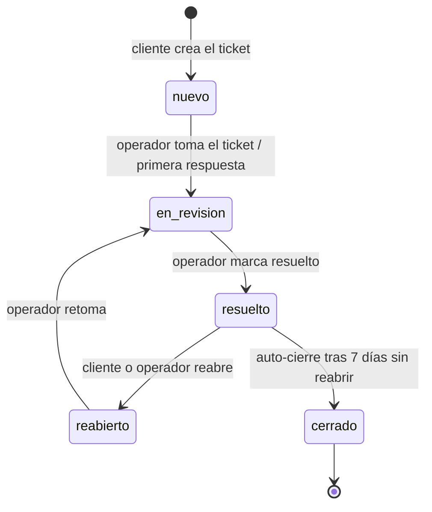
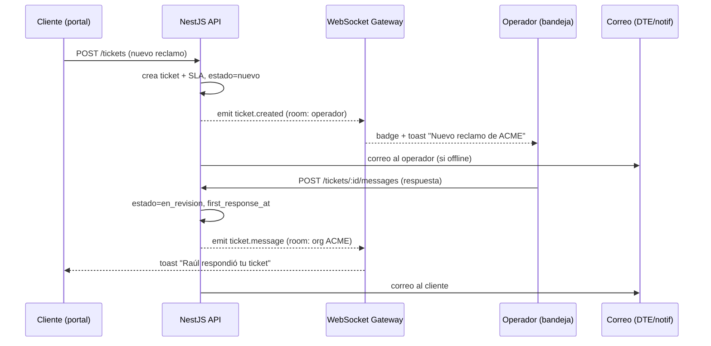
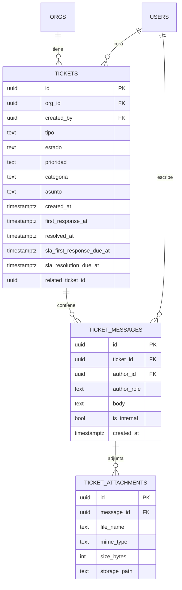
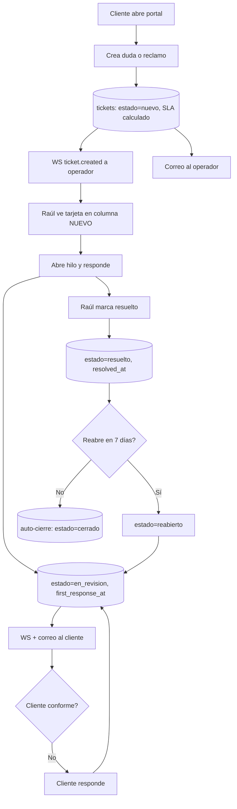

# 08 · Dudas, Reclamos y Soporte

> Módulo de **tickets** de Kaudal: el CLIENTE crea dudas y reclamos desde su portal, el OPERADOR (Raúl) los administra desde una bandeja tipo kanban, y ambos conversan en un hilo con adjuntos. Incluye estados, SLA simple, notificaciones en tiempo real y el modelo de datos con RLS.

---

## 1. Objetivo y alcance

El cliente que Raúl inscribe necesita un canal claro para preguntar ("¿por qué mi agente marcó más uso ayer?") o reclamar ("me cobraron una boleta que no corresponde"). Este módulo entrega ese canal **dentro del portal**, sin depender de correos sueltos ni WhatsApp.

**Sí hace:**
- Crear tickets (duda o reclamo) desde el portal del cliente.
- Bandeja del operador con vista kanban por estado.
- Hilo de mensajes bidireccional con adjuntos.
- Estados, prioridad y un SLA simple (tiempo de primera respuesta y de resolución).
- Notificaciones en tiempo real (WebSocket) y por correo.

**No hace (por ahora):**
- No es un chat en vivo tipo Intercom (es asíncrono, orientado a ticket).
- No enruta automáticamente a varios agentes de soporte: hay un solo operador.
- No integra proveedores externos de helpdesk (Zendesk, Freshdesk).

---

## 2. Conceptos y roles

| Concepto | Descripción |
|---|---|
| **Ticket** | Una duda o un reclamo. Tiene tipo, estado, prioridad, categoría y un hilo de mensajes. |
| **Hilo (thread)** | Secuencia de mensajes dentro del ticket. Cada mensaje tiene autor, cuerpo y adjuntos opcionales. |
| **Nota interna** | Mensaje visible **solo para el operador**. El cliente nunca la ve. Sirve para dejar contexto. |
| **SLA** | Compromiso simple de tiempo: primera respuesta y resolución, según prioridad. |

| Rol | Qué puede hacer con tickets |
|---|---|
| **CLIENTE** | Crea tickets de su propia org, responde en el hilo, adjunta archivos, ve el estado, reabre un ticket resuelto. **Solo ve los tickets de su `org_id`.** |
| **OPERADOR** | Ve la bandeja de **todas** las orgs, responde, cambia estado y prioridad, escribe notas internas, asigna categoría, cierra y reabre. |

> El cliente jamás ve tickets de otra org ni notas internas. Esto se garantiza con **RLS por `org_id`** más un flag `is_internal` filtrado en la API.

---

## 3. Estados del ticket

Flujo simple de tres estados operativos más dos terminales.



| Estado | Código | Significado | Quién lo gatilla |
|---|---|---|---|
| Nuevo | `nuevo` | Recién creado, sin respuesta del operador. Cuenta contra el SLA de primera respuesta. | Cliente (al crear) |
| En revisión | `en_revision` | El operador ya lo tomó o respondió; está en trabajo. | Operador |
| Resuelto | `resuelto` | El operador entregó una solución. El cliente aún puede reabrir. | Operador |
| Reabierto | `reabierto` | El cliente no quedó conforme o volvió a escribir tras "resuelto". | Cliente u operador |
| Cerrado | `cerrado` | Terminal. Auto-cierre a los 7 días de "resuelto" sin actividad, o cierre manual. | Sistema / operador |

**Reglas de transición**
- Un mensaje nuevo del **cliente** sobre un ticket `resuelto` lo pasa automáticamente a `reabierto`.
- Un mensaje nuevo del **operador** sobre un ticket `nuevo` lo pasa a `en_revision` (y marca la primera respuesta para el SLA).
- Solo el operador puede pasar a `resuelto` o `cerrado`.
- `cerrado` no admite nuevos mensajes: si el cliente escribe, se crea un **ticket nuevo** enlazado al anterior (`related_ticket_id`).

---

## 4. Prioridad, categoría y tipo

**Tipo** (lo elige el cliente al crear):

| Tipo | Uso |
|---|---|
| `duda` | Consulta, no bloqueante. |
| `reclamo` | Algo salió mal: cobro, uso incorrecto, agente caído. |

**Prioridad** (la fija el operador; por defecto se deriva del tipo):

| Prioridad | Default | Color UI |
|---|---|---|
| `baja` | dudas generales | gris |
| `media` | default de dudas | violeta `#7C5CFF` |
| `alta` | default de reclamos | naranjo `#FF7A45` |
| `urgente` | reclamo de cobro o agente caído | rojo/naranjo intenso |

**Categoría** (etiqueta interna del operador, opcional):

`cobro` · `uso_consumo` · `agente_caido` · `api_key` · `boleta_factura` · `general`

---

## 5. SLA simple

SLA solo de referencia operativa: mide y alerta, **no bloquea** ni penaliza automáticamente.

| Prioridad | Primera respuesta | Resolución objetivo |
|---|---|---|
| `urgente` | 2 horas hábiles | 1 día hábil |
| `alta` | 4 horas hábiles | 2 días hábiles |
| `media` | 1 día hábil | 3 días hábiles |
| `baja` | 2 días hábiles | 5 días hábiles |

- **Horario hábil:** lunes a viernes, 09:00–19:00 (hora de Chile, `America/Santiago`). Configurable por el operador.
- Se calculan dos marcas de tiempo desde la creación: `sla_first_response_due_at` y `sla_resolution_due_at`.
- La bandeja muestra un semáforo por ticket:
  - **Verde:** dentro de plazo.
  - **Ámbar (menta `#00E0B8` atenuado):** queda menos del 20% del plazo.
  - **Rojo:** plazo vencido (`breach`).
- Al registrar la primera respuesta del operador se congela `first_response_at` y se evalúa si hubo `breach`.

---

## 6. Notificaciones

Dos canales: **tiempo real** (WebSocket, dentro del portal) y **correo** (resumen para cuando no está conectado).



| Evento | Destinatario | WebSocket | Correo |
|---|---|---|---|
| `ticket.created` | Operador | Sí | Sí |
| `ticket.message` (del operador) | Cliente | Sí | Sí |
| `ticket.message` (del cliente) | Operador | Sí | Sí (agrupado) |
| `ticket.status_changed` | Cliente | Sí | Solo `resuelto` / `cerrado` |
| `sla.breach` | Operador | Sí | Sí |

**Rooms de WebSocket:**
- Operador se une a la room `operador:tickets` (recibe todo).
- Cada cliente se une a `org:{org_id}:tickets` (recibe solo lo suyo).
- El servidor **nunca** emite a una room de org distinta a la del recurso: aislamiento reforzado en el gateway, además de la RLS en datos.

---

## 7. Adjuntos

- Se suben a **Supabase Storage**, en un bucket privado `ticket-attachments`.
- Ruta: `ticket-attachments/{org_id}/{ticket_id}/{uuid}-{filename}`.
- El frontend nunca recibe una URL pública fija: se entregan **URLs firmadas** de corta duración (ej. 5 min) generadas por el backend.
- Límites: máx. **10 MB** por archivo, hasta **5** por mensaje.
- Tipos permitidos: `png, jpg, jpeg, pdf, csv, txt, log, json`. El resto se rechaza en el backend (validación por MIME + extensión).
- Política de Storage con RLS: solo miembros de la `org_id` del path y el operador pueden leer.

| Campo del adjunto | Tipo | Descripción |
|---|---|---|
| `id` | uuid | PK |
| `message_id` | uuid | Mensaje al que pertenece |
| `file_name` | text | Nombre original |
| `mime_type` | text | Validado en backend |
| `size_bytes` | int | ≤ 10 MB |
| `storage_path` | text | Ruta interna en el bucket |

---

## 8. Modelo de datos



### 8.1 Tabla `tickets`

| Campo | Tipo | Notas |
|---|---|---|
| `id` | uuid | PK |
| `org_id` | uuid | FK a `orgs`. Clave de aislamiento multi-tenant. |
| `created_by` | uuid | FK a `users`. |
| `tipo` | text | `duda` \| `reclamo`. |
| `estado` | text | `nuevo` \| `en_revision` \| `resuelto` \| `reabierto` \| `cerrado`. |
| `prioridad` | text | `baja` \| `media` \| `alta` \| `urgente`. |
| `categoria` | text | Etiqueta interna, nullable. |
| `asunto` | text | Título corto, obligatorio. |
| `created_at` | timestamptz | default `now()`. |
| `first_response_at` | timestamptz | Se llena en la 1ª respuesta del operador. |
| `resolved_at` | timestamptz | Se llena al pasar a `resuelto`. |
| `sla_first_response_due_at` | timestamptz | Calculado al crear. |
| `sla_resolution_due_at` | timestamptz | Calculado al crear. |
| `related_ticket_id` | uuid | Nullable. Enlaza a un ticket anterior cerrado. |

### 8.2 Tabla `ticket_messages`

| Campo | Tipo | Notas |
|---|---|---|
| `id` | uuid | PK |
| `ticket_id` | uuid | FK. |
| `author_id` | uuid | FK a `users`. |
| `author_role` | text | `cliente` \| `operador` (denormalizado para render rápido). |
| `body` | text | Cuerpo del mensaje. |
| `is_internal` | bool | `true` = nota interna, invisible al cliente. |
| `created_at` | timestamptz | default `now()`. |

### 8.3 RLS (Row Level Security)

```sql
-- El cliente solo ve tickets de su org
create policy "cliente ve sus tickets"
on tickets for select
using (
  org_id = auth.jwt() ->> 'org_id'::uuid
);

-- El operador ve todo (rol operador en el claim)
create policy "operador ve todos los tickets"
on tickets for select
using (
  (auth.jwt() ->> 'role') = 'operador'
);

-- Mensajes internos: el cliente nunca los lee
create policy "cliente no ve notas internas"
on ticket_messages for select
using (
  (auth.jwt() ->> 'role') = 'operador'
  or (
    is_internal = false
    and ticket_id in (
      select id from tickets
      where org_id = auth.jwt() ->> 'org_id'::uuid
    )
  )
);
```

> Regla de oro: **toda** consulta de tickets pasa por RLS. La API NestJS nunca hace queries con service-role para listar tickets de cara al cliente; usa el token del usuario para que la RLS aplique.

---

## 9. Endpoints (API REST · NestJS)

Prefijo: `/api/v1`. Autenticación por Bearer JWT (Supabase). El `org_id` y `role` viajan en el claim.

### 9.1 Cliente y operador

| Método | Ruta | Descripción | Rol |
|---|---|---|---|
| `POST` | `/tickets` | Crear ticket (duda/reclamo). | Cliente |
| `GET` | `/tickets` | Listar tickets (filtros por estado, tipo, prioridad, texto). | Cliente / Operador |
| `GET` | `/tickets/:id` | Detalle del ticket con su hilo. | Cliente / Operador |
| `POST` | `/tickets/:id/messages` | Agregar mensaje al hilo (con adjuntos). | Cliente / Operador |
| `POST` | `/tickets/:id/attachments/sign` | Pedir URL firmada de subida. | Cliente / Operador |
| `POST` | `/tickets/:id/reopen` | Reabrir un ticket `resuelto`. | Cliente / Operador |

### 9.2 Solo operador

| Método | Ruta | Descripción |
|---|---|---|
| `PATCH` | `/tickets/:id/status` | Cambiar estado (`en_revision`, `resuelto`, `cerrado`). |
| `PATCH` | `/tickets/:id` | Cambiar prioridad, categoría, asunto. |
| `POST` | `/tickets/:id/messages` (con `is_internal: true`) | Nota interna. |
| `GET` | `/tickets/metrics` | Métricas de bandeja: abiertos por estado, breaches SLA, tiempo medio de respuesta. |

### 9.3 Ejemplos de request/response

**Crear ticket**

```http
POST /api/v1/tickets
Authorization: Bearer <jwt-cliente>
Content-Type: application/json

{
  "tipo": "reclamo",
  "asunto": "Cobro no reconocido en boleta de agosto",
  "body": "Hola Raúl, me llegó una boleta por un uso que no calza con lo que veo en mi panel.",
  "attachment_ids": ["b1f2...", "c3d4..."]
}
```

```json
201 Created
{
  "id": "9a7c...",
  "estado": "nuevo",
  "prioridad": "alta",
  "tipo": "reclamo",
  "sla_first_response_due_at": "2026-08-26T17:30:00-04:00",
  "created_at": "2026-08-26T13:30:00-04:00"
}
```

**Listar con filtros**

```http
GET /api/v1/tickets?estado=nuevo&prioridad=urgente&q=cobro&page=1
```

**Cambiar estado (operador)**

```http
PATCH /api/v1/tickets/9a7c.../status
{ "estado": "resuelto" }
```

### 9.4 Eventos WebSocket

Namespace: `/tickets`. Eventos emitidos por el servidor:

| Evento | Payload (resumen) | Room |
|---|---|---|
| `ticket.created` | `{ id, org_id, tipo, prioridad, asunto }` | `operador:tickets` |
| `ticket.message` | `{ ticket_id, message_id, author_role, preview }` | `org:{org_id}:tickets` / `operador:tickets` |
| `ticket.status_changed` | `{ ticket_id, estado }` | ambos |
| `sla.breach` | `{ ticket_id, tipo_breach }` | `operador:tickets` |

---

## 10. Diseño de la bandeja del operador (kanban)

Vista principal de Raúl. Modo oscuro, columnas por estado, tarjetas arrastrables.

```
┌───────────────────────────────────────────────────────────────────────────┐
│  Soporte · Bandeja                       [ Buscar…]  [Filtros ▾]  [Métricas]│
├──────────────┬──────────────┬──────────────┬──────────────┬────────────────┤
│  NUEVO  (4)  │ EN REVISIÓN(3)│  RESUELTO (6)│  REABIERTO(1)│  CERRADO       │
├──────────────┼──────────────┼──────────────┼──────────────┼────────────────┤
│ ┌──────────┐ │ ┌──────────┐ │ ┌──────────┐ │ ┌──────────┐ │                │
│ │● ACME    │ │ │ Ferretería│ │ │ Panadería│ │ │● Estudio │ │   (colapsado)  │
│ │ Reclamo  │ │ │ Duda     │ │ │ Duda     │ │ │ Reclamo  │ │                │
│ │ Cobro... │ │ │ Uso...   │ │ │ API key  │ │ │ Boleta.. │ │                │
│ │🔴 SLA 1h │ │ │🟢        │ │ │🟢        │ │ │🟠        │ │                │
│ │ hace 20m │ │ │ hace 3h  │ │ │ ayer     │ │ │ hace 1h  │ │                │
│ └──────────┘ │ └──────────┘ │ └──────────┘ │ └──────────┘ │                │
│ ...          │ ...          │ ...          │              │                │
└──────────────┴──────────────┴──────────────┴──────────────┴────────────────┘
```

**Elementos de la tarjeta:**
- **Punto de tipo:** naranjo `#FF7A45` = reclamo, violeta `#7C5CFF` = duda.
- **Org** (nombre de la empresa cliente) + asunto truncado.
- **Semáforo SLA:** verde / ámbar / rojo.
- **Antigüedad relativa** ("hace 20m").
- **Badge "sin leer"** en menta `#00E0B8` cuando hay mensaje nuevo del cliente.

**Interacciones:**
- Arrastrar tarjeta entre columnas = `PATCH /status` (con confirmación al pasar a `cerrado`).
- Click en tarjeta = abre el hilo en panel lateral (drawer), sin salir de la bandeja.
- Filtros: por org, tipo, prioridad, categoría, "solo con SLA vencido".
- Orden dentro de columna: por prioridad y luego por antigüedad (los urgentes y viejos arriba).
- Actualización **en vivo** vía WebSocket: nuevas tarjetas aparecen sin recargar.

---

## 11. Diseño del hilo de mensajes

Usado tanto en el drawer del operador como en el portal del cliente. La diferencia: el cliente **no ve** notas internas.

```
┌─────────────────────────────────────────────┐
│  ← Cobro no reconocido · ACME    🔴 alta  ⋮  │
│  Reclamo · Categoría: cobro · #9a7c          │
│  ─────────────────────────────────────────  │
│                                             │
│   ┌─ ACME (cliente) · hace 20m ───────────┐ │
│   │ Hola Raúl, me llegó una boleta por... │ │
│   │ 📎 boleta-agosto.pdf                   │ │
│   └───────────────────────────────────────┘ │
│                                             │
│        ┌─ Raúl (operador) · hace 12m ─────┐ │
│        │ Hola, lo reviso ahora y te aviso.│ │
│        └──────────────────────────────────┘ │
│                                             │
│   ╔═ Nota interna (solo operador) ════════╗ │
│   ║ Revisar tabla de usos del 24-ago      ║ │
│   ╚═══════════════════════════════════════╝ │
│                                             │
│  ─────────────────────────────────────────  │
│  [ Escribe una respuesta…            ] [📎]  │
│  ( ) Nota interna      [   Enviar   ]        │
│  Estado ▾  Prioridad ▾  Categoría ▾          │
└─────────────────────────────────────────────┘
```

**Detalles:**
- Burbujas alineadas: cliente a la izquierda, operador a la derecha.
- **Nota interna** con borde/fondo distinto (violeta atenuado) y etiqueta clara; solo aparece en la vista del operador.
- Adjuntos como chips con ícono; al hacer click el backend entrega la URL firmada.
- Barra inferior del operador incluye el toggle "Nota interna" y accesos rápidos a estado/prioridad/categoría.
- En el **portal del cliente**, la barra inferior es solo el campo de texto + adjuntar; sin controles de estado.
- Indicador de "enviando…" optimista; si falla el POST, la burbuja queda marcada con reintentar.

---

## 12. Portal del cliente · crear ticket

Formulario simple, tuteo, sin jerga:

| Campo | Control | Obligatorio |
|---|---|---|
| ¿Qué necesitas? | Selector: **Tengo una duda** / **Quiero hacer un reclamo** | Sí |
| Asunto | Texto corto | Sí |
| Cuéntanos más | Área de texto | Sí |
| Adjuntar archivos | Subida (drag & drop, hasta 5) | No |

Al enviar: se crea el ticket, aparece de inmediato en "Mis tickets" con estado **Nuevo**, y el cliente ve un mensaje: *"Listo, recibimos tu mensaje. Te vamos a responder pronto."*

**Lista "Mis tickets" (cliente):** tabla/cards con asunto, tipo, estado (badge con color), última actividad. Filtro por estado. Sin kanban (es más simple para el cliente).

---

## 13. Flujo completo (extremo a extremo)



---

## 14. Reglas de negocio y borde

- **Auto-cierre:** job programado (cron cada hora) que pasa a `cerrado` los tickets `resuelto` con más de 7 días sin actividad.
- **SLA en horario hábil:** el cálculo de vencimientos descuenta noches y fines de semana; se implementa con una tabla de calendario o librería de días hábiles CL (incluye feriados).
- **Ticket cerrado + mensaje del cliente:** se bloquea el POST y el frontend ofrece "crear un nuevo ticket relacionado" (`related_ticket_id`).
- **Rate limit al crear:** máx. 10 tickets por org por hora, para evitar spam accidental.
- **Idempotencia de adjuntos:** la URL firmada de subida es de un solo uso y expira; el mensaje solo referencia adjuntos ya confirmados en Storage.
- **Auditoría:** cada cambio de estado y prioridad queda registrado (quién, cuándo, de qué a qué) para trazabilidad de reclamos de cobro.

---

## 15. Checklist de implementación

- [ ] Tablas `tickets`, `ticket_messages`, `ticket_attachments` con índices por `org_id`, `estado`, `created_at`.
- [ ] Políticas RLS de select/insert para cliente y operador; test de que el cliente A no lee tickets de la org B.
- [ ] Test de que el cliente **no** recibe mensajes con `is_internal = true`.
- [ ] Endpoints REST con validación (DTO + class-validator) y guards por rol.
- [ ] Gateway WebSocket con rooms por org y room de operador; verificación de `org_id` antes de emitir.
- [ ] Bucket privado `ticket-attachments` con RLS y URLs firmadas de corta duración.
- [ ] Cálculo de SLA en horario hábil CL + feriados; semáforo en la tarjeta.
- [ ] Job de auto-cierre y de detección de `sla.breach`.
- [ ] Notificaciones por correo (operador y cliente) además del tiempo real.
- [ ] Bandeja kanban (drag & drop, filtros, live) y hilo (drawer + portal), en modo oscuro con la paleta de marca.