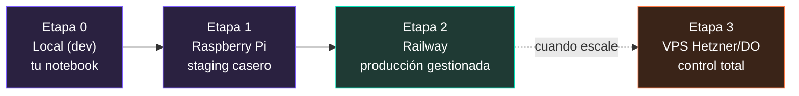
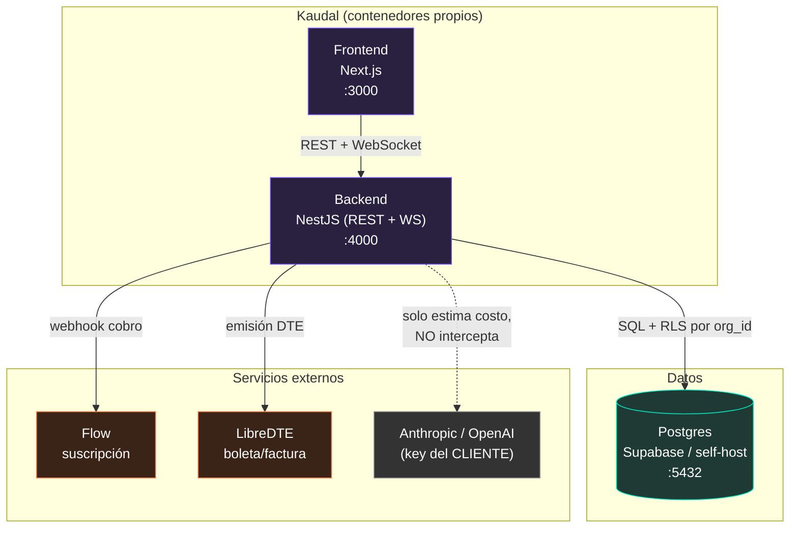
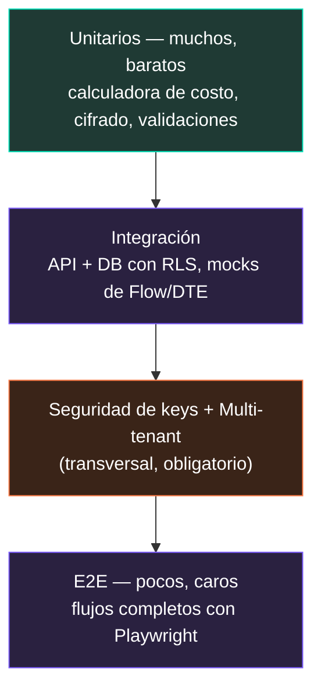
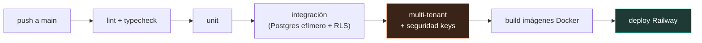
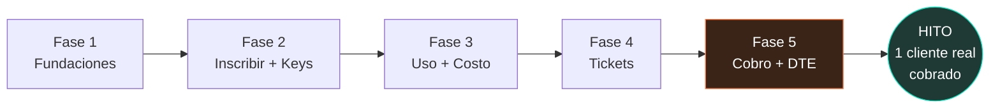
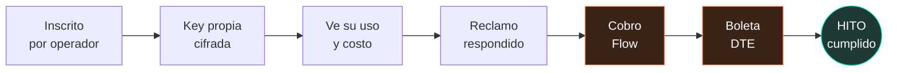

# 09 · Despliegue, Testing y Roadmap

> **Alcance de este documento.** Cómo llevamos Kaudal desde tu notebook o una Raspberry Pi hasta producción en la nube, cómo lo probamos para que no se caiga ni filtre las API keys de los clientes, y qué construimos primero. El norte de todo este documento es un solo hito medible: **un cliente real inscrito, con su propia API key cargada y cifrada, viendo su uso, con un reclamo respondido y cobrado por Flow con boleta DTE emitida.**

---

## 1. Filosofía de despliegue

Kaudal se despliega en **etapas de riesgo creciente**. No saltamos a la nube antes de tiempo: cada etapa valida algo concreto y barato antes de gastar en la siguiente.



**Principio rector:** el mismo `docker-compose` corre en las cuatro etapas. Lo único que cambia es el archivo `.env` y dónde vive el Postgres. Si funciona en la Raspberry, funciona en Railway.

---

## 2. Arquitectura de despliegue

Kaudal son tres piezas más los servicios externos:



Nota clave de arquitectura: **Kaudal no es proxy del modelo**. La flecha punteada hacia Anthropic/OpenAI existe solo para *estimar* costo con la calculadora (usos × tarifa del modelo). El consumo real corre por la key del cliente, desde su propio agente. Esto simplifica el despliegue: no necesitamos infraestructura de baja latencia para interceptar llamadas.

---

## 3. Docker

Todo se empaqueta en contenedores. Un solo `docker-compose.yml` levanta el stack completo.

### 3.1 Estructura de imágenes

| Servicio | Base | Puerto | Notas |
|---|---|---|---|
| `kaudal-frontend` | `node:20-alpine` | 3000 | Next.js en modo `standalone`, build multi-stage |
| `kaudal-backend` | `node:20-alpine` | 4000 | NestJS, expone REST y WebSocket en el mismo puerto |
| `kaudal-db` | `postgres:16-alpine` | 5432 | Solo en local/Raspberry. En Railway/Supabase es gestionado |

### 3.2 Dockerfile del backend (multi-stage)

```dockerfile
# ---- build ----
FROM node:20-alpine AS build
WORKDIR /app
COPY package*.json ./
RUN npm ci
COPY . .
RUN npm run build

# ---- runtime ----
FROM node:20-alpine AS runtime
WORKDIR /app
ENV NODE_ENV=production
COPY --from=build /app/node_modules ./node_modules
COPY --from=build /app/dist ./dist
COPY --from=build /app/package.json ./
# Usuario no-root: nunca corras el backend como root
RUN addgroup -S kaudal && adduser -S kaudal -G kaudal
USER kaudal
EXPOSE 4000
CMD ["node", "dist/main.js"]
```

### 3.3 docker-compose.yml (local / Raspberry)

```yaml
services:
  db:
    image: postgres:16-alpine
    restart: unless-stopped
    environment:
      POSTGRES_USER: ${POSTGRES_USER}
      POSTGRES_PASSWORD: ${POSTGRES_PASSWORD}
      POSTGRES_DB: kaudal
    volumes:
      - kaudal_pgdata:/var/lib/postgresql/data
    ports:
      - "5432:5432"
    healthcheck:
      test: ["CMD-SHELL", "pg_isready -U ${POSTGRES_USER}"]
      interval: 10s
      timeout: 5s
      retries: 5

  backend:
    build: ./backend
    restart: unless-stopped
    env_file: .env
    depends_on:
      db:
        condition: service_healthy
    ports:
      - "4000:4000"

  frontend:
    build: ./frontend
    restart: unless-stopped
    env_file: .env.frontend
    depends_on:
      - backend
    ports:
      - "3000:3000"

volumes:
  kaudal_pgdata:
```

> **Raspberry Pi:** las imágenes `alpine` de Node y Postgres tienen builds `arm64`, así que el mismo compose corre en una Pi 4/5 sin cambios. Usa la Pi 64-bit (Raspberry Pi OS Lite arm64). Para el build de las imágenes en la Pi, `docker compose build` funciona pero es lento; conviene buildear en el notebook con `--platform linux/arm64` y hacer `docker save` / `docker load`, o usar un registry.

---

## 4. Variables de entorno

Separadas por confidencialidad. **Las variables marcadas como SECRETO nunca llegan al frontend ni a un repositorio.**

### 4.1 Backend (`.env`)

| Variable | Ejemplo | Confid. | Descripción |
|---|---|---|---|
| `NODE_ENV` | `production` | público | Entorno de ejecución |
| `PORT` | `4000` | público | Puerto del backend |
| `DATABASE_URL` | `postgresql://user:pass@db:5432/kaudal` | **SECRETO** | Conexión Postgres |
| `SUPABASE_URL` | `https://xxxx.supabase.co` | público | Solo si usamos Supabase gestionado |
| `SUPABASE_SERVICE_ROLE_KEY` | `eyJ...` | **SECRETO** | Rol de servicio; jamás al frontend |
| `JWT_SECRET` | `<64 bytes aleatorios>` | **SECRETO** | Firma de sesiones |
| `KAUDAL_ENCRYPTION_KEY` | `<32 bytes base64>` | **SECRETO CRÍTICO** | Clave maestra que cifra las API keys de los clientes (AES-256-GCM) |
| `FLOW_API_KEY` | `...` | **SECRETO** | Credencial Flow |
| `FLOW_SECRET_KEY` | `...` | **SECRETO** | Firma HMAC de Flow |
| `FLOW_BASE_URL` | `https://www.flow.cl/api` | público | `sandbox.flow.cl` en pruebas |
| `LIBREDTE_API_TOKEN` | `...` | **SECRETO** | Token LibreDTE para emitir DTE |
| `LIBREDTE_RUT_EMISOR` | `76.123.456-7` | público | RUT del emisor (operador) |
| `CORS_ORIGIN` | `https://app.kaudal.cl` | público | Origen permitido del frontend |
| `WS_ORIGIN` | `https://app.kaudal.cl` | público | Origen permitido del WebSocket |

### 4.2 Frontend (`.env.frontend`)

Solo variables `NEXT_PUBLIC_*`, y **ninguna es secreta** — todo lo `NEXT_PUBLIC_` viaja al navegador.

| Variable | Ejemplo | Descripción |
|---|---|---|
| `NEXT_PUBLIC_API_URL` | `https://api.kaudal.cl` | Base del backend REST |
| `NEXT_PUBLIC_WS_URL` | `wss://api.kaudal.cl` | WebSocket tiempo real |
| `NEXT_PUBLIC_ENV` | `production` | Bandera de entorno para la UI |

> **Regla de oro:** si una variable termina en el bundle de Next.js, cualquiera la ve con F12. Por eso `KAUDAL_ENCRYPTION_KEY`, `FLOW_SECRET_KEY` y las API keys de clientes **viven exclusivamente en el backend**. El frontend nunca recibe una API key de cliente, ni siquiera enmascarada con más de los últimos 4 dígitos.

### 4.3 Generar secretos

```bash
# Clave maestra de cifrado (32 bytes, base64)
openssl rand -base64 32

# JWT secret (64 bytes, hex)
openssl rand -hex 64
```

---

## 5. Despliegue por etapas

### Etapa 0 — Local (desarrollo)

**Objetivo:** iterar rápido. Postgres en Docker, backend y frontend en `npm run dev` con hot-reload.

```bash
cp .env.example .env            # rellenar secretos
docker compose up -d db         # solo la base
cd backend && npm run start:dev # NestJS watch
cd frontend && npm run dev      # Next.js :3000
```

**Costo:** $0.

### Etapa 1 — Raspberry Pi (staging casero)

**Objetivo:** validar el stack completo dockerizado, corriendo 24/7, accesible desde internet para probar webhooks reales de Flow.

- Todo en `docker compose up -d`.
- Exponer con un túnel (Cloudflare Tunnel o Tailscale Funnel) para recibir el webhook de Flow sin abrir puertos del router.
- Backups: `pg_dump` diario a un disco USB o a un bucket.

**Costo:** ~$0 marginal (hardware que ya tienes) + electricidad. Túnel Cloudflare gratis.

**Advertencia:** la Raspberry es **staging**, no producción real. Sirve para probar el flujo completo (inscribir cliente → cargar key → estimar uso → cobrar → emitir boleta) contra los sandboxes de Flow y LibreDTE. No pongas datos de un cliente pagador aquí sin backups probados.

### Etapa 2 — Railway (producción gestionada) — *recomendado para el primer cliente real*

**Objetivo:** producción de verdad, sin administrar servidores. Railway construye desde el `Dockerfile`, gestiona TLS, variables y el Postgres.

- Un proyecto Railway con tres servicios: `frontend`, `backend`, `Postgres` (plugin gestionado de Railway, o Supabase como Postgres externo).
- Variables de entorno cargadas en el panel de Railway (nunca en el repo).
- Dominios: `app.kaudal.cl` → frontend, `api.kaudal.cl` → backend. TLS automático.
- Deploy automático al hacer push a `main` (o a `release`).

**Costo referencial:**

| Concepto | Railway |
|---|---|
| Plan Hobby (base) | ~US$5/mes de crédito incluido |
| Uso backend + frontend + Postgres (bajo tráfico, 1–3 clientes) | **~US$5–20/mes** total |
| Postgres gestionado en Railway | incluido en el uso medido |

> Para el primer cliente real, Railway a ~US$5–20/mes es el punto correcto: barato, con TLS y backups gestionados, y sin distraerte administrando un servidor.

### Etapa 3 — VPS (Hetzner / DigitalOcean) — *cuando escale*

**Objetivo:** control total y mejor costo por recurso cuando ya haya varios clientes y el uso justifique administrar el servidor.

- El mismo `docker-compose.yml`, más un reverse proxy (Caddy o Traefik) para TLS automático.
- Postgres self-host en el mismo VPS (con backups a bucket) o Supabase gestionado aparte.

**Costo referencial:**

| Proveedor | Plan | Costo aprox. |
|---|---|---|
| Hetzner Cloud | CX22 (2 vCPU, 4 GB RAM) | **~€4–5/mes (~US$5–6)** |
| Hetzner Cloud | CX32 (4 vCPU, 8 GB) | ~€8–10/mes |
| DigitalOcean | Droplet 2 GB | **US$12/mes** |
| DigitalOcean | Droplet 4 GB | US$24/mes |

**Trade-off:** Hetzner es el más barato por recurso, pero tú administras TLS, backups, actualizaciones de SO y seguridad. Solo salta acá cuando el ahorro compense el tiempo de operación.

### Resumen de costos por etapa

| Etapa | Infraestructura | Costo/mes | Cuándo |
|---|---|---|---|
| 0 · Local | Docker en tu notebook | $0 | Desarrollo diario |
| 1 · Raspberry | Pi + túnel Cloudflare | ~$0 | Staging, probar webhooks |
| 2 · Railway | Gestionado | US$5–20 | **Primer cliente real** |
| 3 · VPS | Hetzner/DO | US$5–24 | Al escalar (varios clientes) |

---

## 6. Estrategia de testing

Testing en pirámide, con dos capas propias que son **no negociables en Kaudal**: multi-tenant y seguridad de keys.



### 6.1 Unitarios (Jest)

Prueban lógica pura, sin red ni base de datos.

| Módulo | Qué se prueba |
|---|---|
| **Calculadora de costo** | `usos × tarifa_modelo` da el estimado correcto por modelo (Claude, GPT), redondeo, moneda CLP/USD |
| **Cifrado de keys** | `encrypt(key)` → `decrypt()` recupera el original; el ciphertext nunca es igual al plano; IV distinto en cada cifrado (AES-256-GCM) |
| **Validaciones** | Formato de API key por proveedor, RUT chileno, montos de cobro |
| **Enmascarado** | `maskKey()` solo revela los últimos 4 caracteres |

Meta de cobertura en estos módulos críticos: **≥ 90%**.

### 6.2 Integración (Jest + Postgres de prueba)

Levantan un Postgres real (contenedor efímero) y prueban endpoints contra la base **con RLS activo**.

- Crear cliente → aparece con su `org_id`.
- Cargar API key → se guarda cifrada (verificar en la tabla que el valor **no** es texto plano).
- Registrar agente por endpoint/webhook.
- Ticket (duda/reclamo) creado por cliente → visible para operador.
- **Flow y LibreDTE se mockean** (no golpeamos sus sandboxes en cada corrida): se verifica que el backend construye el payload correcto y maneja la respuesta de éxito y de error.

### 6.3 E2E (Playwright)

Prueban el flujo completo por la UI, contra los **sandboxes** de Flow y LibreDTE.

**Escenario E2E estrella (el hito):**

1. Operador (Raúl) inicia sesión.
2. Operador inscribe una empresa cliente (crea su cuenta).
3. Cliente inicia sesión en su portal.
4. Cliente carga su propia API key de Anthropic/OpenAI.
5. Cliente ve su panel de uso (uso por día, por agente) y costo estimado.
6. Cliente abre un reclamo (ticket).
7. Operador responde el reclamo → el cliente lo ve resuelto.
8. Se genera el cobro por Flow (sandbox) → pago simulado exitoso.
9. Se emite la boleta DTE por LibreDTE (sandbox).

### 6.4 Multi-tenant (obligatorio)

El corazón de la seguridad de datos. **Un cliente jamás debe ver datos de otro.**

| Prueba | Resultado esperado |
|---|---|
| Cliente A consulta `/usage` con sesión de A | Solo ve datos con su `org_id` |
| Cliente A intenta `GET /clients/{id_de_B}` | **403 / vacío** — RLS bloquea |
| Cliente A intenta leer ticket de B por ID directo | **403 / no encontrado** |
| Consulta sin `org_id` en el contexto | RLS no devuelve filas (falla cerrado, no abierto) |
| Operador consulta cualquier `org_id` | Ve todo (rol operador) |

La política RLS se prueba a nivel de base: se ejecutan queries con el rol de cliente y se confirma que Postgres filtra por `org_id` aunque el backend tuviera un bug. **Defensa en profundidad: el filtrado no depende solo del código del backend.**

### 6.5 Seguridad de las API keys (crítico)

| Prueba | Resultado esperado |
|---|---|
| Guardar key y leer la fila cruda de la tabla | El valor está **cifrado**, nunca en texto plano |
| Respuesta de cualquier endpoint que devuelva un cliente | La key **no aparece**; a lo más `••••1234` |
| Bundle del frontend | No contiene ninguna API key ni `KAUDAL_ENCRYPTION_KEY` |
| Logs del backend | Nunca imprimen la key en claro (ni en errores) |
| Cliente A intenta leer la key de B | Bloqueado por RLS + no se expone jamás |
| Rotar `KAUDAL_ENCRYPTION_KEY` | Existe procedimiento de re-cifrado documentado |

> Estas dos últimas capas (6.4 y 6.5) corren en **CI en cada push**. Si fallan, no se despliega. Una filtración de la key de un cliente es un incidente de seguridad grave: el consumo corre por su cuenta.

### 6.6 CI/CD



Herramientas: GitHub Actions. La etapa de **seguridad de keys + multi-tenant es un gate**: si no pasa, el pipeline se detiene y no llega a `deploy`.

---

## 7. Roadmap por fases

Todo el roadmap converge en un solo hito de negocio. No hay features que no sirvan a ese hito hasta alcanzarlo.



### Fase 1 · Fundaciones

**Meta:** la base sobre la que todo se apoya, con seguridad desde el día uno.

- [ ] Monorepo: `frontend` (Next.js) + `backend` (NestJS) + `docker-compose`.
- [ ] Postgres con Supabase/RLS; esquema base: `orgs`, `users`, `roles` (operador/cliente).
- [ ] Autenticación y sesiones (JWT); roles operador vs. cliente.
- [ ] **RLS por `org_id` activo y probado** (tests multi-tenant en verde).
- [ ] Módulo de cifrado AES-256-GCM con `KAUDAL_ENCRYPTION_KEY` (tests de cifrado en verde).
- [ ] Tema oscuro con la marca (violeta #7C5CFF, menta #00E0B8, naranjo #FF7A45).
- [ ] CI con gate de seguridad.
- [ ] Deploy a Railway funcionando (aunque sea un "hola mundo" con login).

**Sale a producción cuando:** un operador puede iniciar sesión en Railway con TLS.

### Fase 2 · Inscribir cliente y cargar su API key

**Meta:** el operador inscribe una empresa y el cliente carga su propia key, cifrada.

- [ ] Operador crea la cuenta de un cliente (empresa) → se genera su `org_id`.
- [ ] Cliente inicia sesión en su portal.
- [ ] Cliente **carga su propia API key** (Anthropic/OpenAI) → se guarda **cifrada**, aislada por `org_id`.
- [ ] La key nunca vuelve al frontend salvo enmascarada (`••••1234`).
- [ ] Registrar un agente por endpoint/webhook (n8n, Mastra o código propio).
- [ ] Tests de seguridad de keys en verde.

**Sale a producción cuando:** el cliente ve "API key cargada · ••••1234" en su portal y el valor está cifrado en la base.

### Fase 3 · Uso y costo estimado

**Meta:** el cliente ve, bonito, dónde y cuánto se usa su agente.

- [ ] Ingesta de uso: el agente reporta usos (o se estiman) → tabla `usage` por `org_id` y por agente.
- [ ] Calculadora de costo estimado (usos × tarifa del modelo), en CLP.
- [ ] Panel del cliente: uso **por día** y **por agente**, con costo estimado.
- [ ] WebSocket para actualización en tiempo real del panel.
- [ ] Panel del operador: ve el uso de **todos** los clientes.

**Sale a producción cuando:** el cliente entra a su portal y ve un gráfico de su uso por día con costo estimado.

### Fase 4 · Dudas y reclamos (tickets)

**Meta:** el cliente pregunta/reclama, el operador responde.

- [ ] Cliente crea ticket (duda o reclamo) desde su portal.
- [ ] Operador ve la bandeja de tickets de todos los clientes.
- [ ] Operador responde → el cliente ve la respuesta y el estado (abierto/respondido/resuelto).
- [ ] Notificación en tiempo real (WebSocket) al cliente cuando hay respuesta.
- [ ] RLS: un cliente solo ve **sus** tickets.

**Sale a producción cuando:** un cliente abre un reclamo y lo ve respondido por el operador.

### Fase 5 · Cobro por Flow y boleta DTE

**Meta:** cerrar el ciclo comercial. Cobrar y emitir documento tributario.

- [ ] Integración Flow (suscripción): crear cobro, recibir webhook de pago, validar firma HMAC.
- [ ] Integración LibreDTE: emitir **boleta/factura** al confirmarse el pago.
- [ ] Vista de facturación en el portal del cliente (estado de pago, documento emitido).
- [ ] Panel del operador: estado de cobros por cliente.
- [ ] Probado en **sandbox** de Flow y LibreDTE (E2E), luego cambio a producción.

**Sale a producción cuando:** se completa el hito.

---

## 8. Definición del hito (Definition of Done)

El hito se declara cumplido **solo si todas estas casillas están marcadas contra un cliente real, en Railway, en producción:**

- [ ] Existe **un cliente real inscrito** por el operador (Raúl), con su `org_id` propio.
- [ ] El cliente cargó **su propia API key**, guardada **cifrada** y **aislada** de otros clientes.
- [ ] El cliente **ve su uso** (por día, por agente) y su **costo estimado** en su portal.
- [ ] El cliente abrió un **reclamo** y el operador lo **respondió** (ticket resuelto).
- [ ] Se generó un **cobro por Flow** que se pagó exitosamente.
- [ ] Se emitió la **boleta DTE** (LibreDTE) correspondiente a ese cobro.
- [ ] Las pruebas de **multi-tenant** y **seguridad de keys** están en verde en CI.



Cuando esas siete casillas estén marcadas, Kaudal dejó de ser un proyecto y pasó a ser un servicio que funciona de punta a punta con dinero real.

---

## 9. Post-hito (fuera de alcance por ahora)

Anotado para no olvidarlo, **pero no se construye antes del hito:**

- Proxy real del modelo (interceptar llamadas para costo exacto en vez de estimado).
- Múltiples operadores / equipos.
- Migración de Railway a VPS Hetzner/DO al escalar.
- Alertas de sobreconsumo al cliente.
- Reportes exportables (PDF/CSV) de uso y facturación.
- Onboarding autoservicio (que el cliente se inscriba solo, sin el operador).

> Disciplina: cualquier idea nueva que no aparezca en las Fases 1–5 va a esta lista. Primero el hito.