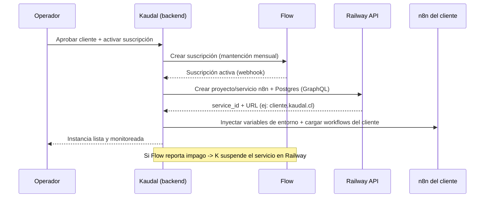

# 10 · Auto-despliegue y Costos (nunca perder plata en una instancia)

> Extiende el modelo actual (bring-your-own-key + Flow). Agrega que la plataforma **provisione y administre el n8n de cada cliente**, con la garantía de que **ninguna instancia corre si el cliente no paga**. Se reusa todo lo construido (tickets, aislamiento por empresa, portal, auth, API key cifrada, uso estimado).

## 1. Principio: infraestructura como costo traspasado
- El **único costo** que asume el operador por cliente es su **instancia** (el n8n en Railway). Los tokens los paga el cliente con su propia llave.
- Regla de oro: **el cobro mensual del cliente siempre es ≥ (costo de su instancia + margen).** Así cada cliente se autofinancia.

## 2. Las 3 reglas que garantizan no perder plata
1. **Provisión por pago activo:** el n8n del cliente se crea SOLO cuando su suscripción Flow está activa (o tras el primer pago). Sin pago → sin instancia.
2. **Precio ≥ costo + margen:** la mantención incluye el costo de la instancia + tu margen. Ejemplo: instancia ~$8.000 CLP/mes → cobras $45.000 (cubre + gana).
3. **Auto-suspensión por no pago:** si Flow reporta impago/cancelación, el panel **suspende** el servicio Railway del cliente (API). Periodo de gracia (ej. 5 días) → luego **apagar/borrar**. La instancia deja de generar costo.

## 3. Qué NO significa auto-despliegue (aclaración clave)
"Clonar una plantilla" = levantar un **n8n vacío** (el motor), NO copiar el mismo agente a todos. Adentro de ese n8n, el operador carga **los agentes que quiera para ese cliente** — distintos por cliente, de cualquier tipo. La automatización solo ahorra la pega de levantar el entorno.

## 4. Flujo de aprovisionamiento


## 5. Datos nuevos (se suma a docs/eng/02)
```sql
CREATE TABLE instancias (
  id uuid PRIMARY KEY DEFAULT gen_random_uuid(),
  org_id uuid NOT NULL REFERENCES orgs(id),
  proveedor text NOT NULL DEFAULT 'railway',
  railway_project_id text,
  railway_service_id text,
  url text,
  estado text NOT NULL DEFAULT 'pendiente', -- pendiente|activa|suspendida|eliminada
  costo_mensual_estimado_clp int,           -- costo de la instancia (para el margen)
  created_at timestamptz DEFAULT now(),
  updated_at timestamptz DEFAULT now()
);
-- RLS por org. Solo el operador administra; el cliente ve estado (vivo/suspendido), no IDs internos.
```
Y en `suscripciones` (ya existe): agregar `cubre_instancia boolean` y `margen_pct int` para dejar registrado que la mantención cubre el costo.

## 6. Endpoints nuevos (backend NestJS)
- `POST /operador/instancias` → provisiona (llama Railway API). Requiere suscripción activa.
- `POST /operador/instancias/:id/suspender` y `/reactivar` → cambia estado y llama Railway.
- `POST /webhooks/flow` → al recibir impago, dispara suspensión; al recibir pago, reactiva.
- `GET /cliente/instancia` → el cliente ve solo estado (vivo/suspendido) y su agente, no datos internos.

## 7. Cómo empezar sin gastar de más (recomendado)
1. **Manual primero:** construye la pantalla que **registra** una instancia que desplegaste a mano (como hoy) + el gating por pago + la auto-suspensión. Ya con esto no pierdes plata.
2. **Automatiza el botón después:** conecta la Railway API para que el "Desplegar" haga el clon solo. Misma pantalla, un paso más.
3. **Migra a VPS a volumen:** sobre ~10-15 clientes, corre muchos n8n en un VPS propio (Hetzner/DO) con Docker — más barato que N servicios Railway. Ver `docs/16`.

## 8. Chequeo de rentabilidad por cliente (usar la calculadora)
Para cada cliente: `mantención_mensual ≥ costo_instancia + margen`. La instancia es tu costo; los tokens no. Si un cliente no cubre su instancia, subes precio o lo suspendes. La calculadora (`tools/`) te ayuda a fijar el número.
