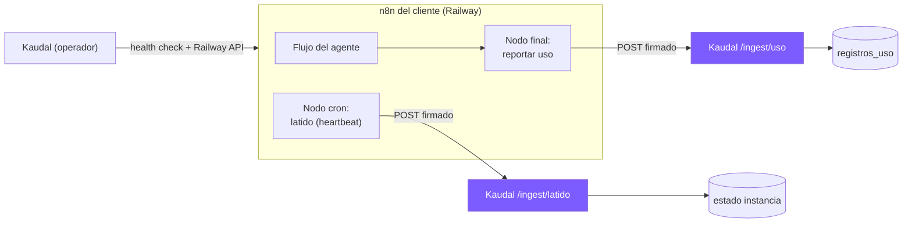

# 11 · Conexión con n8n (uso, monitoreo y llaves)

> Cómo Kaudal (el panel) se conecta a los **flujos de n8n** de cada cliente para: (a) recibir cuánto se usó, (b) saber si el agente está vivo, y (c) que el n8n use la API key del cliente. Kaudal NO ejecuta el agente ni proxya el modelo — solo lo rodea. Reusa el aislamiento por org ya construido.

## 1. Panorama


Tres canales:
1. **Uso** (push): el flujo, al terminar, le avisa a Kaudal cuánto gastó.
2. **Latido** (push): un cron dentro del n8n le avisa a Kaudal "sigo vivo".
3. **Chequeo** (pull): Kaudal consulta el health de n8n y su estado en Railway.

## 2. Reportar uso (push desde n8n)
Cada flujo termina con un **nodo HTTP Request** que hace un POST a Kaudal. Kaudal le entrega al operador un snippet listo para pegar al final de cualquier flujo.

**Endpoint:** `POST /ingest/uso`
**Headers:** `X-Kaudal-Signature: <HMAC-SHA256 del body con el secreto de la instancia>`
**Body (JSON):**
```json
{
  "instancia_id": "uuid-de-la-instancia",
  "agente": "bot-ventas-whatsapp",
  "modelo": "claude-3-5-sonnet",
  "tokens_input": 1500,
  "tokens_output": 700,
  "usos": 1,
  "ts": "2026-08-26T14:03:00Z",
  "meta": { "canal": "whatsapp" }
}
```
- Si el flujo no sabe los tokens (n8n no siempre los expone), manda `usos: 1` y Kaudal **estima** el costo por uso × modelo (calculadora). Si sí los sabe, mejor.
- Kaudal valida la firma HMAC, resuelve `instancia_id → org_id`, y escribe en `registros_uso` (aislado por org).

**Snippet para el nodo n8n (HTTP Request):**
```
Método: POST
URL: https://panel.kaudal.cl/ingest/uso
Auth/Headers: X-Kaudal-Signature = {{ $env.KAUDAL_SIGN( $json ) }}   (o firmar en un nodo Code previo)
Body (JSON): { instancia_id, agente, modelo, tokens_input, tokens_output, usos, ts }
```
> El `instancia_id` y el `KAUDAL_SECRET` se inyectan como variables de entorno cuando Kaudal provisiona el n8n (ver `docs/eng/10`).

## 3. Latido / heartbeat (¿está vivo?)
Un nodo **Schedule (cron)** dentro del n8n, cada 5-10 min, hace `POST /ingest/latido` con `{ instancia_id, ts }` firmado.
- Kaudal marca la instancia `viva` y guarda `ultimo_latido`.
- Si no llega latido en X min (ej. 20), Kaudal la marca `caida` y alerta al operador (y muestra "con problema" en el portal del cliente).
- Alternativa/complemento: Kaudal hace **pull** al health de n8n (`GET https://cliente.kaudal.cl/healthz`) desde un cron propio.

## 4. La API key del cliente (bring-your-own-key)
- El cliente ingresa su key en Kaudal → se guarda **cifrada** (ver `docs/eng/03`).
- Al provisionar/actualizar el n8n del cliente, Kaudal **inyecta esa key como credencial/variable de entorno dentro de ESE n8n** (por la Railway API / n8n API), para que el flujo llame al modelo con la key del cliente.
- La key vive en el n8n del cliente, no en el flujo de otro. El modelo lo consume el cliente con su plata.
- **Honestidad (docs/18 §9):** como Kaudal administra ese n8n, hay exposición técnica mínima inevitable; se minimiza (cifrada en tránsito y en reposo, nunca en logs, nunca mostrada) y se es transparente con el cliente.

## 5. Monitoreo y estado (lo que ve cada quien)
- **Operador:** estado real de cada instancia (viva/caída/suspendida), último latido, uso, y control (suspender/reactivar vía Railway, `docs/eng/10`).
- **Cliente:** solo "tu agente está trabajando / con problema" + su uso/costo estimado + su límite con aviso. No ve IDs internos ni la lógica del flujo (caja negra).

## 6. Datos (se apoya en docs/eng/02 y 10)
- `registros_uso` (ya en `docs/eng/02`): recibe cada evento de `/ingest/uso`.
- `instancias` (en `docs/eng/10`): agrega `secreto_hmac` (cifrado), `ultimo_latido timestamptz`, `estado`.
- Todo aislado por `org_id` con RLS.

## 7. Seguridad de la ingesta
- **Firma HMAC** obligatoria en `/ingest/*`; rechazar sin firma o inválida.
- **Idempotencia:** un mismo evento (mismo `ts`+`instancia_id`+hash) no se cuenta dos veces.
- **Rate limiting** por instancia (un flujo en bucle no puede inundar la ingesta).
- El `secreto_hmac` es por instancia; si se filtra, se rota sin tocar a los demás.
- Corre `security-auditor` sobre estos endpoints.

## 8. Qué le toca a Claude Code (cuándo)
- Fase 6 (registrar agente): guardar `instancia_id`, endpoint y el secreto; entregar el snippet de reporte para pegar en n8n.
- Fase 7 (uso): construir `/ingest/uso` + `/ingest/latido` (firmados) y alimentar la pantalla "dónde se usa".
- Fase 11.5 (auto-despliegue): inyectar `instancia_id`, `KAUDAL_SECRET` y la key del cliente al provisionar en Railway.
> Regla: Kaudal recibe y muestra; n8n ejecuta y reporta. No mezclar.
