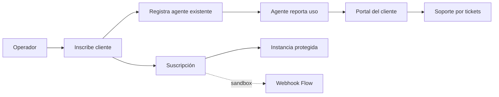

# Guía práctica: un cliente de punta a punta en Kaudal

Esta guía explica cómo funciona Kaudal hoy y cómo probar un flujo completo sin cobrar dinero ni desplegar infraestructura pagada.

## La idea en una frase

Kaudal **no ejecuta agentes**. Registra agentes que ya funcionan —n8n, Mastra o código propio— y les agrega cliente, visibilidad de uso, soporte, cobro y control de infraestructura.



## Antes de empezar

1. Levanta Supabase local y la app.

```powershell
cd app
npm run dev
```

2. Entra con la cuenta de operador local que configuraste. Las contraseñas de desarrollo no se documentan ni se suben a GitHub.

3. Usa `http://127.0.0.1:3000`, no una URL de producción.

## Flujo completo en sandbox

### 1. Inscribir un cliente

Ve a **Clientes → Inscribir cliente**. Crea, por ejemplo:

| Campo | Ejemplo |
|---|---|
| Razón social | Panadería Los Andes SpA |
| RUT | 76.123.456-7 |
| Contacto | contacto@losandes.cl |

Esto crea el registro de negocio y envía/inicia la invitación de acceso del cliente. El cliente queda aislado: no puede ver datos de otros clientes.

### 2. Registrar el agente que ya existe

Ve a **Agentes → Registrar agente**.

Ejemplo para un flujo n8n que responde mensajes:

| Paso | Campo | Ejemplo |
|---|---|---|
| Datos | Cliente | Panadería Los Andes SpA |
| Datos | Nombre | Asistente de pedidos |
| Datos | Descripción | Responde consultas de horarios y toma pedidos por WhatsApp. |
| Conexión | Tipo | n8n |
| Conexión | Endpoint | `https://n8n.ejemplo.cl/webhook/pedidos` |
| Conexión | Healthcheck | `https://n8n.ejemplo.cl/healthz` |
| Medición | Modelo | `claude-sonnet-4-5` |
| Medición | Modo de conteo | Reportado por el agente |
| Medición | Canal | WhatsApp |

El botón **Probar conexión** solo comprueba que el endpoint responda. Kaudal no copia ni modifica el workflow de n8n.

Al terminar, Kaudal puede mostrar un `ingest token` una sola vez. Guárdalo en el secreto del agente; sirve para que el agente reporte actividad sin exponer la API key del modelo.

### 3. Reportar uso desde el agente

Cuando el agente termina una ejecución, puede informar un uso a Kaudal.

```bash
curl -X POST http://127.0.0.1:3000/api/usage/events \
  -H "Authorization: Bearer TU_INGEST_TOKEN" \
  -H "Idempotency-Key: 3b2c9295-0e19-4f48-bda0-471b83c86040" \
  -H "Content-Type: application/json" \
  -d '{
    "units": 1,
    "model": "claude-sonnet-4-5",
    "input_tokens": 1200,
    "output_tokens": 350,
    "status": "ok"
  }'
```

El token representa al agente, no al cliente ni a su API key. La `Idempotency-Key` evita duplicar costos si n8n reintenta el webhook.

Después ve a **Uso y costo**. Ahí aparece la estimación mensual por día y por agente. Es informativa: no genera un cargo.

### 4. Qué ve el cliente

El cliente entra al portal y puede ver:

- Sus agentes y si están funcionando.
- Uso y costo estimado del mes.
- Estado de su instancia: funcionando, suspendida o en preparación.
- Tickets y respuestas del operador.
- Estado de cuenta sandbox.

El cliente no ve endpoints internos, tokens de ingest, API keys ni identificadores de Railway.

### 5. Soporte

El cliente abre una duda o reclamo desde **Dudas y reclamos**. El operador responde desde **Reclamos**.

Ejemplo de ticket:

> “El asistente no respondió durante la mañana. ¿Pueden revisar WhatsApp?”

El operador ve el hilo, puede cambiar el estado y dejar notas internas que el cliente no puede leer.

### 6. Cobro e instancia: qué hace hoy el sandbox

En desarrollo no se cobra dinero. El flujo está modelado para probar la lógica:

1. En **Cobros** se ve el estado sandbox de pagos y documentos.
2. En **Instancias** registras manualmente el servidor del cliente y su costo mensual estimado.
3. La base bloquea dejar una instancia `activa` si no tiene una suscripción activa que la cubra.
4. Si llega un impago sandbox, se otorgan cinco días de gracia.
5. Pasado el plazo, el proceso interno deja la instancia como `suspendida`.
6. Un pago sandbox vuelve a activarla si la cobertura sigue siendo válida.

Ejemplo de decisión de margen:

| Concepto | Monto |
|---|---:|
| Costo Railway/VPS | $8.000 CLP/mes |
| Margen mínimo | 50 % |
| Cobro mínimo calculado | $12.000 CLP/mes |
| Plan que vendes | $45.000 CLP/mes |

El plan cubre la instancia y deja margen. Los tokens del modelo siguen siendo pagados con la API key del cliente.

## Lo que falta para producción

No uses el sandbox para cobrar clientes reales. Antes debes conectar:

1. **Flow real:** credenciales, webhook oficial, consulta de estado e idempotencia.
2. **DTE:** emisor, certificados y proveedor tributario para boletas/facturas.
3. **Railway o VPS:** credenciales y una tarea programada que suspenda infraestructura real tras la gracia.
4. **Supabase Realtime:** para tickets y uso en vivo.
5. **Operación:** MFA de operador, proxy confiable y rate limiting distribuido.

El estado exacto se mantiene en [el reporte GO/NO-GO](eng/13-reporte-go-no-go-2026-08-30.md).

## Resumen de responsabilidades

| Parte | Quién la opera | Qué hace |
|---|---|---|
| Agente | n8n / Mastra / código propio | Ejecuta la automatización y usa la API key del cliente. |
| Kaudal | Operador | Registra, mide, muestra, soporta y protege el servicio. |
| Cliente | Cliente final | Ve estado, uso, costo estimado y abre tickets. |
| Flow / DTE / Railway | Proveedores externos | Cobran, emiten documentos y alojan infraestructura en producción. |

## Orden recomendado para tu primera demo

1. Entra como operador.
2. Crea o usa un cliente de prueba.
3. Registra un agente n8n real o de ejemplo.
4. Envía un evento de uso con el token de ingest.
5. Revisa el panel de Uso y costo.
6. Entra como cliente y revisa el portal.
7. Abre un ticket y respóndelo como operador.
8. Registra una instancia en modo pendiente y revisa el gating de cobertura.

Con eso puedes demostrar toda la propuesta de Kaudal sin conectar servicios de pago ni gastar dinero.
